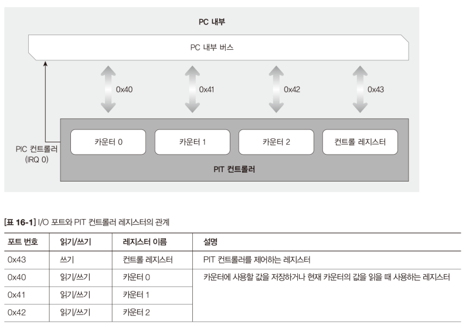
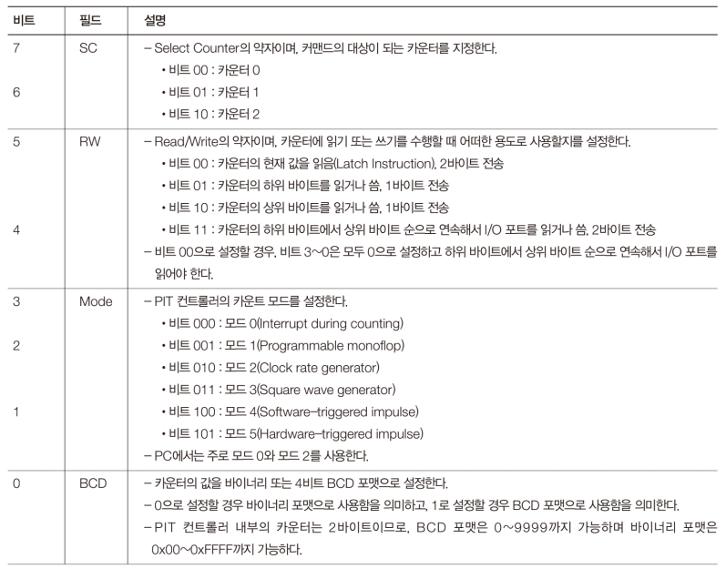
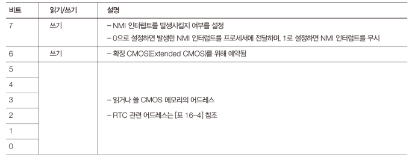
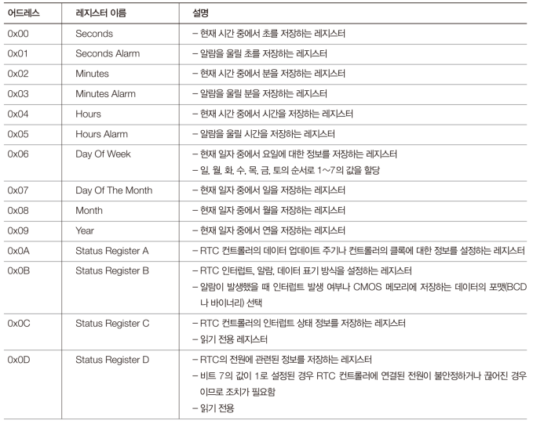

# Code: PIT.[h, c]

# Explanation

## What does the code do?

The code contains functions related to PIC. Because MINT64Os utilizes only
`counter0` register, `mode0` and `mode2`, these files have functions that
controls only counter0.

## PIT (Programmable Interval Timer)

PIT is used to perform Preemptive Multitasking and to implement sleep function

1. PIT frequency is `1.193182MHz`

### Mode/Command register

1. If mode is passed to register, it determines the size of registers and
type of operation

2. If command is passed to register, it determines the value to read in
data port

    1. `read-back` command (multiple channels)

        1. If bit 5 is clear, read current counter of one or more channels
        (similar to sending the latch command, except it works for multiple
        channels with one command)

        2. If bit 4 is clear, read current status of one or more channels 

        3. Bit 4 and 5 should not be clear at the same time

    2. `latch` command (one channels)
    
        1. read current counter of one channel

        2. If access mode is lobyte/hibyte, latch command allows both bytes
        of the current count to be read without inconsistencies

3. PIT supports `six modes` for each register

    1. `mode 0` is one time timer

    2. `mode 2` is periodic timer

### Data register

1. There are three channels and three data ports

    * The output for channel 0 is connected to `IRQ0`

    * The output for channel 1 was once used for refreshing the DRAM.
    channel 1 is no longer usable and may not be implemented at all. 

    * The output of PIT channel 2 is connected to the PC `speaker`.

2. size and type of the register is determined by access mode

    * type/size: low (1 byte), high (1 byte), both (2 bytes)

    * if size is 2 bytes, register should be read twice

3. reading data register returns value of `current counter`

    * If size is 2 bytes, latch command allows both bytes of the current
    count to be read without inconsistencies

4. writing to data register changes `reset value`

    * If reset value (2 bytes) is binary, the maximum value is 65536.
    0 means 65536 (about 54ms)

    <figure style='display: inline-block;'>
    
    <figcaption style='text-align: center;'>
        PIT port I/O explanation
    </figcaption>
    </figure>

    <figure style='display: inline-block;'>
    
    <figcaption style='text-align: center;'>
        PIT control/mode register explanation
    </figcaption>
    </figure>

## TSC (Time Stamp Counter)

TSC is 64 bit `MSR` (Model Specific Register). It is a precise method of
getting a high-resolution measure of the passage of time

1. `rdtsc` to access TSS

    * TSC is saved as `EDX:EAX` (high 32 bits:low 32 bits) 

## RTC (Real Time Clock)

1. RTC controller records the date and time to `CMOS` even after PC is off.

2. CMOS memory address port is `0x70` and memory data port is `0x71`

    1. data in data port is `1 byte`, and its format is `BCD`

    <figure style='display: inline-block;'>
    
    <figcaption style='text-align: center;'>
        CMOS memory address port explanation
    </figcaption>
    </figure>

    <figure style='display: inline-block;'>
    
    <figcaption style='text-align: center;'>
        CMOS memory addresses
    </figcaption>
    </figure>

## Note

1. In original PIT.c, `kWaitUsingDirectPIT` function uses 0x00 for reset value.
However, this is problematic because the function busily check the current
counter value. If PC is so fast, it sets reset value and gets the current value
before one clock of PIT; counter value is set to zero and is changed after
a clock of PIT. Because of the logic of the function, I changed the value
to 0xFFFF.