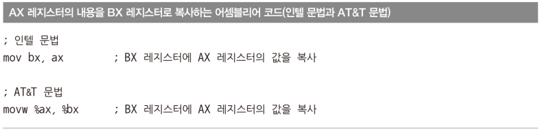
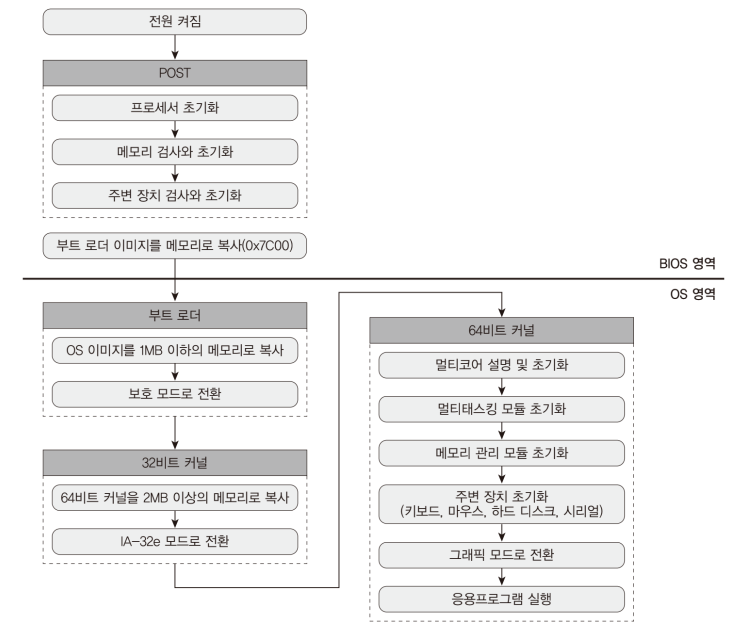

# Code: Very Simple Bootloader

```assembly
[ORG 0x00]
[BITS 16]

SECTION .text

jmp $

times 510 - ($ - $$) db 0x00

db 0x55
db 0xAA
```

# Explanation

## Assembly

1. `[ORG 0x00]` tells nasm to calculate real address of label based on `0x00`
2. `[BITS 16]` tells nasm that every instruction below `[BITS 16]` is for real 
mode
3. `($ - $$)` means (current address - current section address)

    * gives you the offset(number) in the current section
    * You might think that in the above example, $$ means 0x00, so
    `times 510 - $ db 0x00` should work, but actually nasm gives error because
    TIMES requires number argument. Nasm parses $ and $$ as address not as
    number, which means 510 - $ cannot be parsed 

4. `times 510` tells nasm to repeat the instruction 510 times
5. `db` means `define byte` which just add data to code
6. There are two Assembly Grammars: Intel and AT&T



## Computer Booting Order

1. Power on
2. Processor loads BIOS into memory
3. BIOS executes POST(Power On Self Test)
4. BIOS loads bootloader into memory(`0x07C0`)



## BIOS

1. program stored in ROM or flash memory
2. has hardware-related functions (BIOS means Basic Input/Output System)

    * Disk input/output
    * Video mode
    * Hardware initialization and test (POST)
    * Hardware Configuration
    * and so on...

3. 16bits OSes such as DOS heavily depended on BIOS
4. load Bootloader at `0x07C0`
    
    * read first sector of storage medium
    * check if bootloader ends with `0x55` and `0xAA`
    * otherwise, it stops booting or reboot

## Bootloader

1. also called Bootstrap code
2. a `512 bytes` program recorded at `first sector(MBR)` of storage medium
3. is loaded at `0x07C0`
4. must ends with `0x55` and `0xAA` 

    * If storage medium is not booting disk, first sector can be just a data
    * `0x55` and `0xAA` is signature that proves that first sector is bootloader

## MBR

1. Master Boot Record is data stored in first sector of storage medium
2. MBR has not only bootloader but also disk partition information
3. partition is unit for logical disk area

    * when one partition is damaged, other partitions are still safe

4. MBR can have up to `4 partitions`
