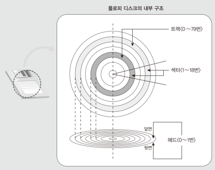
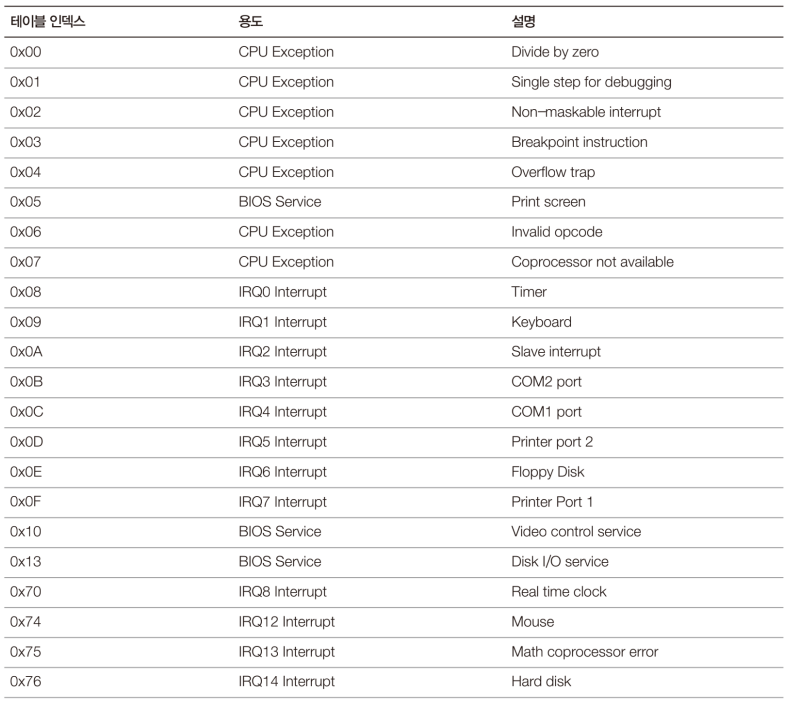
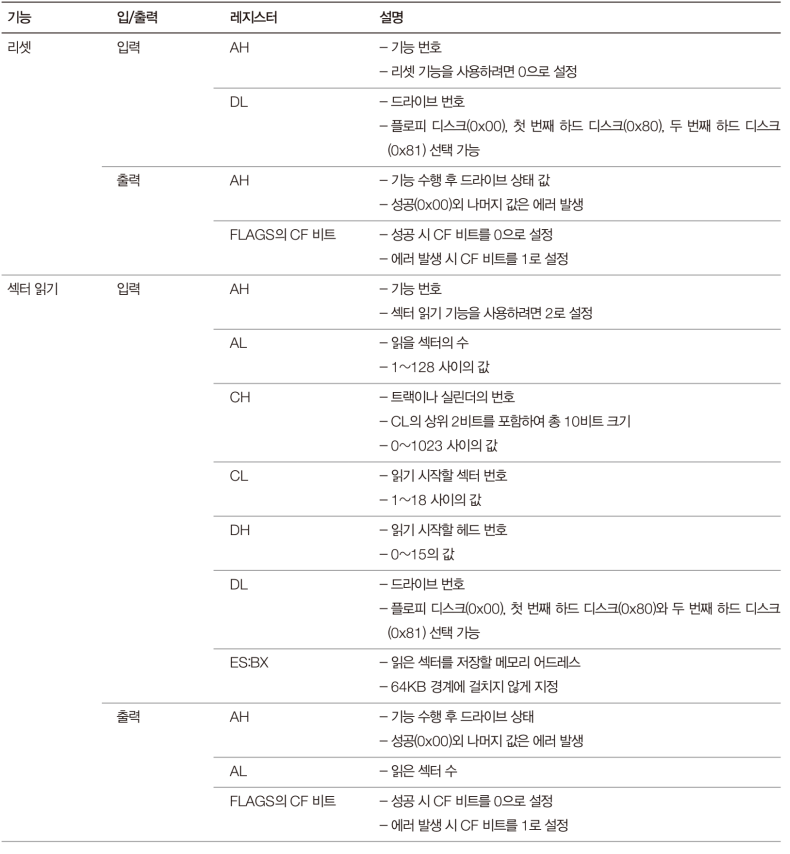

# Code: Part of Bootloader that read data from floppy disk

```assembly

TOTALSECTORCOUNT: dw 1024 ; size of MINT64OS image is 1024 sectors

; vars for reading data: src_addr
SECTORNUMBER: db 0x02 ; os image starts from 0x02 sector
HEADNUMBER: db 0x00
TRACKNUMBER: db 0x00

; 0x10000 is start addr of OS in memory
; regs for reading data: dest_addr
mov si, 0x1000
mov es, si
mov bx, 0x0000

; reg for reading data: count
mov di, word [TOTALSECTORCOUNT]

READDATA:
    ; check if there is no more sectors to read
    cmp di, 0
    je READEND

    sub di, 0x01

    ; call BIOS I/O service
    mov ah, 0x02                ; service number (read sector)
    mov al, 0x01                ; number of sectors to read
    mov ch, byte [TRACKNUMBER]
    mov cl, byte [SECTORNUMBER]
    mov dh, byte [HEADNUMBER]
    mov dl, 0x00                ; drive to read (0=Floppy)
    int 0x13                    ; interrupt to execute service

    jc HANDLEDISKERROR    

    ; set next dest_addr: after 512 byte from prev dest
    add si, 0x0020
    mov es, si

    ; set sector, head, track numbers to next src_addr
    ; floppy sector range: 1~19
    ; floppy head range: 0~1
    ; floppy track(cylinder) range: 0~79
    mov al, byte [SECTORNUMBER]
    add al, 0x01
    mov byte [SECTORNUMBER], al
    cmp al, 19
    jl READDATA

    xor byte [HEADNUMBER], 0x01
    mov byte [SECTORNUMBER], 0x01
    cmp byte [HEADNUMBER], 0x00
    jne READDATA

    add byte [TRACKNUMBER], 0x01
    jmp READDATA

READEND:

HANDLEDISKERROR:
    ; skip

```

# Explanation

## Assembly

1. `int 0x13` is software interrupt that calls function whose address is
at `0x13`

2. `jc HANDLEDISKERROR` is jump to HANDLEDISKERROR if CF(carry flag) is set

## Disk Structure

1. Sequence Access Order: `Cylinder(Track) <- Head <- Sector` (`CHS`)

<div>
  <figure style='display: inline-block;'>
    
    <figcaption style='text-align: center;'>floppy disk structure</figcaption>
  </figure>
</div>


## BIOS Service and Software Interrupt

1. Unlike libraries, BIOS set its function address to Interrupt Vector Table
and user code should call int table index
2. Interrupt is signal sent by peripheral devices and it is handled by
interrupt handler
3. `Interrupt Vector Table` contains interrupt handler addresses

    * starts from `0x00`
    * have `256` vectors, and vector size in real mode is `4 bytes`


<div>
  <figure style='display: inline-block;'>
    
    <figcaption style='text-align: center;'>
      most used interrupt index in real mode
    </figcaption>
  </figure>
</div>

<div>
  <figure style='display: inline-block;'>
    
    <figcaption style='text-align: center;'>
      BIOS I/O service parameters
    </figcaption>
  </figure>
</div>

## MINT64OS Characteristics

1. load OS image to 0x10000(64KByte) in memory

    * OS can be anywhere in the memory. For example, it can be after
    0x07C0 + 0x020(512 bytes). Later, you will see that Mint64OS uses memory
    below 0x10000 for other feature