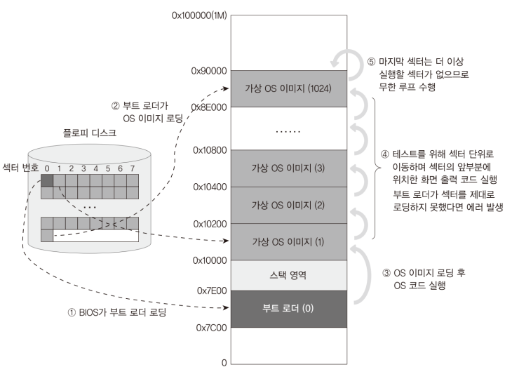

# Code:  Virtual OS that resides from sector 2 of floppy disk
```Assembly
[ORG 0x00]
[BITS 16]

SECTION .text

jmp 0x1000:START ;; right after bootloader sector

SECTORCOUNT: dw 0x0000 ; currently executing sector
TOTALSECTORCOUNT equ 1024 ; virtual OS's num of sectors

;; code section
START:
    ; segment setting for each sector
    mov ax, cs ; ex: 0x0000, 0x0020, ...
    mov ds, ax
    mov ax, 0xB800;
    mov es, ax;

    ; print number for current memory addr and jump to next memory addr
    ; which is multiply of 512 bytes
    %assign i 0
    %rep TOTALSECTORCOUNT ; repeat as many as TOTALSECTORCOUNT
        %assign i i+1

        mov ax, 2
        mul word [SECTORCOUNT]
        mov si, ax ; si(video memory offset) = char_size * sector_count

        ; 160 * 2 + es:si == third line + offset
        mov byte [es:si + (160 * 2)], '0' + (i % 10)
        add word [SECTORCOUNT], 1

        %if i == TOTALSECTORCOUNT
            jmp $ ; end of virtual OS
        %else
            jmp (0x1000 + i * 0x20):0x0000 ; jump to next memory addr
        %endif

        ; $$ == SECTION .code == 0x00
        ; $ == cur addr that can be over 0x10000 + 512 bytes
        times (512 - ($ - $$) % 512) db 0x00
    %endrep
```

# Explanation

## What does code do?

1. Start code from `0x10000`, start address of OS in memory
2. Print number to screen
3. jump to next segment whose address is multiply of 512 bytes
4. If jump reaches last segment(last part of OS), infinite loop
5. Otherwise, repeat from 2 

<div>
  <figure style='display: inline-block;'>
    
    <figcaption style='text-align: center;'>virtual OS layout</figcaption>
  </figure>
</div>


## Assembly

1. `TOTALSECTORCOUNT equ 1024` is like preprocessor. The result machine code
does not have space for the value of 1024. However, you can access the variable
from different asm file because the variable exists in object file

2. Preprocessor

    * `%assign i 0` defines i = 0; re-assignable
    * `%rep TOTALSECTORCOUNT` repeats as many as TOTALSECTORCOUNT
    * `%endrep`
    * `%if i == TOTALSECTORCOUNT`
    * `%elif`
    * `%else`
    * `%endif`

## MINT64OS Characteristics

1. Virtual OS code is for test purpose. Later, the code is replaced with
complex operating system code that can handle signal, thread, process,
multi-cores, and so on

2. One thing to notice is that you cannot set `TOTALSECTORCOUNT` over `1152`.
If image occupies 1153 sectors, OS invades `0xA0000` in memory which is reserved
for graphic mode video memory. If you change TOTALSECTORCOUNT in VirtualOS.asm
and TOTALSECTORCOUNT in BootLoader.asm to 1153, then you will see that total
number of printed string is just 1152 (80 * 14 + 32). The OS size is 1024
sectors, but you can set it up to 1152. No special reason to have 1024 sectors

3. Now you can see a new directory named `01.Kernel32`. This directory contains
the virtual OS assembly code and Makefile. Also there is some change in Makefile
in root directory

4. Memory Layout up to CH05

    * start(inclusive) ~ end(exclusive)
    * 0x00000 ~ 0x00400 (Interrupt Vector Table)
    * 0x07C00 ~ 0x07E00 (Bootloader)
    * 0x07E00 ~ 0x10000 (Stack)
    * 0x10000 ~ 0x90000 (Operating System; 1024 sectors)
    * 0xA0000 ~ ...     (video memory for graphic mode)
    * 0xB8000 ~ ...     (video memory for text mode)