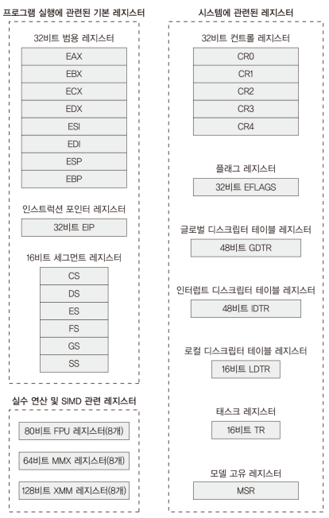
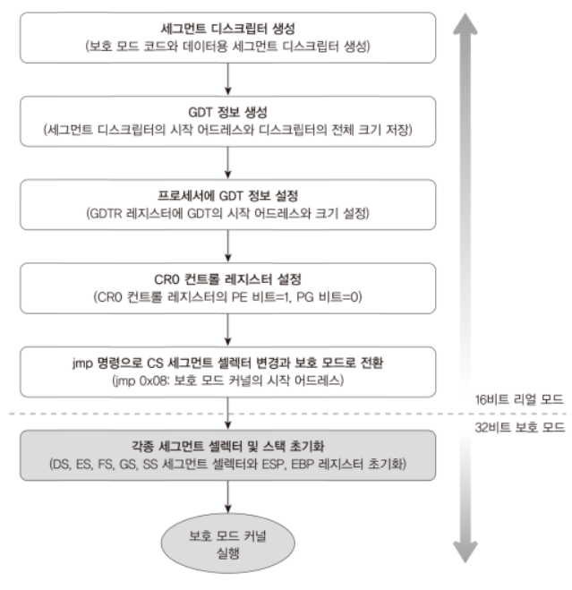
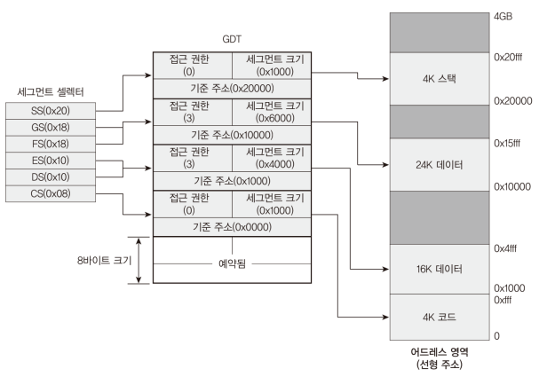
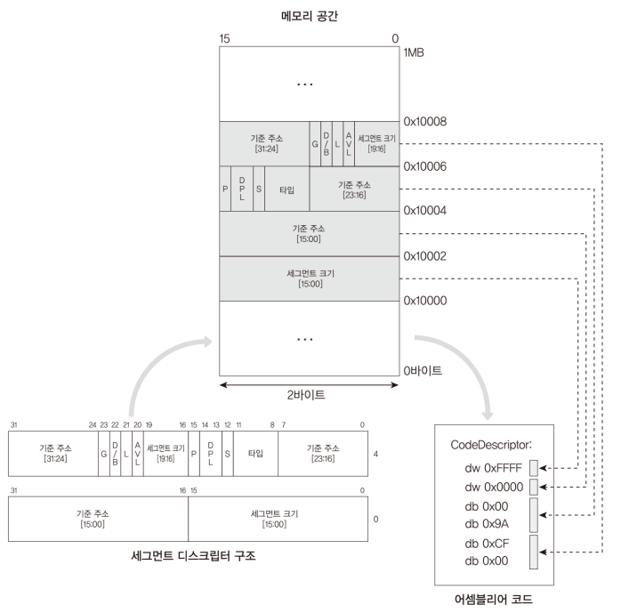
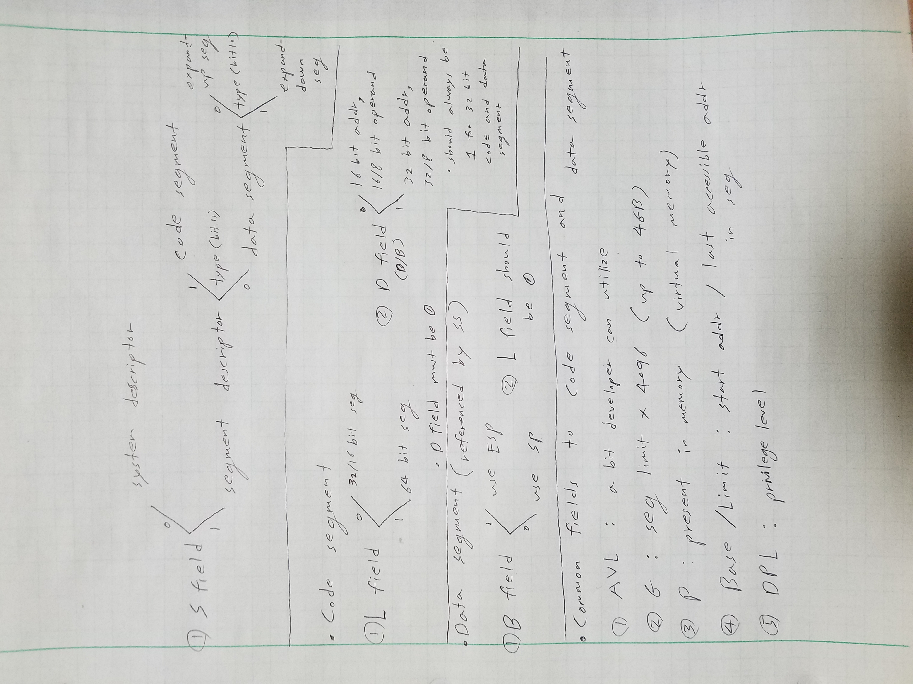
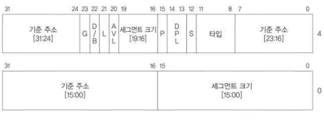
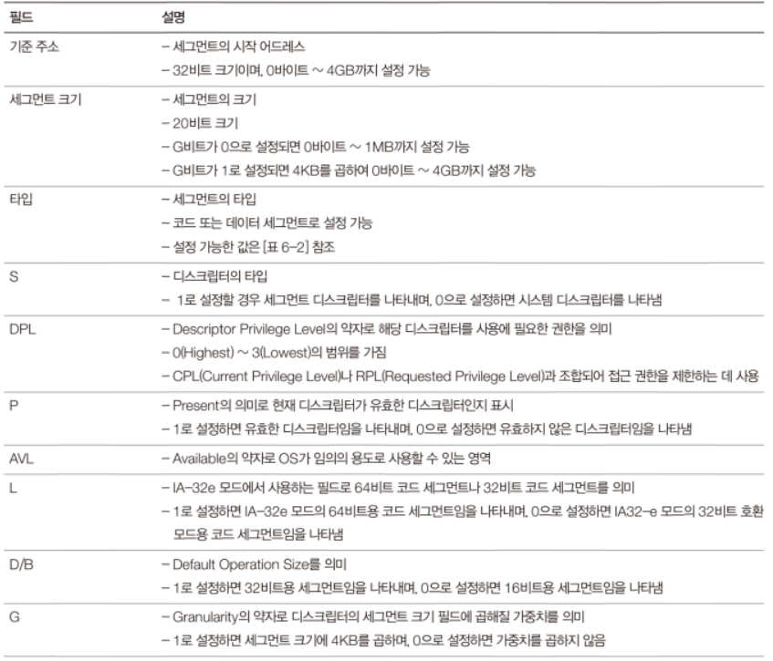
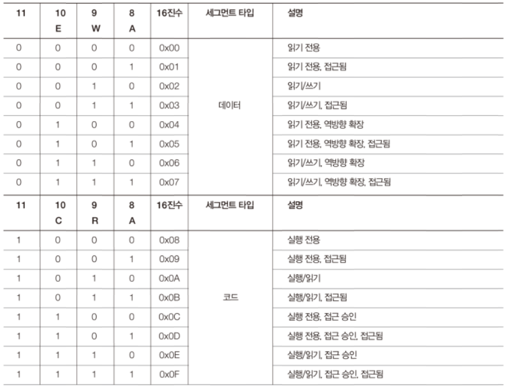

# Code: Part of EntryPoint.s about segment descriptor

```assembly
;; segment descriptors
;; Because MINT64OS utilizes IA-32 mode just to switch to IA-32e mode,
;; no processes will be running in IA-32 mode. This means that we need only 
;; two descriptors for kernels, and their privilege is ring 0 (DPL=0) which is the
;; most highest

; descriptor for CS
CODEDESCRIPTOR:
    ; BASE: 0x00000000
    ; LIMIT: 0xFFFFF
    ; P=1, DPL=0, Code Segment, Execute/Read
    ; G=1, D=1, L=0
    dw 0xFFFF ; Limit (16:0]
    dw 0x0000 ; Base (32:16)
    db 0x00   ; Base (40:32]
    db 0x9A   ; P/DPL/S/Type (48:40]
    db 0xCF   ; G/D/L/LIMIT (56:48]
    db 0x00   ; BASE (64:56]

; descriptor for DS, SS
DATADESCRIPTOR:
    ; BASE: 0x00000000
    ; LIMIT: 0xFFFFF
    ; P=1, DPL=0, Data Segment, Read/Write
    ; G=1, B=1, L=0
    dw 0xFFFF ; Limit (16:0]
    dw 0x0000 ; Base (32:16)
    db 0x00   ; Base (40:32]
    db 0x92   ; P/DPL/S/Type (48:40]
    db 0xCF   ; G/D/L/LIMIT (56:48]
    db 0x00   ; BASE (64:56]
```

# Explanation

## Protected Mode (IA-32 Mode)

1. `Protected Mode` is a operational mode that allows system software to use
features such as extended segmentation, privilege levels, paging, multitasking
and so on.

2. Protected Mode offers two memory managements techniques: `Segmentation`
and `Paging`

3. Protected Mode has more accessible registers and instruction's effective
addr and operand size can be bigger than real mode 

<div>
  <figure style='display: inline-block;'>
    
    <figcaption style='text-align: center;'>protected mode registers</figcaption>
  </figure>
</div>

## Protected Mode Segmentation

Unlike Real mode, Protected Mode Segment provides extended features

1. variable segment size (Real Mode: fixed segment size)
2. permission and owner(ring0~3) of each segment
3. `expand-down segment` whose size grows in real time
4. The biggest size of segment is 4GB (Real Mode: 64KB)
5. Because of address limit, The last accessible address is 0xFFFFFFFF
(Real Mode: 0xFFFF)

## How to use those features (in other word, how to enter Protected Mode)

Unlike Real Mode that depends on only segment registers, Paging and
Segmentation in Protected Mode utilize data structures in memory. Because of
that, you need to create and initialize and save reference to the structures
in registers.

Because instructions in Protected Mode depend on one of these two
features, you must initialize the data structures although you do not like
the memory management features. It is like mov ax, [0x0000] actually means
mov ax, [ds:0x0000] in Real Mode: Your code cannot be independent from
segmentation

1. Create data structure named `GDT` whose entry is 8 bytes `descriptor`
2. Make at least two descriptors: one for code segment, and one for data segment

    * If code segment descriptor is properly not set, it is impossible to run
    code. In worst case, computer will reboot
    * If data segment descriptor is properly not set, cpu will interrupt or
    reboot when code accesses data in memory

3. Make data structure named `GDTR` that has address to GDT and its size 
4. Load GDTR to `48 bits GDTR register`
5. Set `CR0` that changes internal logic of cpu so you can use the features
6. `far jump` to code where 32 bit code resides

    * This code set code segment register to reference the code descriptor
    * Because of cpu architecture, there are pre-fetched input in a queue after
    far jump. Those inputs are supposed to work in Protected Mode, but
    they were fetched in Real Mode. This means that cpu will process as if those
    inputs are instructions for Real Mode. Because This far jump clears all
    instructions in the queue, far jump is mandatory unless you do not have code
    after setting far jump

<div>
  <figure style='display: inline-block;'>
    
    <figcaption style='text-align: center;'>six stages to protected mode</figcaption>
  </figure>
</div>

## Segment Descriptor

Because there are a lot of meta information about the segments, the information
can not be held in registers. Instead, segment registers reference a data
structure that have the information and addr to segments: segment descriptor.
By the way, Descriptors are generic data structures for many specific features.
For segmentation feature, we need only segment descriptors that reference to
code segment or data segment


* Real Mode : `register -> segment addr`
* Protected Mode: `register -> descriptor -> segment addr`

<div>
  <figure style='display: inline-block;'>
    
    <figcaption style='text-align: center;'>IA-32 segmentation</figcaption>
  </figure>
</div>

<div>
  <figure style='display: inline-block;'>
    
    <figcaption style='text-align: center;'>IA-32 segmentation2</figcaption>
  </figure>
</div>

Before explaining about segment descriptor in detail, There are two biggest
categories of descriptors and sub categories. 

1. System Descriptors

    * Local descriptor-table(LDT) segment descriptor
    * Task-state segment(TSS) descriptor
    * Call-gate descriptors
    * interrupt-gate-descriptor
    * Trap-gate descriptor
    * Task-gate descriptor

2. Segment Descriptors

    * Code Segment descriptor
    * Data Segment descriptors
    
        * Expand-up segment descriptor
        * Expand-down segment descriptor

Because all we want to do is utilizing the segmentation feature in IA-32 mode,
Here I explain only Data segments descriptors. I think explaining features that
we do not know what they solve just makes confusion when studying. So I skip
explaining other descriptors. You will face problems where the descriptors are
needed, and I'll explain those in later chapter. Expand-down segment is not
utilized in Mint64OS, I'll skip that too. Just keep in mind that there are
various descriptors

### Segment Descriptor in detail

<div>
  <figure style='display: inline-block;'>
    
    <figcaption style='text-align: center;'>segment descriptor summary</figcaption>
  </figure>
</div>

<div>
  <figure style='display: inline-block;'>
    
    <figcaption style='text-align: center;'>segment descriptor structure</figcaption>
  </figure>
</div>

<div>
  <figure style='display: inline-block;'>
    
    <figcaption style='text-align: center;'>segment descriptor explanation</figcaption>
  </figure>
</div>

<div>
  <figure style='display: inline-block;'>
    
    <figcaption style='text-align: center;'>segment descriptor type field</figcaption>
  </figure>
</div>

### D/B flag

Performs different functions depending on whether the segment descriptor is an
executable code segment, an expand-down data segment, or a stack segment.
(This flag should `always be set to 1 for 32-bit code and data segments` and to
0 for 16-bit code and data segments.)

* `executable code segment` The flag is called the D flag and it indicates the
default length for effective addresses and operands referenced by instructions
in the segment. I f the flag is set, `32-bit` addresses and 32-bit or 8-bit
operands are assumed; if it is clear, `16-bit` addresses and 16-bit or 8-bit
operands are assumed.

* `Stack segment (data segment pointed to by the SS register)` The flag is
called the B (big) flag and it specifies the size of the stack pointer used
for implicit stack operations (such as pushes, pops, and calls). If the flag is
set, a 32-bit stack pointer is used, which is stored in the `32-bit ESP`
register; if the flag is clear, a 16-bit stack pointer is used, which is stored
in the `16-bit SP` register. I f the stack segment is set up to be an
expand-down data segment (described in the next paragraph), the B flag also
specifies the upper bound of the stack segment

### L flag

L flag indicates whether `code segment contains native 64-bit code` If L-bit is
set, then `D-bit must be cleared`. When not in IA-32e mode or for non-code
segments, bit 21 is reserved and should always be set to 0.

1. 64 bit code segment: set L flag and clear D-bit in D/B flag
2. 32 bit code segment: clear L flag
3. data segment: clear L flag

### Types

The highest order bit(bit 11) determines whether segment descriptor is code or
data segment descriptor. Lower three bits decides permission to the segment


* data segment `extend bit`(bit 10) sets the data descriptor is expand-down data
descriptor; expand-down data descriptor is utilized as a stack

* code segment `conforming bit`(bit 10) is like `setuid`.

    * less-privileged code can execute more-privileged code at current privilege
    level if conforming bit is set
    * Unlike root user in linux, more-privileged code cannot execute
    less-privileged code even if conforming bit is set

* data segment is all `non-confirming`

    * Unlike code segment, more-privileged code can access less-privileged code
    if conforming bit is set

## MINT64OS Characteristics

1. MINT64OS utilizes features offered by hardware such as multi-tasks, paging,
and threads. However, Although Protected Mode offers those features, MINT64OS
uses those features in IA-32e mode(64bit) not in IA-32 mode (Protected Mode).
Because of that you will see that there will be only two segments descriptors
with the highest privilege(ring 0) and many features in protected mode are 
disabled. To MINT64OS, IA-32 is just temporary mode that it must go through to
activate IA-32e mode.

    * Because features MINT64OS uses in IA-32e mode and features in IA-32 have
    common characteristics, protected mode features are explained in this
    chapter

## References

1. [intel segmentation and paging](./assets/intel-segmentation-and-paging.pdf)
2. [more explanation about expand-down segment](
    https://groups.google.com/g/comp.lang.asm.x86/c/v7PcHy9t1AU)
3. [expand-down-segment explanation1](
    ./assets/expalantion-about-expand-down-segment.PNG
)
4. [expand-down-segment explanation2 (same context as 2/ backup as image)](
    ./assets/expand-down-segment.PNG
)