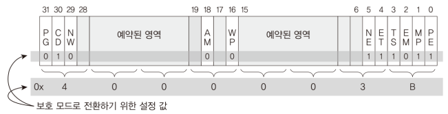
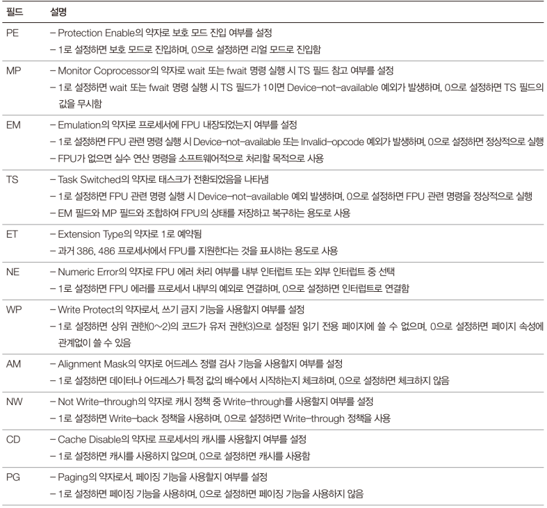

# Code: Part of EntryPoint.s about GDT/GDTR and CR0 and far jump to IA-32 mode code

```assembly
[ORG 0x00]
[BIS 16]

SECTION .text

START:
    mov ax, 0x1000
    mov ds, ax
    mov es, ax

    cli
    lgdt [GDTR]
    
    ; PG=0, CD=1, NW=0, AM=0, WP=0, NE=0, ET=1, EM=0, MP=1, PE=1
    ; CD means cache disable
    ; PE is protection enable    
    ; EM, ET, MP, PE are FPU-related fields and they are set
    ; although their feature is not used in IA-32 mode. they will
    ; be explained in detail later. Don't worry about the fields now
    mov eax, 0x4000003B
    mov cr0, eax

    ; 0x08 is offset to the code segment descriptor from GDT
    ; PROTECTEDMODE - $$ + 0x10000 is offset to the code from
    ; segment
    jmp dword 0x08: (PROTECTEDMODE - $$ + 0x10000)

[BITS 32]
PROTECTEDMODE:
    ; set code and data segment
    mov ax, 0x10 ; 0x10 = offset to data segment descriptor from gdt
    mov ds, ax
    mov es, ax ; it is not required to set es, fs, and gs
    mov fs, ax
    mov gs, ax

    ; set stack segment
    ; because bootloader is not used anymore stack is from 0x0C700 ~ 0xFFFE0
    mov ss, ax ; data segment is also used as stack segment
    mov esp, 0xFFFE
    mov ebp, 0xFFFE


; GDTR data structure
GDTR:
    dw GDTEND - GDT - 1 ; GDTR size starts from 0 which count as 1 descriptor
    dd (GDT - $$  + 0x10000) ; this EntryPoint.s starts at 0x10000

GDT:
    ; first descriptor must be null descriptor
    NULLDescriptor:
        dw 0x0000
        dw 0x0000
        db 0x0000
        db 0x00
        db 0x00
        db 0x00

; descriptor for CS
CODEDESCRIPTOR:
    ; BASE: 0x00000000
    ; LIMIT: 0xFFFFF
    ; P=1, DPL=0, Code Segment, Execute/Read
    ; G=1, D=1, L=0
    dw 0xFFFF ; Limit (16:0]
    dw 0x0000 ; Base (32:16)
    db 0x00   ; Base (40:32]
    db 0x9A   ; P/DPL/S/Type (48:40]
    db 0xCF   ; G/D/L/LIMIT (56:48]
    db 0x00   ; BASE (64:56]

; descriptor for DS, SS
DATADESCRIPTOR:
    ; BASE: 0x00000000
    ; LIMIT: 0xFFFFF
    ; P=1, DPL=0, Data Segment, Read/Write
    ; G=1, B=1, L=0
    dw 0xFFFF ; Limit (16:0]
    dw 0x0000 ; Base (32:16)
    db 0x00   ; Base (40:32]
    db 0x92   ; P/DPL/S/Type (48:40]
    db 0xCF   ; G/D/L/LIMIT (56:48]
    db 0x00   ; BASE (64:56]
GDTEND:
```
# Assembly

1. `cli` (clear interrupt) stops interrupt. To restore the interrupt, use
`sti` (store interrupt)
2. `lgdt` loads GDTR structure to register. This is for running protected mode

# Explanation

## cli and sti during switching to Protected Mode

While preparing for Protected Mode, it is good idea to ignore all interrupts
occurred. If interrupt happens when interrupt-related setting is not done,
unexpected behavior could happen. sti should be called after interrupt handler
is set.

## GDTR

<div>
  <figure style='display: inline-block;'>
    
    <figcaption style='text-align: center;'>GDTR structure</figcaption>
  </figure>
</div>

1. `48 bits` structure that points to GDT structure, collection of consecutive descriptors

2. Maximum number of descriptors in GDT is `8192`

    * 2^16 bytes / 8 bytes == 8192
    * size of a descriptor is 8 bytes
    * it seams the number is enough, but there are segments descriptors for each
    task, system descriptors for multi-tasking, so and on. To address this
    problem, x86 provides LDT(Local Descriptor Table) per each task whose role
    is similar to GDT.

3. `value of 0` in size part means GDT has one descriptor (size starts from 0 to 0xFFFF)

## CR0 (Control register)

<div>
  <figure style='display: inline-block;'>
    
    <figcaption style='text-align: center;'>CR0 structure</figcaption>
  </figure>
</div>

`CR0` control register has not only switch button to Protected Mode but also
buttons for cache, paging and FPU (floating point unit)

<div>
  <figure style='display: inline-block;'>
    
    <figcaption style='text-align: center;'>CR0 fields explanation table</figcaption>
  </figure>
</div>

## Cache

    1. Cache related fields in CR0 registers are `CD` and `NW`

    2. `Write-through` flush cache to memory every time mov to memory executed
    3. `Write-back` flushes to memory only when storage in cache is not enough
        
        * Write-back has better performance but it can make trouble when device
        is using memory-mapped io
        * memory-mapped io is a way to communicate with devices by reading and
        writing data at specific memory addr

## FPU

1. FPU related fields in CR0 register

    * EM: 0 = hardware / 1 = software
    * ET: 0 = 827 FPU / 1 = 837 FPU
    * MP: will be explained in later chapter
    * TS: will be explained in later chapter 
    * NE: 0 = Interrupt / 1 = Native Exception

2. FPU(floating point unit) is numeric coprocessor that was originally separated
chip from CPU. This chip was dedicated on PCB board, and CPU interacted with FPU
chip. However, 486 intel CPU and after integrated FPU `on-die`. 

3. Because FPU was performing calculations `asynchronously` from the core logic,
it's results would have been available after the main processor has executed
several other instructions. Since errors would also become available
asynchronously, the original PC had the error line of the FPU wired to the
interrupt controller.

4. 386 CPU could communicate with 827 FPU or 837 FPU. This means that ET is
needed to set in 386 CPU. However, from 486, `ET` should be 1

5. 486 CPU integrated the FPU on-die and added an option to signal a regular
exception rather than an interrupt. If NE is clear, FPU `native exception` is
sent vial interrupt controller

## MINT64OS Characteristics

1. Protected Mode is just temporary mode that Mint64OS pass by for IA-32e mode.
Therefore, features such as Paging, Cache, FPU, Memory Alignment Test are not
set in CR0 register. However, In IA-32e mode, the OS uses the features, and
actually needs to set fields in CR0 register. Because the features are big
topic, the explanation is in the later chapters, and for this chapter we use CR0
as button to switch to IA-32 mode, and you'll see that Mint64OS do nothing in
Protected Mode except initializing data structures for switching over to IA-32e

2. You might notice that FPU related fields in CR0 are set although I said that
MINT64OS does not activate the feature in Protected Mode. Do not worry about
those fields (MP, TS, NE, ET, EM). They will be explained in FPU chapter

3. MINT64OS set interrupt handler in IA-32e mode. Therefore, sti instruction is
called in IA-32e.

## References

1. [OSDev FPU](https://wiki.osdev.org/FPU)
2. [FPU know as x87](https://en.wikipedia.org/wiki/X87)