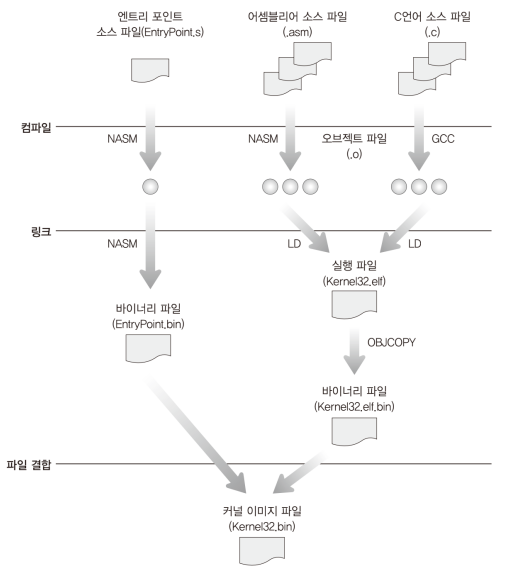
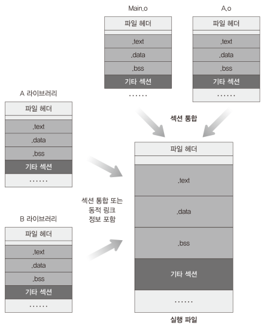
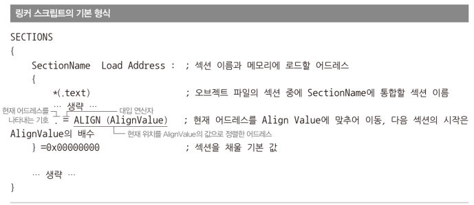
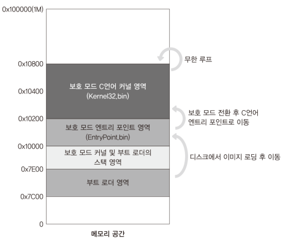

# Code: Linker Script for Code in C Language

```
OUTPUT_FORMAT("binary")
OUTPUT_ARCH(i386)

SECTIONS {
    /* code resides at 0x10200 */
    .text 0x10200 : {
        /* text section of Main file comes first in file*/
        Main.o(.text)
        /* text section of other files comes after main in the order of input */
        *(.text)
    }

    /* as .rodata data comes here, operand of instruction that references to a
     * data in .rodata is adjusted
     */
    .rodata : {
        *(.rodata)

        /* add padding to the end so .rodata is aligned to multiply of 512 */
        . = ALIGN(512);
    }

    /* discard all other sections in input files. If this is not specified,
     * ld adds the sections somewhere in the program although instruction to
     * add the sections is not in the script
     */
    /DISCARD/ : {
        *(*)
    }
}

```

# Explanation

## Linker

### What problem does Linker solve? 

When writing code, one thing we need to take care is to make sure that the code
is always loaded at the same address in the memory, so the code works as
intended. For example, let's say that you made an assembly code that includes a
message, and the code is supposed to be at 0x0000 because `mov ax, [MESSAGE]` is
converted into, like, `mov ax, 0x100`. This means that if you load the code
somewhere except 0x00, the program does not work as you intended.

If you are writing one small code, it might be easy to take care of the memory
address, but when you are writing multiple files, libraries that must be linked
with your program, calculating the address is really hard work. Thankfully,
linker does all the address calculation and links the files into one file. 
Because of Linker, when you write program in C, you do not need to think about
memory layout of a program in most cases.

One more thing: Every C code is compiled into object file with assembly code 
which is based on [ORG 0x00]. Linker changes the address based on 0x00 into
proper address

<div>
  <figure style='display: inline-block;'>
    
    <figcaption style='text-align: center;'>how to make kernel</figcaption>
  </figure>
</div>

<div>
  <figure style='display: inline-block;'>
    
    <figcaption style='text-align: center;'>how linking works</figcaption>
  </figure>
</div>

However, Linker is not magic tool that does linking automatically for you. 
Although it separate memory layout stuff from code, it stills needs instructions
for linking. The instructions is defined in `linker script`

1. `OUTPUT_FORMAT("binary")` means linked output format is binary

    * `objdump -i` shows what format is available
    * One common standard format is `ELF` which is for executable files, object
    code, and shared libraries

2. `OUTPUT_ARCH(i386)` means output machine architecture

3. `SECTIONS` describes `memory layout` of a whole program (or object files).

    * this memory layout let linker change address of instructions in assembly
    file to proper address so it can reference data without problem  
    * It does not describe how to combine the object files into a file, but you
    can somehow expect how the code will be combined into a file.

4. `. = ALIGN(512);`

    * `.` means current address counter
    * ALIGN(512) returns (current addr + value) so it is aligned to multiply
    of 512. In other words, it adds padding to the end to the output file

<div>
  <figure style='display: inline-block;'>
    
    <figcaption style='text-align: center;'>
      linker script basic template
    </figcaption>
  </figure>
</div>

## how to use gcc and ld commands

gcc and ld are commands that offers powerful features. By default, if you do
not give any options, they compile and link with optimization and under an
assumption that you are compiling code that works on hosting operating system.
Because we do not need those features, some options must be added

1. `gcc -m32 -c -ffreestanding -fno-pie -o Main.o Main.c`

    * `-m32`: compile code for x86 system
    * `-c`: give object output instead of complete binary file
    * `-ffreestanding`: the code does not use standard library, so do not
    change functions that have function declaration same as those in standard
    library
    * `-fno-pie`: do not add _GLOBAL_OFFSET_TABLE_ to object symbol table.
    The symbol is a feature offered by gcc, but we do not need it

2. `ld -T binary_i386.x -nostdlib -o Kernel32.bin Main.o`

    * `-T binary_i386.x` is read script named binary_i386.x
    * `-nostdlib` means do not search functions or constants outside, so
    symbols defined somewhere are not linked into program 

## MINT64OS Characteristics

1. From here, code will be written in C language except some special case such
as switching to IA-32e mode. 32 bit code will be at `0x10200` and the code will
be split into multiple files. Since the memory layout considering the 0x10200
address is defined in linker script, there is no more memory-layout related code
in file. 

<div>
  <figure style='display: inline-block;'>
    
    <figcaption style='text-align: center;'>
      MINT64OS memory layout
    </figcaption>
  </figure>
</div>

2. QEMU cannot read data from floppy if the image is not aligned to multiply of
sector. so ALIGN(512) is added to the end of .rodata. if `. = ALIGN(512);` is
at the end of sections or at the end after .rodata section, linker does not add
padding to the end, so it is important to put ALIGN inside section

## References

1. [ld documentation](
    https://sourceware.org/binutils/docs/ld/index.html#SEC_Contents)

2. [What do linkers do?](
    https://stackoverflow.com/questions/3322911/what-do-linkers-do
)

3. [Why does ld include sections in the output file that are not specified in the link command file?](
    https://stackoverflow.com/questions/41511317/why-does-ld-include-sections-in-the-output-file-that-are-not-specified-in-the-li/41512501#41512501
)

4. [ALIGN in Linker Scripts](
    https://stackoverflow.com/questions/8458084/align-in-linker-scripts/8461938#8461938
)

5. [undefined reference to _GLOBAL_OFFSET_TABLE_](
    https://stackoverflow.com/questions/45422374/undefined-reference-to-global-offset-table-only-when-generating-binaries
)

6. [What does “ENTRY” mean in a linker script?](
    https://stackoverflow.com/questions/40606700/what-does-entry-mean-in-a-linker-script/40690736#40690736
)