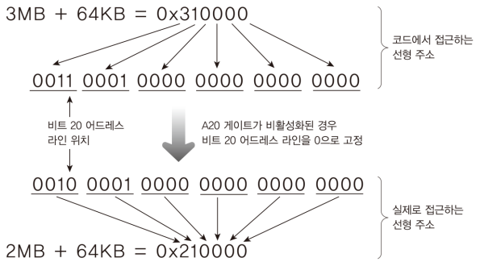
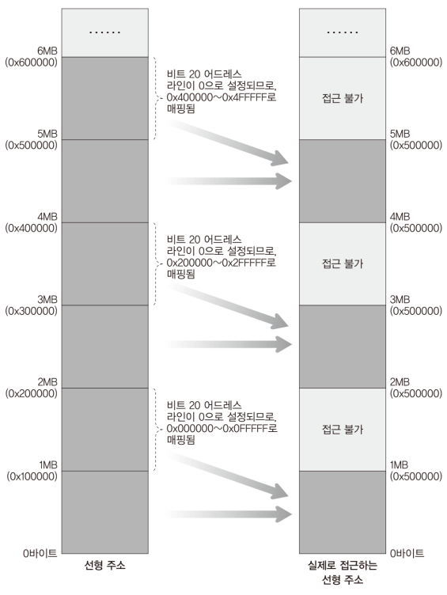

# Code: Main.c that initializes IA-32e mode Kernel memory area

```c
#include "Types.h"

void kPrintString(int iX, int iY, const char *pcString);
BOOL kInitializeKernel64Area(void);

void Main(void) {
    DWORD i;

  	kPrintString(0, 3, "C Language Kernel Started~!!!");

    // Initialize IA-32e mode kernel area with value of 0x00
    // area: 1MB ~ 6MB
    kInitializeKernel64Area();
    kPrintString(0, 4, "IA-32e Kernel Area Initialization Complete");

	while (1);
}

void kPrintString(int iX, int iY, const char *pcString) {
	CHARACTER *pstScreen = (CHARACTER *) 0xB8000;
    int i;

    pstScreen += iY * 80 + iX;

    for (i = 0; pcString[i] != 0; i++) {
    	pstScreen[i].bCharacter = pcString[i];
    }
}

// initialize IA-32e mode kernel area with 0x00
// the area for IA-32e mode Kernel is [1MB, 6MB)
BOOL kInitializeKernel64Area(void) {
    DWORD* pdwCurrentAddress = (DWORD*) 0x100000;

    while ( (DWORD) pdwCurrentAddress < 0x600000) {
        *pdwCurrentAddress = 0x00;

        // check if 0x00 is written to current addr
        if (*pdwCurrentAddress != 0) {
            return FALSE;
        }
        pdwCurrentAddress++;
    }
    return TRUE;
}
```

# Explanation

## What does the code do?

Above code initialize memory area from 1MB to 6MB. You might think that is it 
unnecessary work since 64 bits kernel image will be copied. The reason is that
IA-32e Kernel image contains `.bss section` which is about uninitialized data.
When IA-32 Kernel copies IA-32e Kernel image to memory, it adds area for
uninitialized data to memory. If the area is not initialized with default
value, there is a possibility that code referencing the uninitialized area does
not work as intended. To prevent this case, initializing memory area is
required.

If you compile this code, some of you might encounter a situation that the
program does not work. This is because A20 Gate is deactivated. Old QEMU does
not activate A20 Gate by default, but I checked that qemu with 6.0 version has
A20 Gate activated by default.

Without A20 Gate activated, accessing 1MB ~ 2MB actually accesses 0MB ~ 1MB
that contains MINT64OS Kernel

## A20 Gate

When people used XT PC, the maximum accessible memory address was 1MB.
Although Real Mode memory segmentation calculation let you access `above 1MB`
(`0xFFFF:0xFFFF` = 0x10FFEF), only 0x00FFEF was recognized due to XT's hardware
limit. Only first 20 bits could be used. And there comes AT PC which allows
to access up to 16MB memory address.

The problem is that some programs designed for XT PC does not work on AT PC
due to the XT's unique address calculation. Some XT programs depended on the
calculation. To address the compatibility problem, AT PC made A20 Gate which can
activate or deactivate `20th bit`. This feature is still alive, so to access
above 1MB without problem, you need to activate A20 Gate.

Some newer PC's bios activate A20 Gate by default.

### What happens in Protected Mode without Gate20 Activated?

Gate20 just clears bit 20. This means that you can still use 32 bits address,
but bit 20 becomes 0.

<div>
  <figure style='display: inline-block;'>
    
    <figcaption style='text-align: center;'>
      change of address without A20 activated
    </figcaption>
  </figure>
</div>

Because of A20 Gate, 0~1 MB, 2~3 MB, 4~5 MB, 6~7 MB, ... are accessible.

<div>
  <figure style='display: inline-block;'>
    
    <figcaption style='text-align: center;'>
      accessible memory area without A20 activated
    </figcaption>
  </figure>
</div>
