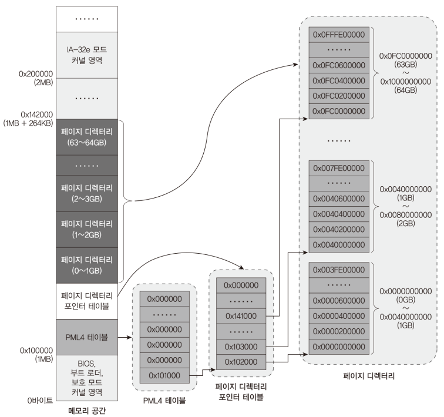

# Code: Page.h and Page.c for initializing paging related structures
```c
/*
 * Page.h contains macros and structure definition for page entries.
 * Because entries has a lot of bits in common, I decided to use the same
 * structure for all entries. Just keep in mind that when you initialize a
 * entry that contains page frame address, use macros for the entry. The macros
 * is labeled under "uncommon"
 * 
 * every entry consists of 8 bytes, but 8 bytes cannot be initialized at once.
 * This code expects you to give upper part and lower part of entry separately 
 * 
 * reference a picture, IA-32e paging structure entries, in 9-1.md
 */


#ifndef __PAGE_H__
#define __PAGE_H__

#include "Types.h"


// common in all entries, 32 bits lower parts
#define PAGE_FLAGS_P     0x00000001   // Present
#define PAGE_FLAGS_RW    0x00000002   // Read/Write
#define PAGE_FLAGS_US    0x00000004   // User/Supervisor ; 1=user level
#define PAGE_FLAGS_PWT   0x00000008   // Page Level Write-through
#define PAGE_FLAGS_PCD   0x00000010   // PAGE Level Cache Disable
#define PAGE_FLAGS_A     0x00000020   // Accessed

// 32 bits upper part
#define PAGE_FLAGS_EXB   0x80000000   // Execute Disable bit

// end of common


// start of uncommon
// only for entry that has addr to page frame, 32 bits lower parts
#define PAGE_FLAGS_D     0x00000040   // Dirty
#define PAGE_FLAGS_PS    0x00000080   // Page Size
#define PAGE_FLAGS_G     0x00000100   // Global

// exception: 4KB entry's PAT is  bit 7; MINT64OS uses IA32-e mode 2MB-4 stages
#define PAGE_FLAGS_PAT   0x00001000   // Page Attribute Table Index

// end of uncommon


#define PAGE_FLAGS_DEFAULT (PAGE_FLAGS_P | PAGE_FLAGS_RW)
#define PAGE_TABLE_SIZE  0x1000  // each table size (8 bytes * 512)
#define PAGE_MAXENTRYCOUNT 512 // max number of entries in a table

#define PAGE_DEFAULTSIZE 0x200000 // size of page frame: 2MB

#pragma pack(push, 1)

// base structure for all entries
typedef struct kPageTableEntryStruct {
	DWORD dwAttributeAndLowerBaseAddress;
	DWORD dwUpperBaseAddressAndEXB;
} PML4ENTRY, PDPTENTRY, PDENTRY, PTENTRY;

#pragma pack(pop)

// initialize paging tree structure for MINT64OS so you can
// use up to 64GB physical memory.
// The data structure live at 0x100000 and its size is 264KB
void kInitializePageTables(void);

// general function for initializing all page entry
// This function is used in kInitializePageTables function
void kSetPageEntryData(PTENTRY *pstEntry, DWORD dwUpperBaseAddress,
		DWORD dwLowerBaseAddress, DWORD dwLowerFlags, DWORD dwUpperFlags);

#endif  /*__PAGE_H__*/
```

```c
#include "Page.h"

// initialize paging tree structure for MINT64OS so you can
// use up to 64GB physical memory.
// the data structure lives at 0x100000 (1MB) and
// it consists of 1 PML4 table, 1 page directory pointer table,
// 64 page directories => (4KB + 4KB + 4KB * 64 = 264KB)
void kInitializePageTables(void) {
    PML4ENTRY *pstPML4TEntry;
    PDPTENTRY *pstPDPTEntry;
    PDENTRY *pstPDEntry;
    DWORD dwMappingAddress;
    int i;

    // initialize PML4 table

    // initialize first entry 
    pstPML4TEntry = (PML4ENTRY *) 0x100000;

    // size of PML4 table is 4KB so first PDPTENTRY address
    // is (1MB + 4KB) which is 0x101000 in hex
    kSetPageEntryData(&(pstPML4TEntry[0]), 0x00, 0x101000,
    		PAGE_FLAGS_DEFAULT, 0);

    // Since we support up to 64GB, one PML4T entry is enough
    // set with 0 from second entries
    for (i = 1; i < PAGE_MAXENTRYCOUNT; i++) {
    	kSetPageEntryData(&(pstPML4TEntry[i]), 0, 0, 0, 0);
    }
    // end of creating PML4 table

    // initialize one page directory pointer table

    // one PDP table can map up to 512GB, so only one table is necessary
    // for 64 GB mapping 
    pstPDPTEntry = (PDPTENTRY *) 0x101000;
    for (i = 0; i < 64; i++) {
    	// (1MB + 4KB) + 4KB = 0x102000
        kSetPageEntryData(&(pstPDPTEntry[i]), 0,
        		0x102000 + (i * PAGE_TABLE_SIZE), PAGE_FLAGS_DEFAULT, 0);
    }

    // set 0 from 65th entries
    for (i = 64; i < PAGE_MAXENTRYCOUNT; i++) {
        kSetPageEntryData(&(pstPDPTEntry[i]), 0, 0, 0, 0);
    }
    // end of creating PDP table

    // start of creating page directory tables

    // first page directory table address and also
    // first page entry address
    pstPDEntry = (PDENTRY *) 0x102000;
    dwMappingAddress = 0;
    for (i = 0; i < 64 * PAGE_MAXENTRYCOUNT; i++) {
    	// since we cannot represent 64 bit address in IA-32 mode,
    	// "(i * PAGE_DEFAULTSIZE) >> 32" cannot be used for upper
    	// base address. so I first right-shifted 20 bits and multiplies
    	// by i and then right-shifted 12 bits
        // remember that only page entry that has pointer to page frame has
        // PAGE_FLAGS_PS.
        kSetPageEntryData(&(pstPDEntry[i]),
        		(i * (PAGE_DEFAULTSIZE >> 20)) >> 12, dwMappingAddress,
				PAGE_FLAGS_DEFAULT | PAGE_FLAGS_PS, 0);
         dwMappingAddress += PAGE_DEFAULTSIZE;
    }
}

// general function for initializing all page entry
// This function is used in kInitializePageTables function
void kSetPageEntryData(
    PTENTRY *pstEntry,
    DWORD dwUpperBaseAddress,
    DWORD dwLowerBaseAddress,
    DWORD dwLowerFlags,
    DWORD dwUpperFlags) {
    pstEntry->dwAttributeAndLowerBaseAddress =
    		dwLowerBaseAddress | dwLowerFlags;

    // and operator is because only 8 bits of upper part 
    // for address
    pstEntry->dwUpperBaseAddressAndEXB =
        (dwUpperBaseAddress & 0xFF) | dwUpperFlags;
}
```

# Explanation

## What does the code do?

kInitializePageTables function is called in Main.c. This function initializes 
page tree data structure from 0x100000(1MB)

## MINT64OS Characteristics

1. MINT64OS uses IA-32e mode `2MB - 4stages`

    * uses 1 PML4 table, 1 directory pointer table, 64 directories 
    * each table has 4KB (512 * 8 bytes) so overall size of tree structure is
    `264 KB` (4 + 4 + 64 * 4)

2. In MINT64OS, linear address is `1-to-1` mapped to physical address. For
example, translation of 0x123456 of linear address is 0x123456 of physical
address. Because this is not for product-level operating system, I made it
simple so debugging can be done easily

3. cache is enabled and other features related to paging is disabled.

<div>
  <figure style='display: inline-block;'>
    
    <figcaption style='text-align: center;'>
      MINT64OS paging memory layout
    </figcaption>
  </figure>
</div>
