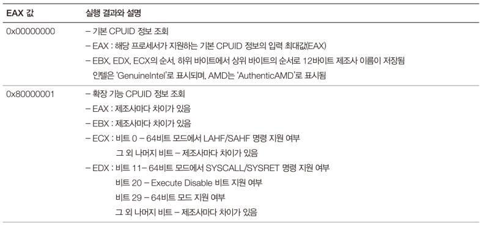
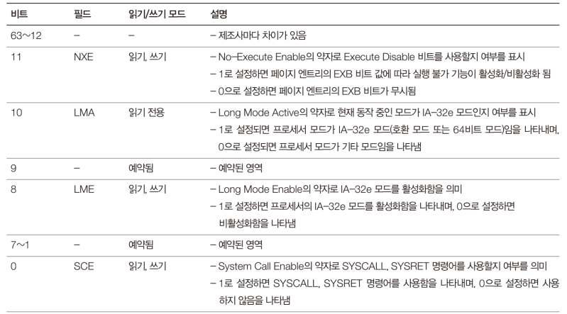
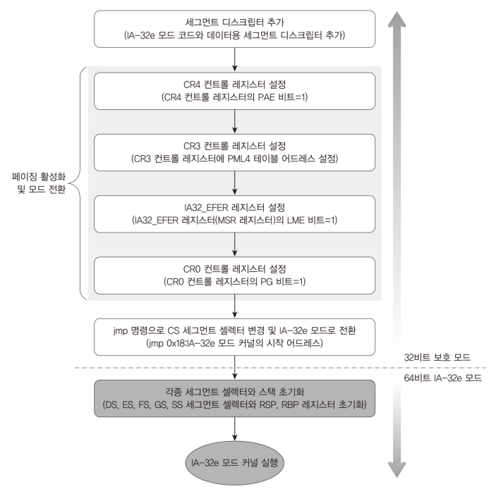

# Code: ModeSwitch.h and ModeSwitch.asm 

```assembly
#ifndef __MODESWITCH_H__
#define __MODESWITCH_H__

#include "Types.h"

// execute CPUID instruction
// params:
//   dwEAX: information to look up
//     possible values: [0x00000000(basic info), 0x80000001(extension info)]
//   pdwEAX: address where EAX returned by CPUID instruction will resides
//   pdwEBX: address where EBX returned by CPUID instruction will resides
//   pdwECX: address where ECX returned by CPUID instruction will resides
//   pdwEDX: address where EDX returned by CPUID instruction will resides 
void kReadCPUID(
    DWORD dwEAX,
	DWORD *pdwEAX,
    DWORD *pdwEBX,
    DWORD *pdwECX,
    DWORD *pdwEDX
);

// switch protected mode to long mode
// this function modifies CR0, CR3, CR4, and IA32_EFER so cpu switches to IA-32e
// with cache and paging enabled. The Cache is write-through cache mode, and
// other paging-specific features are disabled.
// Before calling this function, it is required to initialize IA-32e paging
// tree structure at 0x100000(1MB)
void kSwitchAndExecute64bitKernel(void);

#endif /* 01_KERNEL32_SOURCE_MODESWITCH_H_ */
```

```assembly
[BITS 32]

; disclose following functions to C language code
global kReadCPUID, kSwitchAndExecute64bitKernel

SECTION .text

; CPUID operation provides CPU specific information
; This function shows if long mode is supported
; return CPUID to the address pointed by the params
; PARAM: DWORD dwEAX, DWORD *pdwEAX, *pdwEBX, *pdwECX, *pdwEDX
kReadCPUID:
    ; convention for calling function in 32 bit
    push ebp
    mov ebp, esp
    ; saving previously used registers before using them
    push eax
    push ebx
    push ecx
    push edx
    push esi

    ; dwEAX is parameter for CPUID operation
    mov eax, dword [ebp + 8]
    cpuid

    ; moves returned value to memory address referenced by pointers
    mov esi, dword [ebp + 12]
    mov dword [esi], eax

    mov esi, dword [ebp + 16]
    mov dword [esi], ebx

    mov esi, dword [ebp + 20]
    mov dword [esi], ecx

    mov esi, dword [ebp + 24]
    mov dword [esi], edx

    pop esi
    pop edx
    pop ecx
    pop ebx
    pop eax
    pop ebp

    ret

; switch protected mode to long mode
; this function modifies CR0, CR3, CR4, and IA32_EFER so cpu switches to IA-32e
; with cache and paging enabled. The Cache is write-through cache mode, and
; other paging-specific features are disabled.
; Before calling this function, it is required to initialize IA-32e paging
; tree structure at 0x100000(1MB)
kSwitchAndExecute64bitKernel:
    ; remember that you can not directly set bit to control register
    mov eax, cr4
    or eax, 0x20			; set PAE bit (bit 5) on
    mov cr4, eax


    mov eax, 0x100000	; set PML table address (1 MiB)
    mov cr3, eax

    ; rdmsr get parameter from ecx which is address of msr
    mov ecx, 0xC0000080	; set IA32_EFER address
    rdmsr				; return data to edx (upper) and eax (lower)
    or eax, 0x0100		; set Long Mode Enable (LME) on for IA-32e mode
    wrmsr               ; switch long mode on

    ; currently using code segment descriptor for protected mode, so below
    ; code is running under compatibility mode without paging feature 
    ; set NW bit (bit 29) = 0, CD bit (bit 30) = 0, PG bit (bit 31) = 1
    ; so activates cache and page capability
    mov eax, cr0
    or eax, 0xE0000000	; set NW = 1, CD = 1, PG = 1
    xor eax, 0x60000000	; set NW = 0, CD = 0
    mov cr0, eax        ; switch paging feature on

    jmp 0x08:0x200000	; set CS to IA-32e's code descriptor and jump to
    						; 0x200000 (2 MiB) where 64 bit code exists

    jmp $					; this code never be run
```

# Explanation

## Assembly

1. `CPUID` instruction shows CPU basic and extended information

    * uses EAX as parameter to choose basic or extended information to show
    * returns data to EAX, EBX, ECX, and EDX
    * Depending on `manufacturer`, the returned bits should be analyzed
    differently except some bits

    <div>
      <figure style='display: inline-block;'>
        
        <figcaption style='text-align: center;'>
            CPUID instruction explanation
        </figcaption>
      </figure>
    </div>

2. `rdmsr` and `wrmsr` reads and writes data on MSR(Model Specific Register)

    * Unlike general registers or control registers, model specific registers
    cannot be accessed by `mov` instruction

    * Every model specific register has `its own address`. It is like Port I/O

    * MSR belongs to one of 6 categories

        * Debugging And Performance Monitoring
        * Machine-Check
        * Memory Type Range Registers (MTRRs)
        * Thermal And Power Management
        * Instruction-Specific Support
        * Processor Feature/Mode Support

    * Like CPUID instruction, manufacturer has different way to use MSR

3. `IA32_EFER` is MSR under `Processor Feature/Mode Support`. It's address is
`0xC000080`.

    <div>
      <figure style='display: inline-block;'>
        
        <figcaption style='text-align: center;'>
            IA32_EFER explanation
        </figcaption>
      </figure>
    </div>

    * `LME (Long Mode Enable)` decides long mode

## Note

1. In Mint64OS, there are 7 stages to switch from protected mode to long mode

<div>
    <figure style='display: inline-block;'>
    
    <figcaption style='text-align: center;'>
        7 stages from protected mode to long mode
    </figcaption>
    </figure>
</div>