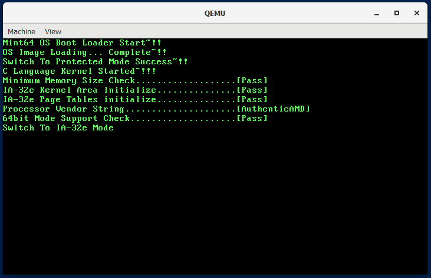

# Code: Part of Main.c that switch to long mode 
```c
    // initialize page table tree for IA-32e mode kernel
    // area: 1MB ~ (1MB + 264KB)
    kPrintString(0, 6, "IA-32e Page Tables initialize...............[    ]");
    kInitializePageTables();
    kPrintString(45, 6, "Pass");


    // check if CPU supports long mode by reading CPU info
    DWORD dwEAX, dwEBX, dwECX, dwEDX;
    char vcVendorString[13] = {0,};
    kReadCPUID(0x00, &dwEAX, &dwEBX, &dwECX, &dwEDX);
    // name of manufacturer is stored at ebx, edx, ecx in order
    *(DWORD *)vcVendorString = dwEBX;
    *((DWORD *)vcVendorString + 1) = dwEDX;
    *((DWORD *)vcVendorString + 2) = dwECX;

    kPrintString(0, 7, "Processor Vendor String"
    		           ".....................[            ]");
    kPrintString(45, 7, vcVendorString);

    // check if CPU supports 64 bit mode
    kReadCPUID(0x80000001, &dwEAX, &dwEBX, &dwECX, &dwEDX);

    kPrintString(0, 8, "64bit Mode Support Check....................[    ]");
    if (dwEDX & (1 << 29)) {
    	kPrintString(45, 8, "Pass");
    }
    else {
    	kPrintString(45, 8, "Fail");
    	kPrintString(0, 9, "This processor does not support 64 bit mode~!!");
        // stop processing
    	while (1);
    }

    // switch to long mode. 
    // This function execute code at 0x200000(2MB) Because of internal
    // implementation, current stack is not counted on anymore. 64 bit kernel
    // will not be able to go back to parent function calling it.
    kPrintString(0, 9, "Switch To IA-32e Mode");
    kSwitchAndExecute64bitKernel();

    // this code will never be executed
	while (1);

```

# Explanation

## What does this code do?

1. Read CPU info and prints if the CPU manufacturer is AMD or Intel.
2. print success message if CPU offers long mode. otherwise, execute infinite
loop

## Note

1. After writing code up to 10-3, you can test this Operating System

<div>
    <figure style='display: inline-block;'>
    
    <figcaption style='text-align: center;'>
        early result of Ch10
    </figcaption>
    </figure>
</div>

2. From 10-4, There will be

    * EntryPoint.s, assembly code for long mode
    * 64 bit c code
    * linker script for 64 bit kernel
    * change in ImageMaker.c, a utility program 
