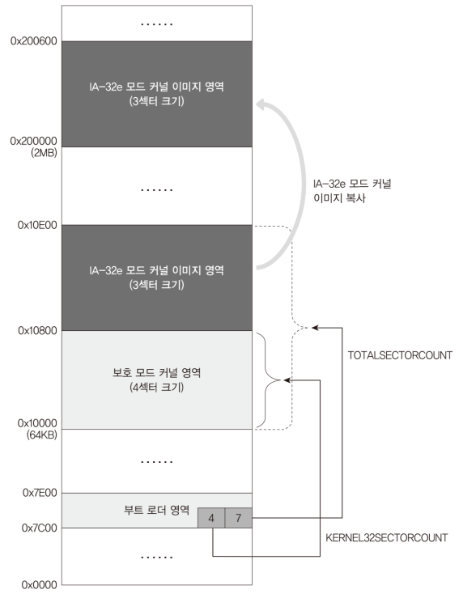
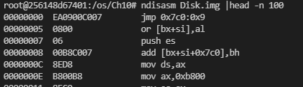

# Code: part of 01.Kernel32/Main.c that copies 64 bit kernel to 0x200000

```c

void Main(void) {
	// more code before...

	// copy IA-32e mode kernel in somewhere under address 1MiB
    // to 0x200000 (2Mbyte)
    kPrintString(0, 9, "Copy IA-32e Kernel To 2M Address............[    ]");
    kCopyKernel64ImageTo2Mbyte();
    kPrintString(45, 9, "Pass");

    // switch to long mode. 
    // This function execute code at 0x200000(2MB) Because of internal
    // implementation, current stack is not counted on anymore. 64 bit kernel
    // will not be able to go back to parent function calling it.
    kPrintString(0, 9, "Switch To IA-32e Mode");
    kSwitchAndExecute64bitKernel();
}


// Copy IA-32e mode kernel somewhere under address 1MB
// to 0x20000 (2Mbyte)
void kCopyKernel64ImageTo2Mbyte(void) {
    WORD wKernel32SectorCount, wTotalKernelSectorCount;
    DWORD * pdwSourceAddress, *pdwDestinationAddress;
    int i;
    int iKernel64ByteCount;

    // count of overall sectors except bootloader is at
    // 0x7c05 and count of protected mode kernel is at
    // 0x7c07
    wTotalKernelSectorCount = *((WORD *) 0x7c05);
    wKernel32SectorCount = *((WORD *) 0x7c07);

    pdwSourceAddress = (DWORD *) (0x10000 + (wKernel32SectorCount * 512));
    pdwDestinationAddress = (DWORD *) 0x200000;

    iKernel64ByteCount = 512 * (wTotalKernelSectorCount - wKernel32SectorCount);
    for (i = 0; i < iKernel64ByteCount / 4; i++) {
    	// copy 4 bytes at once
    	*pdwDestinationAddress = *pdwSourceAddress;
    	pdwDestinationAddress++;
    	pdwSourceAddress++;
    }
}

```


# Explanation

## What does the code do?

1. Bootloader.asm loads the whole image to 0x10000. Instead of reading the
kernel64 from disk, Main.c reads Kernel64 part in memory, and copies to
0x20000. Because it is required to know where Kernel64 starts, it accesses
TOTALKERNELSECTORCOUNT, KERNEL32SECTORCOUNT in Bootloader.asm.

2. TotalKernelSectorCount and Kernel32SectorCount constants of Bootloader.asm
cannot be accessed by name in C code because it was not linked with other object
files. Therefore, Main.c directly read values at `0x7c05` and `0x7c07` which
contains the constants

	<div>
		<figure style='display: inline-block;'>
		
		<figcaption style='text-align: center;'>
			diagram about how kernel64 is copied
		</figcaption>
		</figure>
	</div>

	<div>
		<figure style='display: inline-block;'>
		
		<figcaption style='text-align: center;'>
			location of constants
		</figcaption>
		</figure>
	</div>

3. ndisasm shows assembly instructions starting from offset 0. The first column
is just layout of program in disk. Actual addresses of the constants are
`0x0C70 + 0x05` and `0x0C70 + 0x07`


## MINT64OS Characteristics

1. Memory Layout up to CH10

    * start(inclusive) ~ end(exclusive)
    * 0x00000  ~ 0x00400  (Interrupt Vector Table)
    * 0x07C00  ~ 0x07E00  (Bootloader)
    * 0x07E00  ~ 0x10000  (Stack for real mode and protected mode)
    * 0x10000  ~ 0x10400  (32 bit code of OS; EntryPoint.S + Main.c + ...)
    * 0xA0000  ~ ...      (video memory for graphic mode)
    * 0xB8000  ~ ...      (video memory for text mode)
    *
    * 0x100000(1MB) ~ 0x142000(1MB+264KB) (IA-32 mode page table tree structure)
	* 
	* 0x200000(2MB) ~ ... (64 bit code of OS; EntryPoint.S + Main.c + ...)
	* 0x600000(6MB) ~ 0x6FFFFF(7MB) (Stack for long mode)