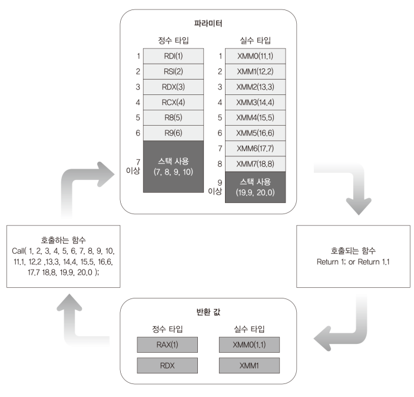

# Code: AssemblyUtility.asm that can read or write byte from I/O ports

```Assembly
[BITS 64]

SECTION .text

; read a byte from port
; or write a byte to port
global kInPortByte, kOutPortByte

; function that reads one byte from port
; this function follows IA-32e mode function convention
; param:
;   port address (word): memory address where data is stored
kInPortByte:
    push rdx
    mov rax, 0	 ; initialize register to zero
    mov rdx, rdi ; move first parameter (port addr) to rax
    in al, dx    ; read byte

    pop rdx
    ret


; function that writes one byte to port
; this function follows IA-32e mode function convention
; param:
;   port address (word): I/O port address to write data
;   data (byte): data to write
kOutPortByte:
    push rdx
    push rax

    mov rdx, rdi ; move first parameter (port addr) to rdi
    mov rax, rsi ; move second parameter (data) to rax
    out dx, al   ; write byte

    pop rax
    pop rdx
    ret
```
# Explanation

## What does this code do?

1. PS/2 Controller (often called a Keyboard controller) is located on the
motherboard, and it uses I/O ports to communicate with CPU. The above
code is utility functions that keyboard-related code depends on.

2. The functions are simple. kInPortByte reads data from a I/O port address and
kOutputByte writes data to a I/O port address

## Long mode calling convention

1. Unlike protected mode, long mode utilizes `registers first` for parameters.
If number of registers for parameters is not enough, `stack` is also utilizes
for extra parameters.

2. Depending on `parameter type`, they are stored in the following order

    * Integer: RDI, RSI, RDX, RCX, R8, R9 (6 registers)
    * Float: XMM0, XMM1, XMM2, XMM3, XMM4, XMM5, XMM6, XMM7 (8 registers)

3. Unlike protected mode, `left parameter` is inserted into register or stack
first. Right-most one is the last.

4. Depending on `return type` they are stored in different registers in the
following order. Only if the return value size is big, two registers are used

    * Integer: RAX, RDX
    * Float: XMM0, XMM1

<div>
    <figure style='display: inline-block;'>
    
    <figcaption style='text-align: center;'>
        long mode calling convention
    </figcaption>
    </figure>
</div>