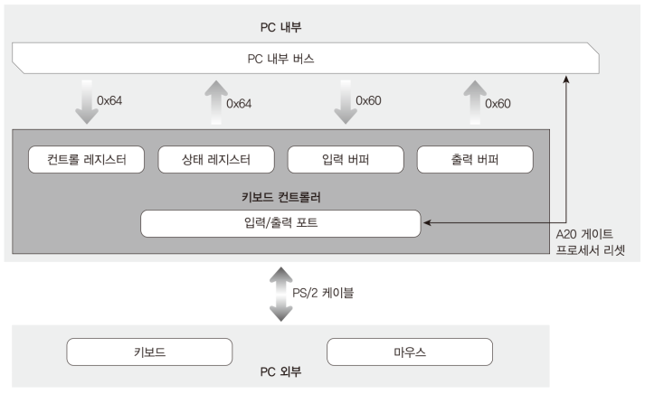
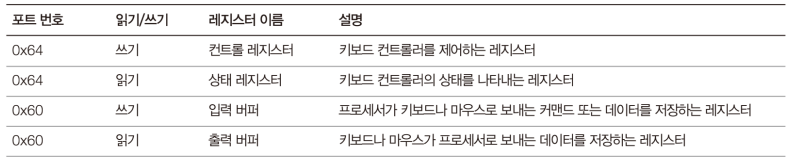
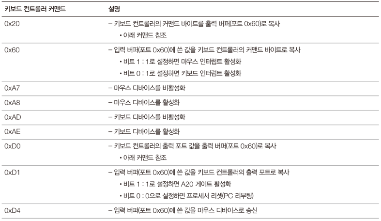
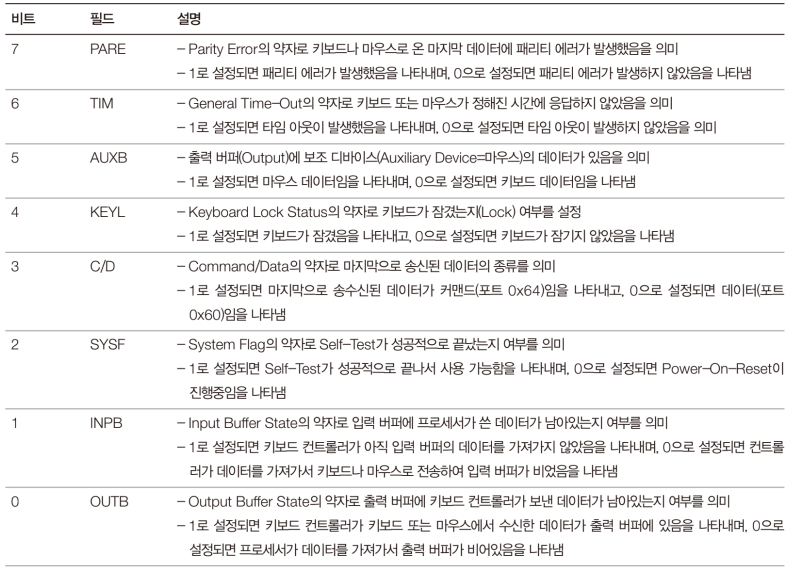
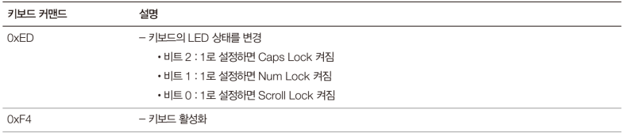

# Code: Keyboard[.c, .h] that has functions handling  keyboard controller

```c
#include "Types.h"
#include "AssemblyUtility.h"
#include "Keyboard.h"

// check if output buffer of PS/2 Controller is full.
BOOL kIsOutputBufferFull(void) {
	// read state register from PS/2 Controller
	// if bit 0 is set to 1, PS/2 Controller filled buffer
	// with data sent by keyboard
	if (kInPortByte(0x64) & 0x01) {
		return TRUE;
	}
	return FALSE;
}


// check if input buffer of PS/2 Controller is full.
// info:
//   PS/2 Controller shares a register, called data register for input buffer
//   and output buffer.
//   this function is used when command is needed to sent to keyboard
BOOL kIsInputBufferFull(void) {
	// read state register from PS/2 Controller
	// if bit 1 is set to 1, the data in data register is not flushed to
    // keyboard yet
	if (kInPortByte(0x64) & 0x02) {
		return TRUE;
	}
	return FALSE;
}


// activate keyboard, so user can get data from keyboard
// info:
//   this function activates PS/2 Controller and
//   keyboard itself
BOOL kActivateKeyboard(void) {
    int i, j;

    // activate keyboard feature of PS/2 Controller
    // writing to 0x64: controller register
    // reading from 0x64: command register
    kOutPortByte(0x64, 0xAE);

    // Keyboard is not as fast as CPU. it is necessary to wait for input buffer
    // is filled. 0xFFFF is just arbitrary number that I think is enough
    // loop counter for waiting. If buffer is full after 0xFFFF, buffer is
    // ignored and activation command is sent
    for (i = 0; i < 0xFFFF; i++) {
        if (!kIsInputBufferFull()) {
            break;
        }
    }

    // send keyboard activation command to keyboard
    kOutPortByte(0x60, 0xF4);

    // Because keyboard sends acknowledge code for every command,
    // it is necessary to wait for the code. it is possible that
    // output buffer is filled with some key data before ACK code,
    // transmitted data is checked 100 times
    for (j = 0; j < 100; j++) {
        for (i = 0; i < 0xFFFF; i++) {
            if (kIsOutputBufferFull()) {
                break;
            }
        }
        // acknowledge code: 0xFA
        if (kInPortByte(0x60) == 0xFA) {
            return TRUE;
        }
    }
    return FALSE;
}


// read byte from output buffer
// caution:
//   if there is no data in output buffer, computer is freezed
BYTE kGetKeyboardScanCode(void) {
    while (!kIsOutputBufferFull());
    // read from output buffer (data register)
    return kInPortByte(0x60);
}


// switch keyboard LED on or off
BOOL kChangeKeyboardLED(
    BOOL bCapsLockOn,
    BOOL bNumLockOn,
	BOOL bScrollLockOn
) {
    int i, j;

    // wait for input buffer to be empty
    for (i = 0; i < 0xFFFF; i++) {
        if (!kIsInputBufferFull()) {
            break;
        }
    }
    // keyboard command that signals LED change: 0xED
    kOutPortByte(0x60, 0xED);

    // wait for ACK code from keyboard
    for (j = 0; j < 100; j++) {
        for (i = 0; i < 0xFFFF; i++) {
            if (kIsOutputBufferFull()) {
                break;
            }
        }
        if (kInPortByte(0x60) == 0xFA) {
            break;
        }
    }
    // fail to get ACK code
    if (j >= 100) {
        return FALSE;
    }

    // send wanted LED state to keyboard
    kOutPortByte(0x60, bCapsLockOn << 2 | bNumLockOn << 1 | bScrollLockOn);

    // wait for ACK code from keyboard
    for (j = 0; j < 100; j++) {
        for (i = 0; i < 0xFFFF; i++) {
            if (kIsOutputBufferFull()) {
                break;
            }
        }
        if (kInPortByte(0x60) == 0xFA) {
            break;
        }
    }
    // fail to get ACK code
    if (j >= 100) {
        return FALSE;
    }
    return TRUE;
}


// enable A20 Gate through PS/2 Controller to access bigger memory address
// info:
//   one of three ways to activate A20 Gate
//   1. BIOS service
//   2. I/O port
//   3. PS/2 Controller
void kEnableA20Gate(void) {
    BYTE kOutputPortData;
    int i;

    // In PS/2 Controller, there is a output port that you cannot access by
    // I/O port address. two keyboard controller commands(0xD0/0xD1) sends
    // data in the port to output buffer and vice versa
    kOutPortByte(0x64, 0xD0);

    // wait for output buffer to be filled with keyboard controller output
    // port data
    for (i = 0; i < 0xFFFF; i++) {
        if (kIsOutputBufferFull()) {
            break;
        }
    }

    // read output port data
    kOutputPortData = kInPortByte(0x60);
    // set A20 gate bit
    kOutputPortData |= 0x01;

    // wait for input buffer to be empty
    for (i = 0; i < 0xFFFF; i++) {
        if (!kIsInputBufferFull()) {
            break;
        }
    }

    // send data in input buffer to output port
    kOutPortByte(0x64, 0xD1);
    kOutPortByte(0x60, kOutputPortData);
}

// reset processor to reboot computer
void kReboot(void) {
    int i;
    
    // wait for input buffer to be empty
    for (i = 0; i < 0xFFFF; i++) {
        if (!kIsInputBufferFull()) {
            break;
        }
    }

    // send data in output port to output buffer
    kOutPortByte(0x64, 0xD1);
    // set bit 0 for rebooting
    kOutPortByte(0x60, 0x00);

    // loop until keyboard controller command is processed
    while (1);
}
```

```c
#ifndef __KEYBOARD_H__
#define __KEYBOARD_H__

#include "Types.h"

// check if output buffer of PS/2 Controller is full.
BOOL kIsOutputBufferFull(void);

// check if input buffer of PS/2 Controller is full.
// info:
//   PS/2 Controller shares a register, called data register for input buffer
//   and output buffer.
//   this function is used when command is needed to sent to keyboard
BOOL kIsInputBufferFull(void);

// activate keyboard, so user can get data from keyboard
// info:
//   this function activates PS/2 Controller and
//   keyboard itself
BOOL kActivateKeyboard(void);

// read byte from output buffer
// caution:
//   if there is no data in output buffer, computer is freezed
BYTE kGetKeyboardScanCode(void);

// switch keyboard LED on or off
BOOL kChangeKeyboardLED(BOOL bCapsLockOn, BOOL bNumLokOn, BOOL bScrollLockOn);

// enable A20 Gate through PS/2 Controller to access bigger memory address
// info:
//   one of three ways to activate A20 Gate
//   1. BIOS service
//   2. I/O port
//   3. PS/2 Controller
void kEnableA20Gate(void);

// reset processor to reboot computer
void kReboot(void);

#endif /* __KEYBOARD_H__ */
```

# Explanation

## PS/2 Controller (or often called Keyboard Controller)

1. PS/2 Controller supports PS/2 `Keyboard` and PS/2 `Mouse`. The controller
does more than controlling communication with PS/2 devices, but here keyboard
and mouse features are focused 

2. The controller has two I/O ports, `0x60` and `0x64`. Interestingly, Through
the two ports, more than two registers can be accessed

    * Reading 0x64 accesses `state register`
    * Writing to 0x64 accesses `control register` 

    * Writing and Reading 0x60 accesses `data register`
    * Input buffer and output buffer in the below diagram shares the same
    register called data register

3. There is one `output port` that is not accessible through I/O port. Two
command to PS/2 controller sends the data in output port to data register
or vice versa

    * `0xD0` and `0xD1` commands 
    * Through output port, processor reset or A20 Gate activation are possible

4. PS/2 Controller and Keyboard are `slow`. They are not as fast as CPU, so
it is necessary to wait for the controller to end its job.

<div>
    <figure style='display: inline-block;'>
    
    <figcaption style='text-align: center;'>
        relationship between keyboard controller and pc
    </figcaption>
    </figure>
</div>

<div>
    <figure style='display: inline-block;'>
    
    <figcaption style='text-align: center;'>
        keyboard controller available IO ports
    </figcaption>
    </figure>
</div>

<div>
    <figure style='display: inline-block;'>
    
    <figcaption style='text-align: center;'>
        keyboard controller command explanation
    </figcaption>
    </figure>
</div>

<div>
    <figure style='display: inline-block;'>
    
    <figcaption style='text-align: center;'>
        keyboard controller state register explanation
    </figcaption>
    </figure>
</div>

## Keyboard Commands 

1. There is no I/O port for keyboard commands. Instead, the commands is sent
through PS/2 Controller input buffer

2. Keyboard responses every command with `ACK` code

3. `0xED` command

    * First, send 0xED command
    * Second, send a byte which is about the LED you want to switch

<div>
    <figure style='display: inline-block;'>
    
    <figcaption style='text-align: center;'>
        keyboard command explanation
    </figcaption>
    </figure>
</div>
