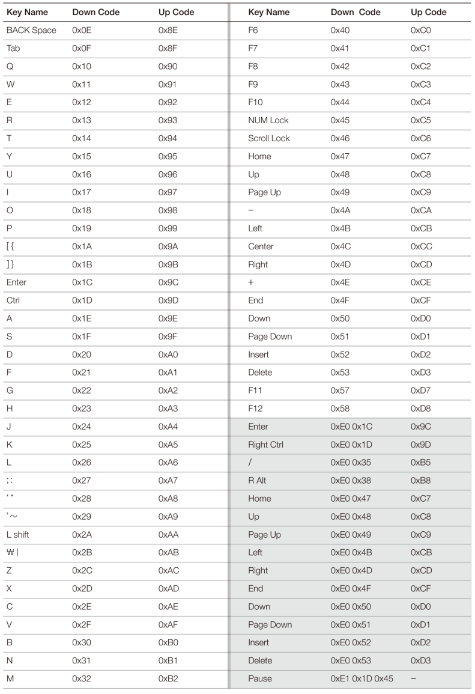

# Code: Part of Keyboard.[c, h] that converts scan code to ascii code

```c
/*
 *  Because newly added code is really long, It looks ugly to paste here.
 *  execute git diff on Keyboard.c and h
 */

/* newly added structures and functions:
 *   kKeyMappingEntryStruct (structure that maps scan code to ascii)
 *   kKeyboardManagerStruct (structure that saves current keyboard state)
 * 
 *   gs_stKeyboardManager (global singleton of kKeyboardManagerStruct)
 *   gs_vstKeyMappingTable (table that maps scan code to ascii)
 *  
 *   Below functions are related to kKeyboardManagerStruct
 *   kShouldUseCombinedCode (private)
 *   kIsAlphabetScanCode (private)
 *   kIsNumberOrSymbolScanCode (private)
 *   kIsNumberPadScanCode (private)
 *   updateCombinationKeyStatusAndLED (private)
 * 
 *   kConvertScanCodeToASCIICode (public)
 */ 
```

# Explanation

# Scan Code

1. Most scan code is `1 byte`

2. Extended scan code is `2 bytes` and they start with `0xE0`

3. A unique key, pause, is extended scan code whose size is `3 bytes` and
starts with `0xE1`

4. Released key scan code has `bit 7` set

<div>
    <figure style='display: inline-block;'>
    
    <figcaption style='text-align: center;'>
        keyboard scan code part 1
    </figcaption>
    </figure>
</div>

<div>
    <figure style='display: inline-block;'>
    
    <figcaption style='text-align: center;'>
        keyboard scan code part 2
    </figcaption>
    </figure>
</div>

<div>
    <figure style='display: inline-block;'>
    
    <figcaption style='text-align: center;'>
        keyboard related function explanation
    </figcaption>
    </figure>
</div>

