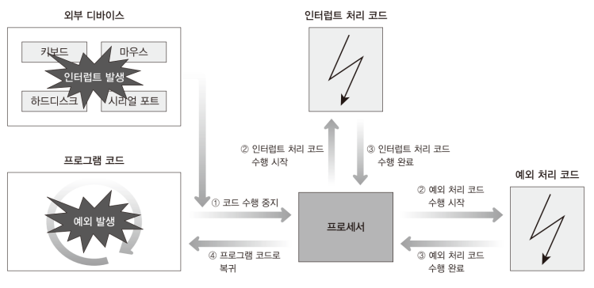
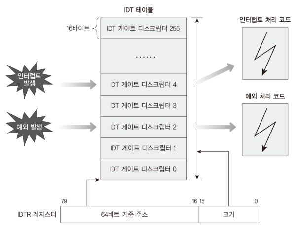
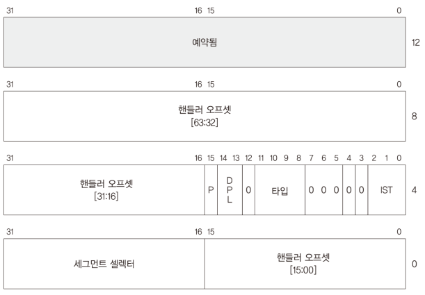
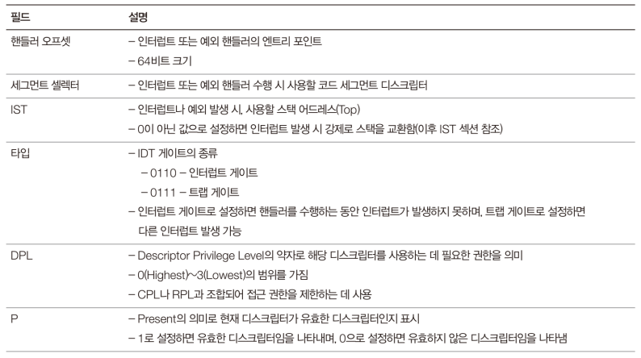
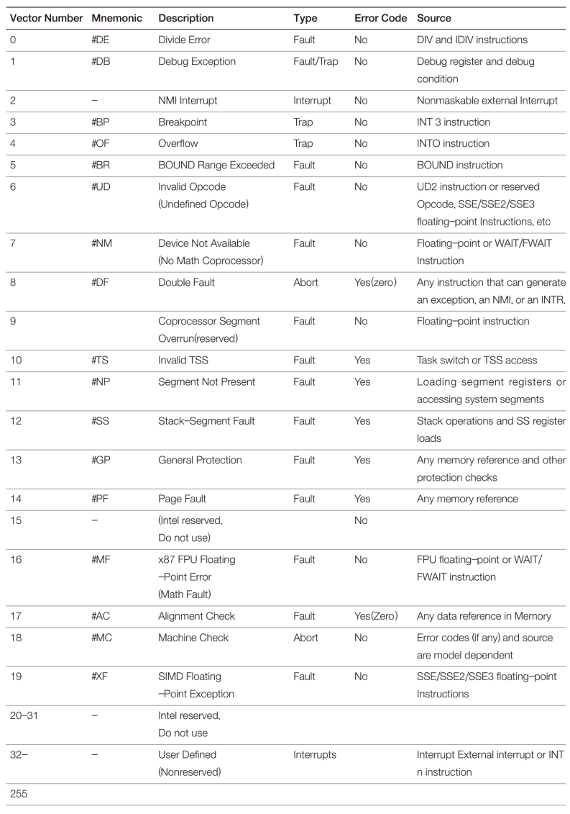
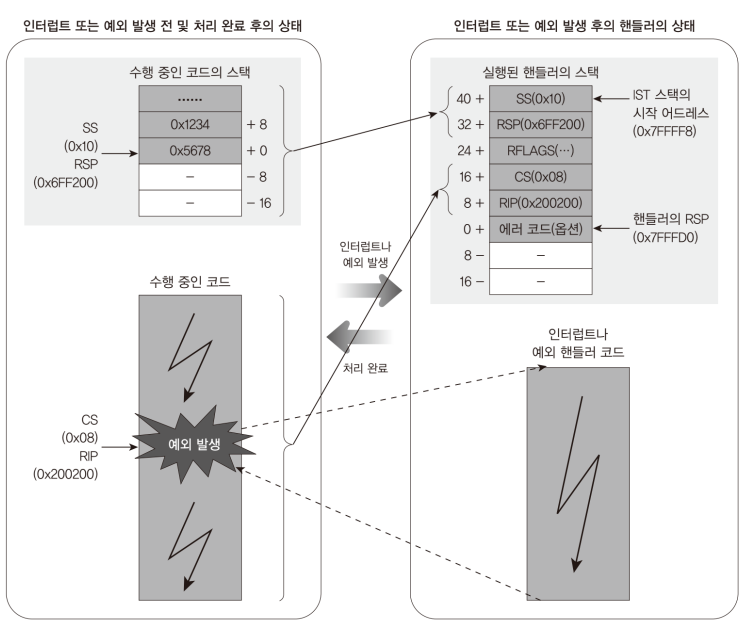
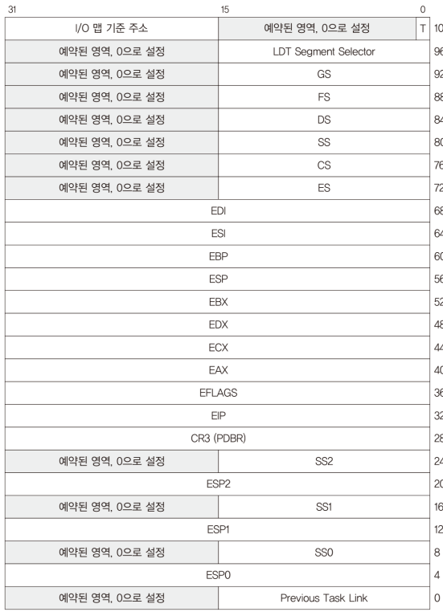
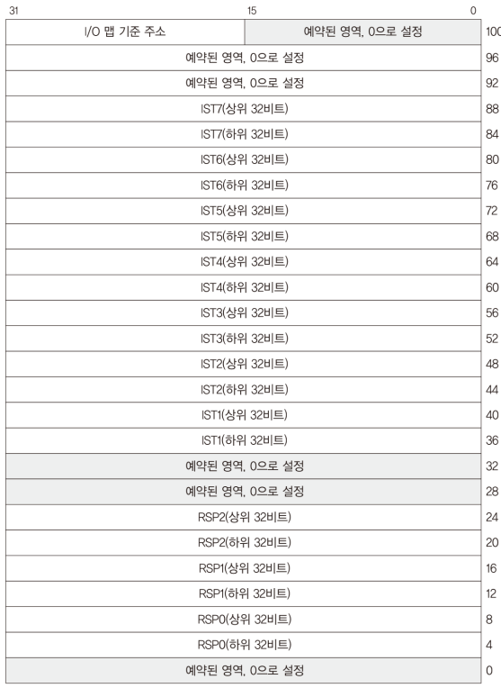
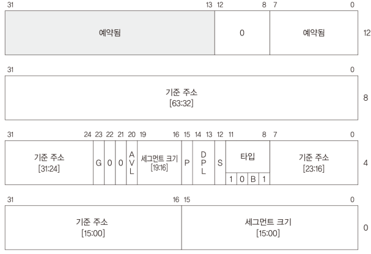
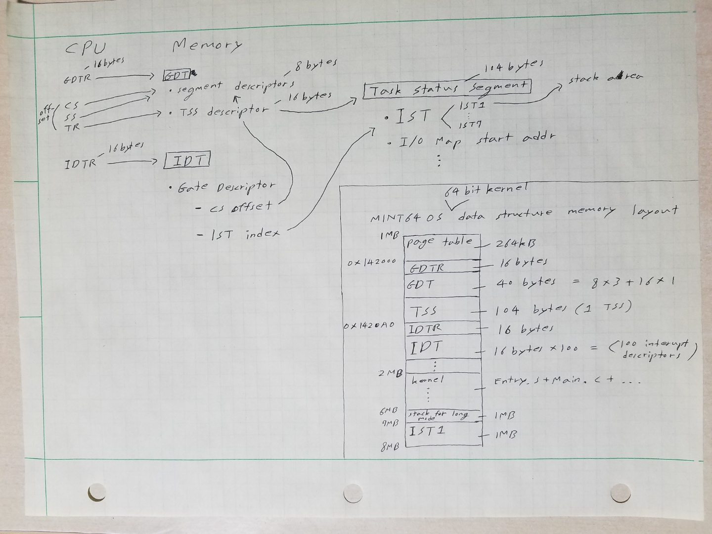

# Explanation

## Exception and Interrupt

1. Exception is event happening `inside` CPU

2. Interrupt is event happening `outside` CPU

3. There are `three` types of exception

    * Fault - recoverable exception
    
    * Trap - related to debugging
   
    * Abort - unrecoverable exception -> malfunction or reboot

    <figure style='display: inline-block;'>
    
    <figcaption style='text-align: center;'>
        simple diagram of interrupt and exception handling
    </figcaption>
    </figure>

## IDT (Interrupt Descriptor Table)

1. `IDT` contains descriptors that has information about interrupt handling

    * In real mode, `0x0000:0000` is reserved for interrupt vector table

2. Similarly to GDT, CPU has `IDTR` register which is `10 bytes`. 

    * In MINT64 OS, GDTR and IDTR structures have padding,
    so they are `16 bytes`

3. The table can have up to `256` entries

    <figure style='display: inline-block;'>
    
    <figcaption style='text-align: center;'>
        IDT and IDTR
    </figcaption>
    </figure>

## IDT Descriptor (or IDT Gate Descriptor)

1. IDT descriptor is called `gate descriptor` because it is gate that can switch
privilege to higher privilege when running interrupt/exception handler

    * `segment selector` decides cs and the privilege level to enter
    
    * `DPL` in IDT descriptor decides if current ring can `software-interrupt`
    the descriptor

    * When hardware interrupt or exception occurs, DPL is not checked 

    * IST (Interrupt Stack Table) is feature introduced in long mode. It
    allows to use different stack

2. IDT descriptor has handler to interrupts and exceptions

3. size of IDT is `16 bytes`

4. There are `three` types of gate descriptor

    * Task Gate - protected mode only
    
    * Interrupt Gate - IF flag is clear
    
    * Trap Gate -  IF flag is set

5. first `32` entries are reserved for specific exceptions and interrupts

    * entries from 20 to 31 are reserved for future use

    * NMI (Non-maskable interrupt) is only interrupt in 32 entries. This
    occurs when hardware has severe problem.

    <figure style='display: inline-block;'>
    
    <figcaption style='text-align: center;'>
        IDT descriptor structure
    </figcaption>
    </figure>

    <figure style='display: inline-block;'>
    
    <figcaption style='text-align: center;'>
        IDT descriptor structure explanation
    </figcaption>
    </figure>

    <figure style='display: inline-block;'>
    
    <figcaption style='text-align: center;'>
        long mode reserved exceptions and interrupts
    </figcaption>
    </figure>

## IST (Interrupt Stack Table)

1. If nothing about stack is configured, interrupt and exception handler
`shares` stack with interrupted code. That causes two problems

    * The handler does not know free space of stack, so overflow can happen

    * It is not good idea that interrupted code and handler at different
    privilege level shares the same space

2. `Protected mode` supports context switch that changes stack area. However,
the stack switch occurs only when privilege level is different

3. Long mode offers a feature named IST to solve the above problem. A IST
can have up to 7 addresses and it is stored in a structure named TSS
(Task Status Segment).

4. IDT Gate Descriptor has a IST field, and it chooses one out of 7 addresses

    * Not to use IST, set IST field with 0. Otherwise between 1 to 7

5. When context switch happens, some registers are pushed into the stack
automatically.

    * SS, RSP, RFLAGS, CS, RIP in order
    
    * Other registers should be pushed by code

    <figure style='display: inline-block;'>
    
    <figcaption style='text-align: center;'>
        IST stack switching diagram
    </figcaption>
    </figure>

## TSS (Task Status Segment)

1. Originally, it did three things for multitasking

    * save all registers except FPU registers when context switch happens
    
    * save stack address per privilege 

    * I/O address mapping access limitation

2. From IA-32e mode, there are more registers to save, the first thing is not
working anymore in long mode. Instead, TSS contains `IST`

3. TSS is accessed from `system descriptor` in GDT

    * TSS descriptor is `16 bytes`

4. TSS is `104 bytes`

5. Not to use I/O address mapping access limitation, put a bigger address
than limit specified in TSS descriptor

    <figure style='display: inline-block;'>
    
    <figcaption style='text-align: center;'>
        IA-32 TSS structure
    </figcaption>
    </figure>

    <figure style='display: inline-block;'>
    
    <figcaption style='text-align: center;'>
        IA-32e TSS structure
    </figcaption>
    </figure>

    <figure style='display: inline-block;'>
    
    <figcaption style='text-align: center;'>
        TSS descriptor structure
    </figcaption>
    </figure>

## Note

1. Most descriptors shares fields and the fields' locations. Their layouts
are very similar

    <figure style='display: inline-block;'>
    
    <figcaption style='text-align: center;'>
        GDT and IDT diagram and MINT64OS memory layout
    </figcaption>
    </figure>

