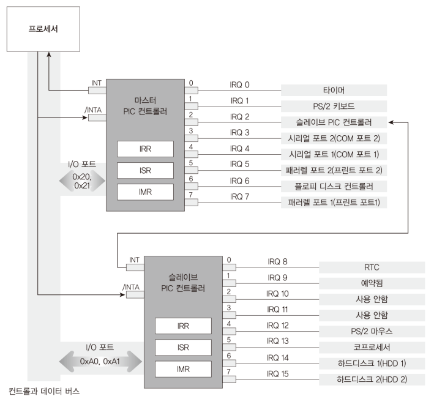
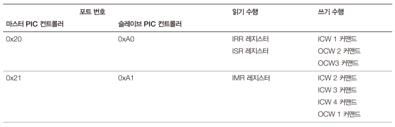
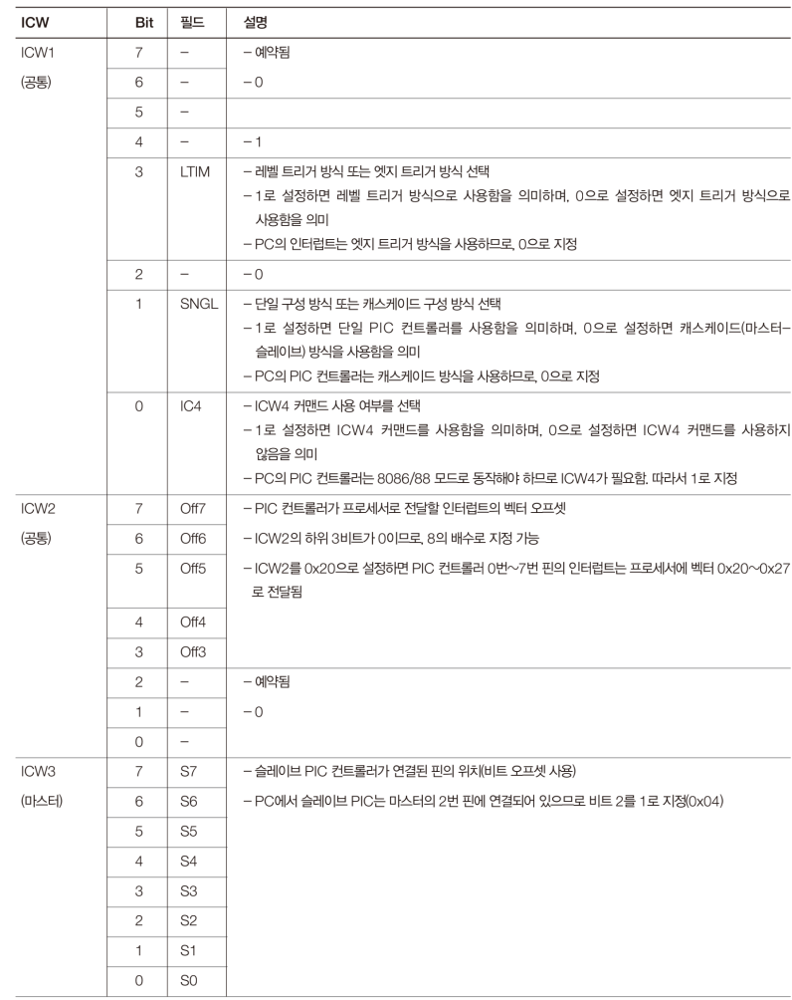
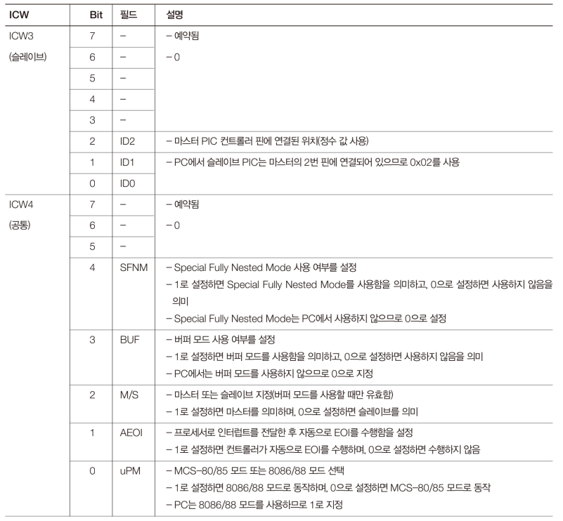
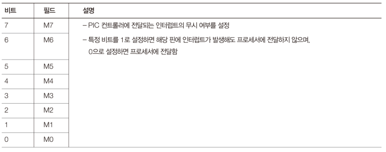
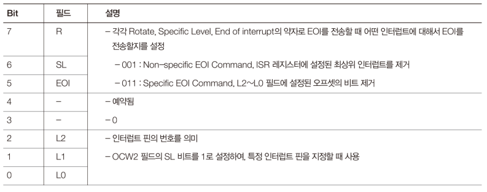
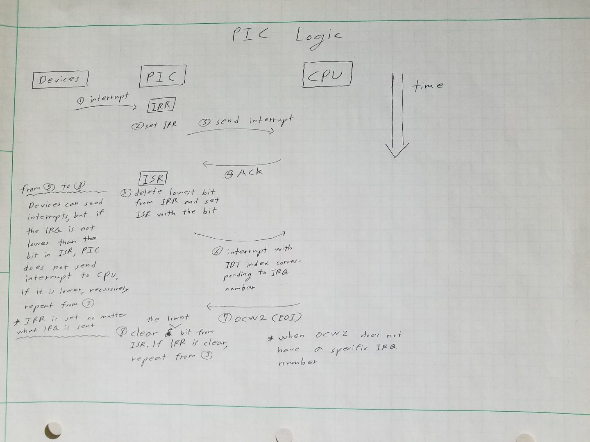

# Code: PIC.[c,h] that initialize programmable interrupt controller

```c
#include "PIC.h"
#include "AssemblyUtility.h"

// initialize master and slave PICs for MINT64OS
// info:
//   ICW1: edge trigger, dual PICs, ICW4
//   ICW2:
//     master: 0x20
//     slave:  0x28
//   ICW3: pin number 2
//   ICW4: no automatic EOI, 8006/88 mode
void kInitializePIC(void) {
    /* Initialize Master PIC */

    // ICW1 command to command port (general configuration):
    //   edge trigger(keyboard, mouse), dual PICs, ICW4(8086 mode)
    kOutPortByte(PIC_MASTER_PORT1, 0x11);

    // ICW2 command (interrupt vector start index):
    //   0x20 (IDT 32nd)
    // info:
    //   first 3 bits must be 0, so value must be multiply of 8
    kOutPortByte(PIC_MASTER_PORT2, PIC_IRQSTARTVECTOR);
    
    // ICW3 command (master's pin where slave PIC is connected):
    //   0x04 (second bit)
    kOutPortByte(PIC_MASTER_PORT2, 0x04);

    // ICW4 command (extended configuration):
    //   uPM (bit 0): 1 for 8086/88 processors
    //   AEOI (bit 1): 0 for manual EOI
    kOutPortByte(PIC_MASTER_PORT2, 0x01);

    
    /* Initialize Slave PIC */
    
    // ICW1 command (general configuration):
    //   same as master
    kOutPortByte(PIC_SLAVE_PORT1, 0x11);

    // ICW2 command (interrupt vector start index):
    //   0x28 (IDT 40nd)
    // info:
    //   same as master
    kOutPortByte(PIC_SLAVE_PORT2, PIC_IRQSTARTVECTOR + 8);

    // ICW3 command (master's pin where slave PIC is connected):
    //   0x02 (integer)
    // info:
    //   Unlike master, the number must be represented as integer in slave
    kOutPortByte(PIC_SLAVE_PORT2, 0x02);

    // ICW4 command (extended configuration):
    //   same as master
    kOutPortByte(PIC_SLAVE_PORT2, 0x01);
}


// set mask register so unwanted interrupts are not sent to CPU and
// wanted interrupts are sent to CPU
// params:
//   wIRQBitMask: IRQ mask for IRQ 0 to IRQ 15
// info:
//   setting bit 2 masks all interrupts from IRQ 8 to 15
void kMaskPICInterrupt(WORD wIRQBitMask) {
    // set IMR to master PIC
	// OCW1 command, mask IRQ 0 ~ IRQ 7
	kOutPortByte(PIC_MASTER_PORT2, (BYTE) wIRQBitMask);

	// set IMR to slave PIC
	// OCW1 command, mask IRQ 8 ~ IRQ 15
	kOutPortByte(PIC_MASTER_PORT2, (BYTE) ( wIRQBitMask >> 8 ));
}


// send EOI (OCW2 command) to in-service interrupt
// params:
//   iIRQNumber:
// info:
//   this function does not send EOI with IRQ number to PIC. The number decides
//   whether it should send EOI to two PICs or just one PIC
void kSendEOIToPIC(int iIRQNumber) {
	// OCW2 command:
    //   EOI (bit 5) = 1
	kOutPortByte(PIC_MASTER_PORT1, 0x20);

    // if IRQ is bigger 7, OCW2 commands must be sent to both master and
    // slave PICs
	if (iIRQNumber > 7) {
		// OCW2 command: 
        //   EOI bit (bit 5) = 1
		kOutPortByte(PIC_SLAVE_PORT1, 0x20);
	}
}
```
```c
#ifndef __PIC_H__
#define __PIC_H__

#include "Types.h"


/* PIC I/O port */

#define PIC_MASTER_PORT1			0x20 // master command port
#define PIC_MASTER_PORT2			0x21 // master data port

#define PIC_SLAVE_PORT1				0xA0 // slave command port
#define PIC_SLAVE_PORT2				0xA1 // slave data port


/* MINT64OS IDT descriptor start index for handling IRQ */

#define PIC_IRQSTARTVECTOR			0x20 // 32


/* PIC related functions */

// initialize master and slave PICs for MINT64OS
// info:
//   ICW1: edge trigger, dual PICs, ICW4
//   ICW2:
//     master: 0x20
//     slave:  0x28
//   ICW3: pin number 2
//   ICW4: no automatic EOI, 8006/88 mode
void kInitializePIC(void);

// set mask register so unwanted interrupts are not sent to CPU and
// wanted interrupts are sent to CPU
// params:
//   wIRQBitMask: IRQ mask for IRQ 0 to IRQ 15
// info:
//   setting bit 2 masks all interrupts from IRQ 8 to 15
void kMaskPICInterrupt(WORD wIRQBitMask);

// send EOI (OCW2 command) to in-service interrupt
// params:
//   iIRQNumber:
// info:
//   this function does not send EOI with IRQ number to PIC. The number decides
//   whether it should send EOI to two PICs or just one PIC
void kSendEOIToPIC(int iIRQNumber);

#endif /* __PIC_H__ */
```

# Explanation

## PIC (Programmable Interrupt Controller)

1. A chip that manages interrupts coming from various hardwares

2. PC usually has two PICs as master and slave.

3. Each chip can handle up to 8 interrupts from devices. However, one pin
of master is connected to slave, so PICs can handle up to `15` interrupts 

3. There is APIC (Advanced Programmable Interrupt Controller) which is better
for multi-core CPU. This chip will be utilized later in MINT64OS

4. There are three registers that can be read and written, but
in most case, they are automatically handled by PIC

5. IRQ (Interrupt Request) is wired to a specific device.

6. There are two I/O ports: one for command and one for data. Also these ports
are utilized for reading and writing registers

<div>
    <figure style='display: inline-block;'>
    
    <figcaption style='text-align: center;'>
        PIC diagram
    </figcaption>
    </figure>
</div>

<div>
    <figure style='display: inline-block;'>
    
    <figcaption style='text-align: center;'>
        PIC I/O ports
    </figcaption>
    </figure>
</div>

## PIC commands

### ICW (Initialization Command Word)

To initialize PIC, ICW should be send from 1 to 4 in order. While
initializing, sending ICW1 resets all works, and you should send
ICW2, ICW3 and ICW4 again.

1. ICW1 (general configuration)

    * interrupt trigger mode (bit 3)

        * Keyboard and mouse uses edge trigger

        * The difference is how to react on electric signal

    * IC4 (bit 0)

        * If extended feature is not used, every bit in ICW4 is zero

2. ICW2 (IDT index for IRQ)

    * PIC send interrupt signal with IRQ number to CPU

3. ICW3 (master pin number that is connected to slave)

    * master uses bit offset

    * slave uses integer

4. ICW4 (extended configuration)

    * uPM (bit 0)

        * PIC was invented when various CPU architectures exist. To use it with modern computer, you should set it 8086/88 mode

<div>
    <figure style='display: inline-block;'>
    
    <figcaption style='text-align: center;'>
        ICW explanation 1
    </figcaption>
    </figure>
</div>

<div>
    <figure style='display: inline-block;'>
    
    <figcaption style='text-align: center;'>
        ICW explanation 2
    </figcaption>
    </figure>
</div>


### OCW (Operation Command Word)

1. OCW1 (Interrupt Mask)

2. OCW2 (EOI command)

    * you can send EOI with specific IRQ number.

3. OCW3 (read ISR/IRR registers)

<div>
    <figure style='display: inline-block;'>
    
    <figcaption style='text-align: center;'>
        OCW1 explanation
    </figcaption>
    </figure>
</div>

<div>
    <figure style='display: inline-block;'>
    
    <figcaption style='text-align: center;'>
        OCW2 explanation
    </figcaption>
    </figure>
</div>

## PIC Operation Logic

<div>
    <figure style='display: inline-block;'>
    
    <figcaption style='text-align: center;'>
        PIC operation diagram
    </figcaption>
    </figure>
</div>


