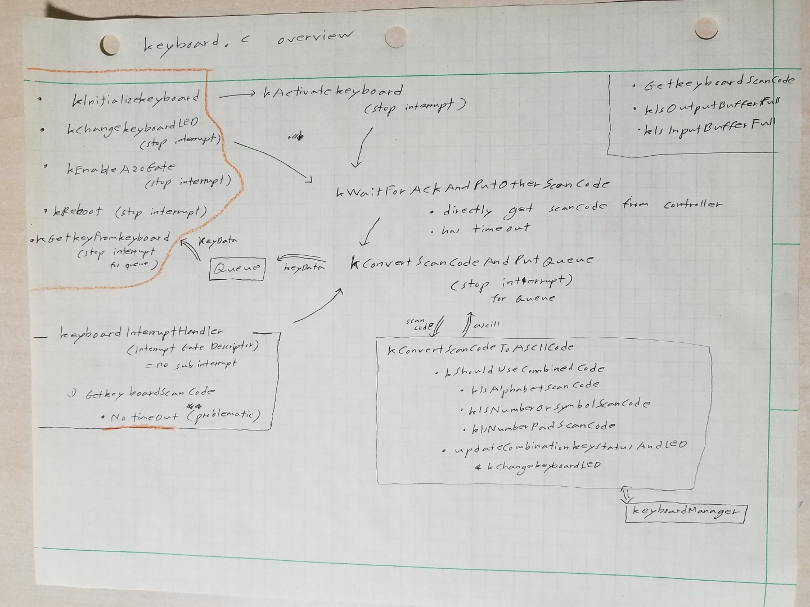

# Explanation

## Interrupt and multi-tasking problem

1. When more than one processes shares the same register or data in memory,
using the shared object is problematic. To prevent the problem, blocking
interrupt or using lock object is necessary.

2. lock object is not implemented yet, you can see that code uses blocking
interrupts

    * Keyboard queue object blocks interrupt

    * functions that use PS/2 controller also blocks interrupt

    <figure style='display: inline-block;'>
    
    <figcaption style='text-align: center;'>
        keyboard code overview
    </figcaption>
    </figure>

## Note

1. Although interrupt is utilized, Main.c busily check keyboard buffer
to get data. Using CPU resource for just checking is not good practice.
Fortunately, there is mechanism offered by CPU, and this mechanism will
be utilized when task structure and lock object for multi tasking is
implemented

## MINT64OS Characteristics

1. Memory Layout up to CH4

    * start(inclusive) ~ end(exclusive)
    * 0x00000  ~ 0x00400  (Interrupt Vector Table for real mode)
    * 0x07C00  ~ 0x07E00  (Bootloader)
    * 0x07E00  ~ 0x10000  (Stack for real mode and protected mode)
    * 0x10000  ~ 0x10400  (32 bit code of OS; EntryPoint.S + Main.c + ...)
    * 0xA0000  ~ ...      (video memory for graphic mode)
    * 0xB8000  ~ ...      (video memory for text mode)
    *
    * 0x100000(1MB) ~ 0x142000 (IA-32 mode page table tree structure, 264KB)
    * 0x142000      ~ 0x142010 (GDTR, 16 bytes)
    * 0x142010      ~ 0x142038 (GDT, 40 bytes = 3 * 8 bytes + 1 * 16 bytes)
    * 0x142038      ~ 0x1420A0 (TSS, 104 bytes = 1 * 104 bytes)
    * 0x1420A0      ~ 0x1420B0 (IDTR, 16 bytes)
    * 0x1420B0      ~ 0x1426F0 (IDT, 1600 bytes = 100 * 16 bytes)
    *
    * 0x200000(2MB) ~ ... (64 bit code of OS; EntryPoint.S + Main.c + ...)
    * 0x600000(6MB) ~ 0x700000(7MB) (Stack for long mode)
    * 0x700000(7MB) ~ 0x800000(8MB) (IST1 stack area)