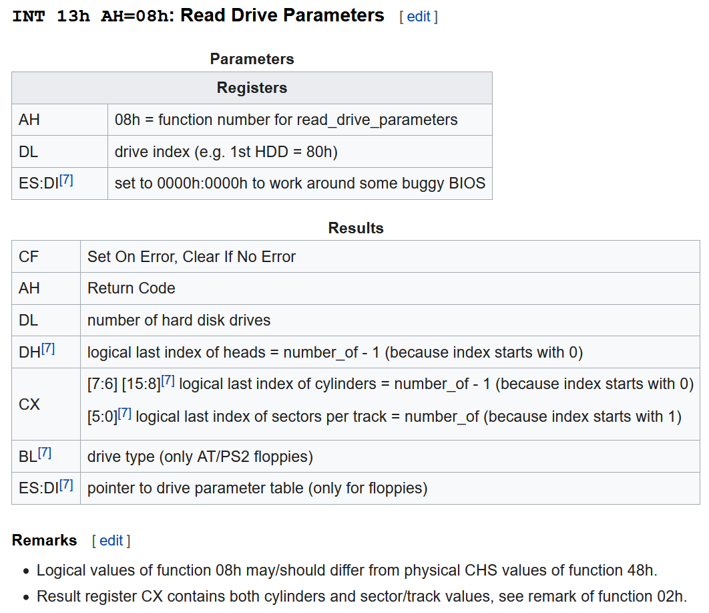

# Code: Bootloader.asm

# Explanation

## What does the code do?

### First problem

Before this chapter, bootloader was built to work with floppy disk.
Fortunately, I had a usb floppy disk drive, and BIOS has a feature to emulate
it as a normal floppy disk so I could boot from floppy disk on real computer. 
However, the drive was not working for some reason. To get around this problem,
I modified the bootloader code, so computer can load MINT64OS from USB.

### First solution

When bootloader is loaded at 0x07C0:0x0000, bios set `dl` register
with disk drive number which has the bootloader code. Bootloader asks BIOS
the drive information including maximum cylinder, head, and sector. Based on
the information, BIOS loads MINT64OS at 0x10000.

### Second problem

Unfortunately, when BIOS came to the world, USB did not exist, and there is
still no standard specification about how to boot from USB. Some vendors
emulate USB as a Floppy disk drive and most vendors emulate USB as a hard disk
drive. In addition, some of them that emulate USB as a hard disk require USB
to have valid partition entries in MBR section. Otherwise, they skips booting
from USB.

### Second solution

My father's Samsung laptop and my Acer laptop emulates USB as a hard disk.
the Samsung laptop allows the USB to boot. However, the Acer laptop requires
it to have partition entries. Therefore, I put a fake partition entry at `0x1BE`
Although the partition really exist, it is ok if the entry looks valid to BIOS

### Third problem

In my Acer laptop, BIOS allows to use video memory address without some
preparation action. However, the Samsung laptop requires some action before
using the video memory address. Otherwise, nothing comes up to the screen.

### Third solution

I do not know the exactly problem, but using a BIOS service that prints text on
the screen solves the problem. Therefore, I added code using BIOS service before
clearing the whole screen.

## Assembly and BIOS

1. When bootloader is loaded, `dl` contains drive number that contains the
bootloader code

2. `0x13` interrupt with `ah=0x08` let you have a drive information. The
information contains maximum track number, head number, and sector number.
You can use the info to load operating system into memory.

    <figure style='display: inline-block;'>
    
    <figcaption style='text-align: center;'>
        BIOS service: read drive parameter
    </figcaption>
    </figure>

3. `0x10` interrupt with `ah=0x0E` let you write a character.

    <figure style='display: inline-block;'>
    
    <figcaption style='text-align: center;'>
        BIOS service: write a character
    </figcaption>
    </figure>

4. `lodsb` means load string byte. For legacy mode, it load byte at address
DS:(E)SI into AL. For 64-bit mode load byte at address (R)SI into AL.

    * Unlike mov, lods increments/decrements ESI additionally.
    * It is usually faster than just mov for this specific goal

5. `or` set `ZF=1` if result is zero

6. conditional jump, `jz` jump if `ZF=0` 

## References

1. [Booting from USB drive](https://forum.osdev.org/viewtopic.php?f=1&t=29237)

2. [MBR structure](https://wiki.osdev.org/MBR_(x86))

3. [BIOS service: INT 0x13, ah=0x08](https://en.wikipedia.org/wiki/INT_13H)

4. [BIOS service: INT 0x10, ah=0x0E](https://en.wikipedia.org/wiki/INT_10H)

5. [MOV vs lobs](https://board.flatassembler.net/topic.php?p=63102)

6. [what is lods](https://modoocode.com/en/inst/lods-lodsb-lodsw-lodsd-lodsq)

7. [conditional jump](https://modoocode.com/en/inst/jcc)

8. [or operation](https://modoocode.com/en/inst/or#page-heading-4)