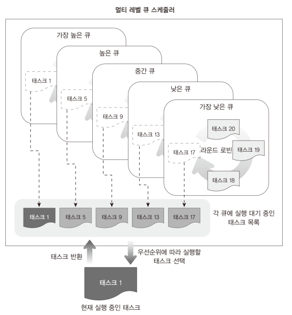

# Code: Task.[h, c], AssemblyUtility.[h, asm]

# Explanation

## What does the code do?

1. The main change in the task file is scheduler structure. In Ch18, we used a
simple round robin scheduler, but in Ch19, scheduler is implemented using
multi-level priority queues.


    * In Ch18, typing shell command while running over 200 tasks was working very
    smoothly because each task intentionally yields CPU. However, if you remove
    'kSchedule()' line from kTestTask functions, then you will find that typing is
    really slow if you run a lot of test tasks. To make the typing faster, here I
    implemented multi-level priority queues. Instead, you will see that tasks
    are running slower than Ch18.


2. The second change is that IDLE task is added to task pool. The IDLE task does
two things. One is cleaning finished tasks and the other is to make the CPU take
a rest if there is no task to run.


    * Since tasks are not removed from the ready list automatically. We need one
    more thing to do: Another queue that have tasks waiting for cleaning. I added a
    wait queue to scheduler and a idle task that is responsible for the cleaning
    work. If scheduler schedule the IDLE task to run, the task check the wait queue
    and make tasks in the queue to be available again for another shell commands.
    Since task pool allows up to 1024 tasks, this work is necessary

    * Also, Until CH18, CPU kept reading instructions even though there is no work
    to do. It stayed in infinite loop while waiting for interrupt if there was
    no work. It is definitely a waste of energy. To fix the problem, IDLE task
    has another work. If there is no work, CPU reads 'hlt' instruction from IDLE
    task which makes CPU stop reading next instructions until interrupt happens.


## Multi Level Priority Queue Scheduling Algorithm

1. Multi level priority queue scheduling algorithm partitions the ready queue
into several separates queues. A task is assigned to one queue and the
frequency of task selection of each queue is based on the priority of the
queue.

2. tasks in higher priority queue are scheduled more frequently than those in
lower priority queues.


    <div>
        <figure style='display: inline-block;'>
            
            <figcaption style='text-align: center;'>
                MINT64OS multi level priority queues task selection
            </figcaption>
        </figure>
    </div>


3. Usually, each queue also has its own scheduling algorithm. In MINT64OS, each
queue is based on round robin scheduling.

    <div>
        <figure style='display: inline-block;'>
            
            <figcaption style='text-align: center;'>
                MINT64OS multi level priority queues
            </figcaption>
        </figure>
    </div>


## IDLE Task

1. If a task does execute infinitely, the task has to free resources assigned
to the task. Because task task cannot free the resources on its own, there must
be another task that takes care about the work. That is why IDLE task is
created.

    * To make idle task to free resources effectively, ended tasks should be in
    another queue which contains only the ended tasks.

    <div>
        <figure style='display: inline-block;'>
            
            <figcaption style='text-align: center;'>
                task state change diagram
            </figcaption>
        </figure>
    </div>


2. Also, the task can calculate CPU usage by checking how often IDLE task
is called. Depending on how busy CPU is, IDLE task can make CPU to take a rest
by issuing hlt instruction which stops CPU reading next instruction until
interrupt happens.


## Error Note


### Forgot to update a scheduler variable

1. file

    * 02.Kernel64/Source/Task.c

2. functions

    * kSchedule
    
    * kScheduleInInterrupt

3. description

    * I forgot to add the line
    
        ```c
        gs_stScheduler.pstRunningTask = pstNextTask;
        ```

    * When all tasks are in the ready queue, the tasks run at most once.
    However, when scheduling occurs, current TCB pointer points next task
    to run and the pointer goes into a ready queue. At the end, there are
    plenty of pointers in the queue that represents the same task.


### Wrong instruction in bootloader that fails reading data from disk

1. file

    * 00.Bootloader/Bootloader.asm

2. code

    ```assembly
    ; read drive maximum CHS
    READDISKPARAMTER:
        mov ah, 0x08
        mov dl, byte [BOOTDRIVE]
        int 0x13
        jc HANDLEDISKERROR

        mov byte [LASTHEAD], dh
        mov al, cl
        add al, 0x3F

        mov byte [LASTSECTOR], al
        mov byte [LASTTRACK], ch
    ```

3. description

    * Instead of `add al, 0x3F`, the instruction should be `and al, 0x3F`

    * Because of the wrong instruction, reading from floppy disk failed from
    chapter 15_sub1.

    * If the disk is hard disk, reading fails depending on the maximum number
    of sections of the disk. In my case, if the image goes over 22KB, reading
    data from disk failed.


### global variables outside of functions are not included in the kernel image

1. files

    * 02.Kernel64/Source/Task.c

2. code

    ```c
    #include "Utility.h"
    #include "AssemblyUtility.h"
    #include "Console.h"


    /* singleton data structure of Scheduler and Task pool manager */

    SCHEDULER gs_stScheduler;
    TCBPOOLMANAGER gs_stTCBPoolManager;
    ```

3. description

    * Up to Ch18, we saw only .bss, .data, .rodata, and .text sections.
    However, global variable without static keyword goes into a new
    section which is *COM*

    * *COM* is a pattern rather than name. If linker script adds a
    section whose name contains "COM", then the global variable
    goes into that section.


## MINT64OS Characteristics

1. Memory Layout up to CH16

    * start(inclusive) ~ end(exclusive)
    * 0x00000  ~ 0x00400  (Interrupt Vector Table for real mode)
    * 0x07C00  ~ 0x07E00  (Bootloader)
    * 0x07E00  ~ 0x10000  (Stack for real mode and protected mode)
    * 0x10000  ~ ...  (32 bit code of OS; EntryPoint.S + Main.c + ...)
    *
    * 0x20000 ~ 0x20004 (number of memory map entries)
    * 0x20004 ~ ... (memory map entires)
    *
    * 0xA0000  ~ ...      (video memory for graphic mode)
    * 0xB8000  ~ ...      (video memory for text mode)
    *
    * 0x100000(1MB) ~ 0x142000 (IA-32 mode page table tree structure, 264KB)
    * 0x142000      ~ 0x142010 (GDTR, 16 bytes)
    * 0x142010      ~ 0x142038 (GDT, 40 bytes = 3 * 8 bytes + 1 * 16 bytes)
    * 0x142038      ~ 0x1420A0 (TSS, 104 bytes = 1 * 104 bytes)
    * 0x1420A0      ~ 0x1420B0 (IDTR, 16 bytes)
    * 0x1420B0      ~ 0x1426F0 (IDT, 1600 bytes = 100 * 16 bytes)
    *
    * 0x200000(2MB) ~ ... 
    
        * 64 bit code of OS; EntryPoint.S + Main.c + task stack + task
        manager + ...
    
    * 0x600000(6MB) ~ 0x700000(7MB) (Stack for long mode kernel)
    * 0x700000(7MB) ~ 0x800000(8MB) (IST1 stack area)
    * 0x800000(8MB) ~ 0x83A000 (Task Pool, 232 KB)
    * 0x83A000      ~ 0x103A000 (Task Stack Pool, 8MB = 8192 * 1024)