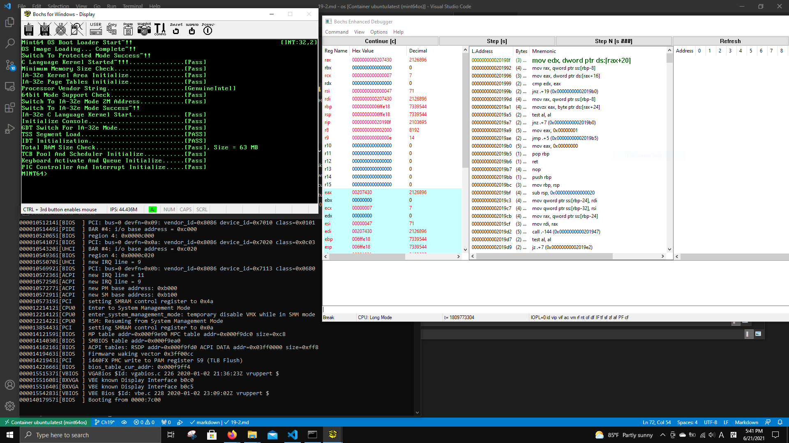

# bochs

Bochs is a highly portable open source IA-32 (x86) PC emulator written in C++

## Why?

When I had problem with the kernel, all I had `kPrintf` function and source code
to solve the problems. Without a debugging tool, it was very painful and
time-consuming work to find what code causes the problem.

Bochs contains internal debugging tool that shows all values in registers and in
memory. You can even modify the values before executing next assembly
instruction. This tool helped me to solve bootloader disk reading failure

## Preparation

1. Install bochs from the [official site](https://bochs.sourceforge.io/)

2. Follow tutorial in the [site](
    https://thestarman.pcministry.com/asm/bochs/bochsdbg.html) to become
    familiar with the tool

    * Files I used for the tutorial are in the Ch19/summary/assets/bochs
    directory. Instead of full path of bochs, I include bochs binary directory
    location to system path variable first.

## Bochs support GDB style debugging or a simple GUI debugging

1. In Windows, there are two executable. One is for normal usage, and
the other one is for debugging. name for the debugging is `bochsdbg`

2. If you want to run debugging in GUI, add 
`display_library: win32, options="gui_debug"` to setting file which ends
with `.bxrc`. 

## How to access memory?

1. read [bochs official docs about internal debugger](
    https://bochs.sourceforge.io/doc/docbook/user/internal-debugger.html)

2. In bochs, options comes with `/`.

    * x /1bx 0x7C00:0x123
    
        * read value at 0x7C00: 0x123 (1 unit, byte size, print in hex)

    * x /1bx DS:0x123

        * read value at DS:0x123 (1 unit, byte size, print in hex)

    * x /2wx 0x7C00:0x123

        * read value at DS:0x123 (2 unit, 4 bytes, print in hex)

3. If you want to see more than just assembly code during debugging, use symbol
table which maps memory address to function name or variable name. Because you
can see function name instead of memory address, it makes debugging easier.

    * The official docs explains how to do it, but the info is not definitely
    not enough to understand. Use sites I put in the reference sections

    <figure style='display: inline-block;'>
        
        <figcaption style='text-align: center;'>
            bochs example
        </figcaption>
    </figure>

## References

1. [Does anyone know how to load a symbol table into bochs?](
    https://forum.osdev.org/viewtopic.php?f=1&t=42104)

2. [How to use symbols in bochs?](
    https://forum.osdev.org/viewtopic.php?f=1&t=26371)