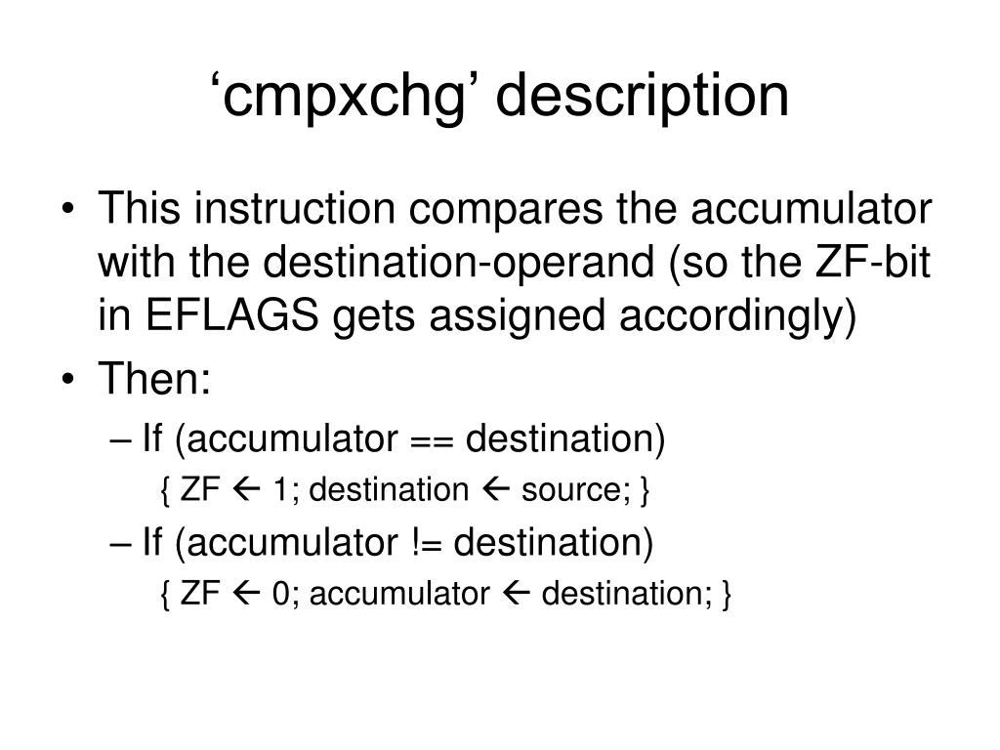
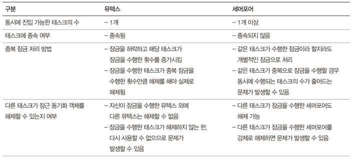

# Code: Synchronization.[h, c], AssemblyUtility.[h, asm]

# Explanation

## What does the code do?

### Problem

1. One of big problems of preemptive multitasking OS is Synchronization.
The synchronization problem happens when more than one task shares the same
object. For example, it can be queue, array, or simply a variable.

2. Current version of MINT64OS has many sync problems.

    * queues in scheduler are used by kernel task and interrupt scheduler

    * x and y variables in Console.c are shared between tasks

    * Keyboard queue is shared between tasks

### Solution

1. To address the problem, Intel CPU offers a instruction, `cmpxchg` and
a preposition, `lock` which can be used for limited instructions.

2. Using above instruction, lock object such as mutex or semaphore can be
implemented. In MINT64OS, mutex is implemented and the lock is used in
scheduler and keyboard queue.

    * I think the lock is also should be used in Console.c, but book does not
    mention about it. so the lock is not included in the Console.c in my repo
    too

## Assembly

1. `cmpxchg` instruction compares register with a value in memory and change
the value in memory depending on the comparison. This behavior is done in one
instruction. Therefore, this instruction is proper for implementing lock
mechanism

    * If CPU has more than one core, `lock` preposition should be attached
    to lock the system bus, so other core cannot access the memory while
    `cmpxchg` is used

    

        <figure style='display: inline-block;'>
            
            <figcaption style='text-align: center;'>
                cmpxchg description
            </figcaption>
        </figure>
    

## C language

1. `volatile` variable means that compiler makes assembly code that always read
the variable from memory instead of registers. Most compilers try to optimize
the written code. For example, a variable that is accessed often is copied from
memory to register and functions works with the register, and then the last
updated value is copied to memory. To implement lock, the variable should be
accessed from memory every time. Therefore, you can see that volatile variable
in `Synchronization.c` file.

## Lock Objects

    <figure style='display: inline-block;'>
        
        <figcaption style='text-align: center;'>
            lock mechanism
        </figcaption>
    </figure>

1. If you see pthread mutex, you can see that there are more
complicated methods than the above image

## Error Note

### (not resolved) Scheduler does not occur race condition problem.

1. file

    * Unknown

2. description

    * Currently, my scheduler does not make sync problem now. I made the
    scheduler to be prone to the sync problem, but for some reason, tasks do
    not make race condition problem even without mutex.

## MINT64OS Characteristics

1. Memory Layout up to CH16

    * start(inclusive) ~ end(exclusive)
    * 0x00000  ~ 0x00400  (Interrupt Vector Table for real mode)
    * 0x07C00  ~ 0x07E00  (Bootloader)
    * 0x07E00  ~ 0x10000  (Stack for real mode and protected mode)
    * 0x10000  ~ ...  (32 bit code of OS; EntryPoint.S + Main.c + ...)
    *
    * 0x20000 ~ 0x20004 (number of memory map entries)
    * 0x20004 ~ ... (memory map entires)
    *
    * 0xA0000  ~ ...      (video memory for graphic mode)
    * 0xB8000  ~ ...      (video memory for text mode)
    *
    * 0x100000(1MB) ~ 0x142000 (IA-32 mode page table tree structure, 264KB)
    * 0x142000      ~ 0x142010 (GDTR, 16 bytes)
    * 0x142010      ~ 0x142038 (GDT, 40 bytes = 3 * 8 bytes + 1 * 16 bytes)
    * 0x142038      ~ 0x1420A0 (TSS, 104 bytes = 1 * 104 bytes)
    * 0x1420A0      ~ 0x1420B0 (IDTR, 16 bytes)
    * 0x1420B0      ~ 0x1426F0 (IDT, 1600 bytes = 100 * 16 bytes)
    *
    * 0x200000(2MB) ~ ... 
    
        * 64 bit code of OS; EntryPoint.S + Main.c + task stack + task
        manager + ...
    
    * 0x600000(6MB) ~ 0x700000(7MB) (Stack for long mode kernel)
    * 0x700000(7MB) ~ 0x800000(8MB) (IST1 stack area)
    * 0x800000(8MB) ~ 0x83A000 (Task Pool, 232 KB)
    * 0x83A000      ~ 0x103A000 (Task Stack Pool, 8MB = 8192 * 1024)