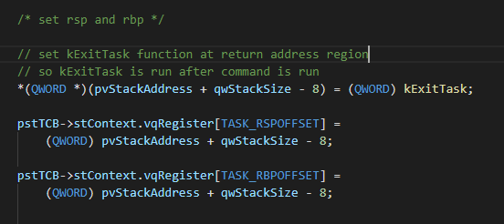
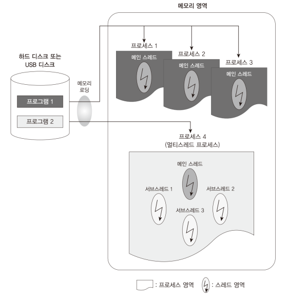
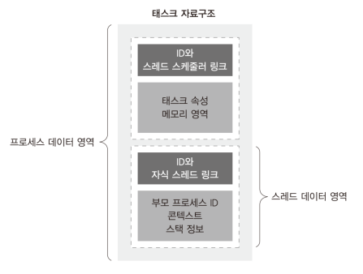
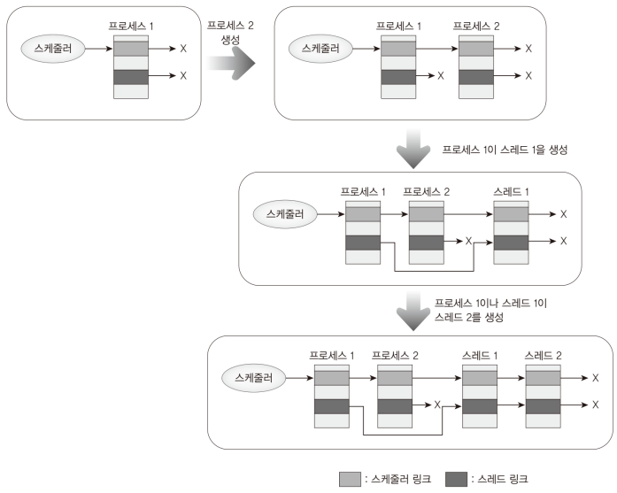

# Code: Task.[c, h], Types.h, Main.c

# Explanation

## What does the code do?

### Problem

I decided to make a type of task that shares the same memory address of a
task (process), so it can give performance advantages when multi cores run the tasks.

### Solution

Thread feature is added, so a thread shares the same memory address with
other threads that have the same parent process.

1. Scheduler can schedule a process or thread

2. If a process is killed, its threads are killed before the process.

3. kIdleTask process becomes a kernel thread (to share the same address)

### Problem

To finish a task without problem, you had to write `kExitTask` function
at the end of a function. It is easy to make mistake of not writing the
function

### Solution

Instead of explicitly calling the function, `kCreateTask` function adds 
`kExitTask` function address to process stack, so when the task ends, 
kExitTask is automatically called.

* Since a task entry point is a function, compiler compiles the function
into assembly code which contains `ret` instruction.

    <figure style='display: inline-block;'>
        
        <figcaption style='text-align: center;'>
            how kExitTask is called automatically
        </figcaption>
    </figure>

## GCC and C

1. `__builtin_offsetof(TYPE, MEMBER)` is macro defined by gcc. This macro lets
you find a overall structure address by using address of a member

    * kIdleTask uses `stThreadLink` member to find TCB structure, so it can
    finish all thread tasks

## Process

1. Processes are isolated by process isolation, and do not share address spaces
or file resources except through explicit methods

## Thread

1. the smallest sequence of programmed instructions that can be managed
independently by a scheduler.

2. Thread can share its process's resources such as memory and file handles

    <figure style='display: inline-block;'>
        
        <figcaption style='text-align: center;'>
            relationship between thread and process
        </figcaption>
    </figure>

### How the thread is implemented in MINT64OS

1. task control block structure in Task.h was for a process task. From Ch21,
threads and processes share the same structure. Depending on what type of task
uses the structure, some members are ignored. For example. thread TCB does not
uses `stChildThreadList` member.

    

        <figure style='display: inline-block;'>
            
            <figcaption style='text-align: center;'>
                MINT64OS TCB structure
            </figcaption>
        </figure>
    

2. When a process is in scheduler wait list, kIdleTask first tries to kill
threads of the process. To do this, all children threads are connected to list,
and TCB is referenced by using `offsetof` macro

    

        <figure style='display: inline-block;'>
            
            <figcaption style='text-align: center;'>
                how threads are linked
            </figcaption>
        </figure>
    

    * a Link Node must be paired with only one list because a node contains
    address to a next node. `stLink` is used for scheduler, so `stThreadLink`
    should exist to manage list of threads.

## Error Note

### Fail to boot in a real PC. CPU raises General Protection Exception.

1. files

    * 02.Kernel64/Source/Task.c

2. functions

    * kInitializeScheduler

3. description

    * When a process is created, `kCreateTask` function initializes TCB
    structure. However, only Kernel process is created by kInitializeScheduler
    function, and I forgot to initialize `stChildThreadList` member. If there is
    no thread of the kernel process, there is no problem, but kIdleTask is
    created as a kernel thread, and it is added to uninitialized thread list.
    Therefore, CPU references a not existing address in the list, and general
    protection exception raises.

    * Original code written by the book author also has this problem.

    * [this video describes this problem](https://youtu.be/-n4KDdYV-Pk)

## MINT64OS Characteristics

1. Memory Layout up to CH16

    * start(inclusive) ~ end(exclusive)
    * 0x00000  ~ 0x00400  (Interrupt Vector Table for real mode)
    * 0x07C00  ~ 0x07E00  (Bootloader)
    * 0x07E00  ~ 0x10000  (Stack for real mode and protected mode)
    * 0x10000  ~ ...  (32 bit code of OS; EntryPoint.S + Main.c + ...)
    *
    * 0x20000 ~ 0x20004 (number of memory map entries)
    * 0x20004 ~ ... (memory map entires)
    *
    * 0xA0000  ~ ...      (video memory for graphic mode)
    * 0xB8000  ~ ...      (video memory for text mode)
    *
    * 0x100000(1MB) ~ 0x142000 (IA-32 mode page table tree structure, 264KB)
    * 0x142000      ~ 0x142010 (GDTR, 16 bytes)
    * 0x142010      ~ 0x142038 (GDT, 40 bytes = 3 * 8 bytes + 1 * 16 bytes)
    * 0x142038      ~ 0x1420A0 (TSS, 104 bytes = 1 * 104 bytes)
    * 0x1420A0      ~ 0x1420B0 (IDTR, 16 bytes)
    * 0x1420B0      ~ 0x1426F0 (IDT, 1600 bytes = 100 * 16 bytes)
    *
    * 0x200000(2MB) ~ ... 
    
        * 64 bit code of OS; EntryPoint.S + Main.c + task stack + task
        manager + ...
    
    * 0x600000(6MB) ~ 0x700000(7MB) (Stack for long mode kernel)
    * 0x700000(7MB) ~ 0x800000(8MB) (IST1 stack area)
    * 0x800000(8MB) ~ 0x849000 (Task Pool, 292 KB)
    * 0x849000      ~ 0x103A000 (Task Stack Pool, 8MB = 8192 * 1024)