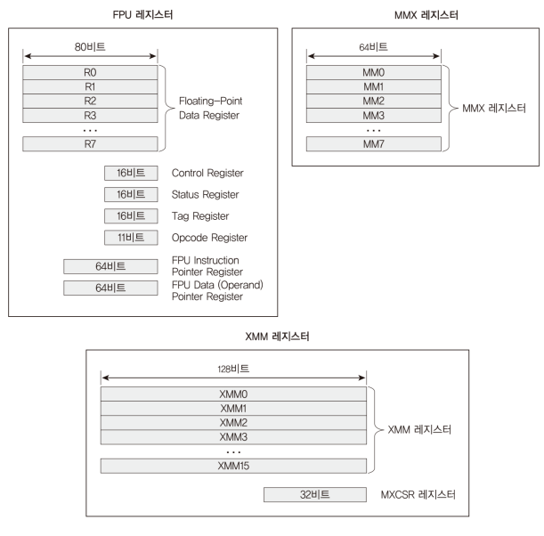
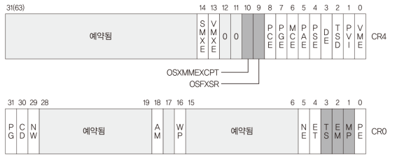
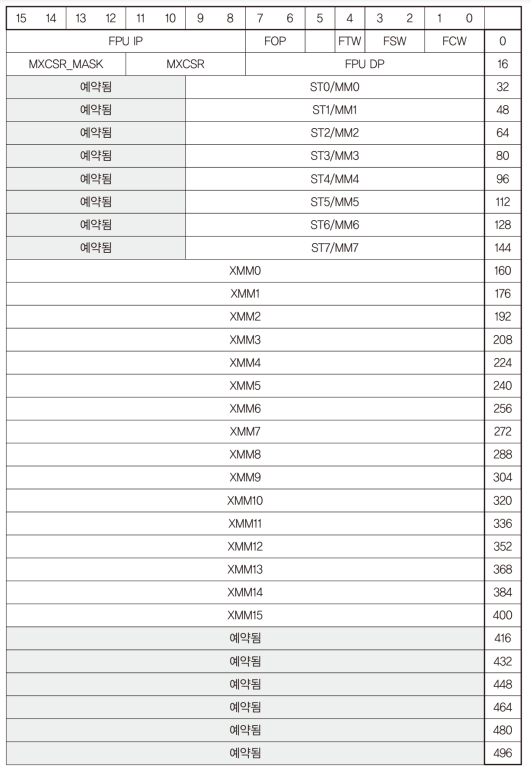
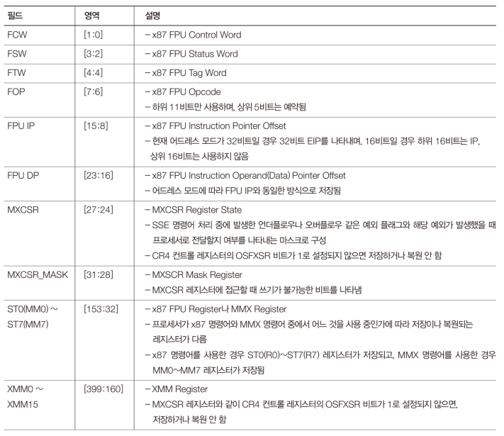

# Code: ModeSwitch.asm, AssemblyUtility.[h, asm]

# Explanation

## What does the code do?

To allow tasks to calculate floating point numbers, first it is necessary to
initialize hardware configuration. ModeSwitch file modifies CPU control
registers so that CPU can communicates with FPU.

AssemblyUtility provides functions that call FPU instructions, so other c code
can utilize FPU

## FPU (Floating Point Unit)

The x86 FPU was originally an optional addition to the processor that was
able to perform floating point math in hardware, but has since been
integrated into the CPU proper and has collected over the years the majority
of math-heavy instructions. The modern FPU has become a legacy term for
what is actually the vector processing units, which just happens to include
the original floating point operations. 

FPU (x87 processor) instructions are deprecated by new instruction sets.
However, x86 provides all compatibility, so FPU instructions are still
working and MINT64OS uses the old instructions for simplicity 

    <figure style='display: inline-block;'>
        
        <figcaption style='text-align: center;'>
            structure of FPU registers
        </figcaption>
    </figure>

## How to enable FPU

To process FPU instructions in hardware, you need to configure CR0 and
CR4 registers

    <figure style='display: inline-block;'>
        
        <figcaption style='text-align: center;'>
            CR0 and CR4 FPU related bits
        </figcaption>
    </figure>

* If `EM` (Emulation bit) is set, all FPU and vector operations will cause
a #UD so they can be EMulated in software. Should be off to be actually
able to use the FPU

* If `MP` (Monitor Coprocessor bit) is set, calling `wait` and `fwait`
instructions, when TS bit is equal to 1, causes exception  

* If `TS` (Task switched) is set, calling FPU instructions raises Exception
#7 (Device Not Available).
    
    * The purpose of this bit is for lazy FPU context switching. Because
    not every task uses FPU and even task using FPU usually
    do not utilize FPU all day long, it is better to switch the heavy FPU
    context when it is necessary.

    * Programmer is responsible to clear the `TS` bit when Device Not Available
    Exception is raised. If you forget to clear the bit, every FPU instruction
    will raise the exception.

* If `OSFXSR` (Operating system support for `FXSAVE` and `FXRSTOR` instructions)
is set, it enables Streaming SIMD Extensions (SSE) instructions. Also, the size
and the structure of FPU context that `FXSAVE` and `FXRSTOR` instructions
handles change because SSE instructions utilizes `FXSAVE` and `FXRSTOR`

* If `OSXMMEXCPT` (Operating System Support for Unmasked SIMD Floating-Point
Exceptions) is set, it enables unmasked SSE exceptions.

To use FPU instructions, you need to set clear `EM` and set `mp`, `TS`,
`OSFXSR`, and `OSXMMEXCPT`

### FPU Context

    <figure style='display: inline-block;'>
        
        <figcaption style='text-align: center;'>
            fxsave and fxrstor context structure
        </figcaption>
    </figure>

    <figure style='display: inline-block;'>
        
        <figcaption style='text-align: center;'>
            fxsave and fxrstor context structure explanation
        </figcaption>
    </figure>

memory address of FPU context must have alignment to 16 bytes boundary.
Otherwise, Alignment Check Exception or General Protection Exception is raised

### IEEE 754: Floating Point Calculation

FPU follows IEEE 754 specification

    <figure style='display: inline-block;'>
        
        <figcaption style='text-align: center;'>
            IEEE 754 single precision
        </figcaption>
    </figure>

