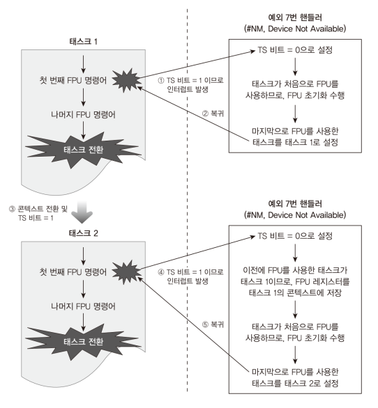
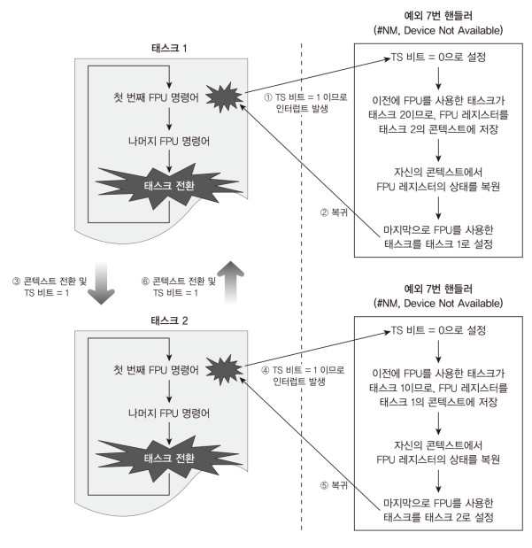

# Code: Task.[h, c], InterruptHandler.[h, c], ISR.asm

# Explanation

## What does the code do?

TCB struct in Task.h include FPU context, 512 bytes field. and TCB and the field
is adjusted to mee the requirement of 16 bytes boundary.

In Task.c, FPU fields in TCB are initialized and scheduler handles FPU fields in
the way that FPU context is lazily switched

## How to utilize FPU

    <figure style='display: inline-block;'>
        
        <figcaption style='text-align: center;'>
            when task uses FPU instruction for the first time
        </figcaption>
    </figure>

    <figure style='display: inline-block;'>
        
        <figcaption style='text-align: center;'>
            when task uses FPU instruction after the first time
        </figcaption>
    </figure>

## Error Note

### Real PC: Failed to use FPU instruction

1. files

    * 02.Kernel64/Source/Task.c

2. functions

    * kInitializeScheduler

3. description

    * When Kernel Process is created, there was one field that was not
    initialized: bFPUUsed. bFPUUsed field is filled with an arbitrary
    number which is not zero. This means that executing first FPU
    instruction causes #NM (Device Not Available) Exception handler
    to load the task FPU context to FPU device although the FPU context
    does not contain valid values.

    * Original code written by the book author also has this problem.

## MINT64OS Characteristics

1. Memory Layout up to CH16

    * start(inclusive) ~ end(exclusive)
    * 0x00000  ~ 0x00400  (Interrupt Vector Table for real mode)
    * 0x07C00  ~ 0x07E00  (Bootloader)
    * 0x07E00  ~ 0x10000  (Stack for real mode and protected mode)
    * 0x10000  ~ ...  (32 bit code of OS; EntryPoint.S + Main.c + ...)
    *
    * 0x20000 ~ 0x20004 (number of memory map entries)
    * 0x20004 ~ ... (memory map entires)
    *
    * 0xA0000  ~ ...      (video memory for graphic mode)
    * 0xB8000  ~ ...      (video memory for text mode)
    *
    * 0x100000(1MB) ~ 0x142000 (IA-32 mode page table tree structure, 264KB)
    * 0x142000      ~ 0x142010 (GDTR, 16 bytes)
    * 0x142010      ~ 0x142038 (GDT, 40 bytes = 3 * 8 bytes + 1 * 16 bytes)
    * 0x142038      ~ 0x1420A0 (TSS, 104 bytes = 1 * 104 bytes)
    * 0x1420A0      ~ 0x1420B0 (IDTR, 16 bytes)
    * 0x1420B0      ~ 0x1426F0 (IDT, 1600 bytes = 100 * 16 bytes)
    *
    * 0x200000(2MB) ~ ... 
    
        * 64 bit code of OS; EntryPoint.S + Main.c + task stack + task
        manager + ...
    
    * 0x600000(6MB) ~ 0x700000(7MB) (Stack for long mode kernel)
    * 0x700000(7MB) ~ 0x800000(8MB) (IST1 stack area)
    * 0x800000(8MB) ~ 0x8CC000 (Task Pool, 816 KB = 816 bytes * 1024)
    * 0x849000      ~ 0x103A000 (Task Stack Pool, 8MB = 8192 * 1024)