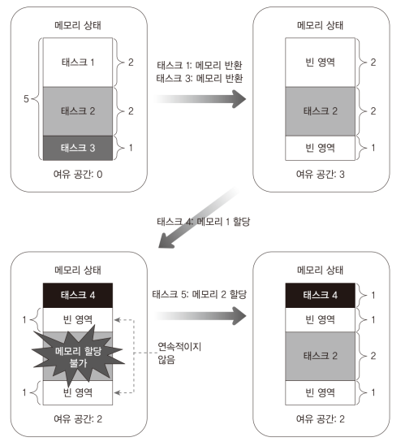
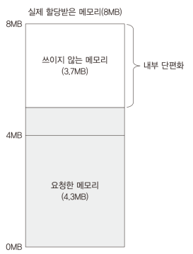
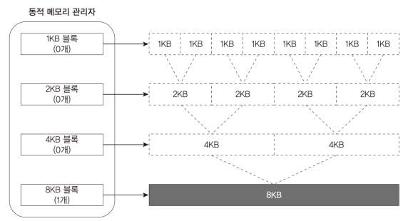
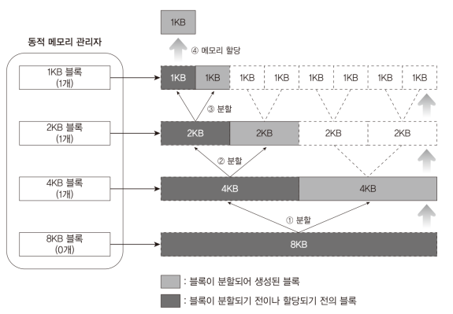
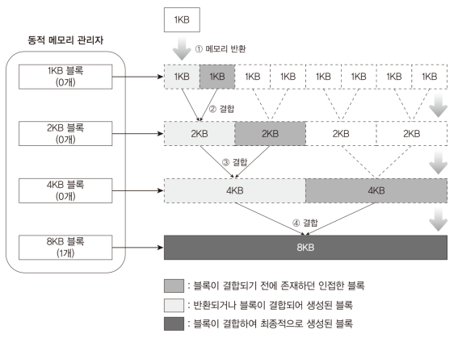
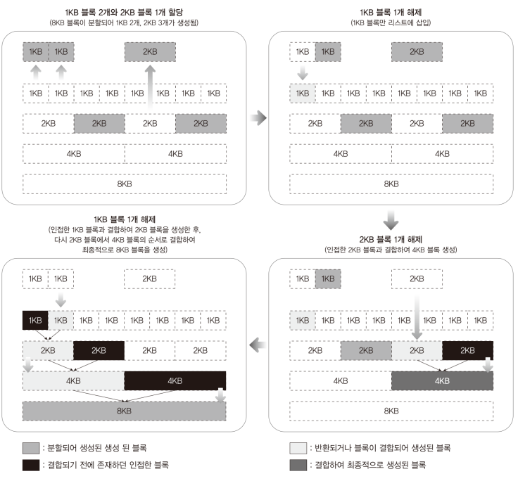
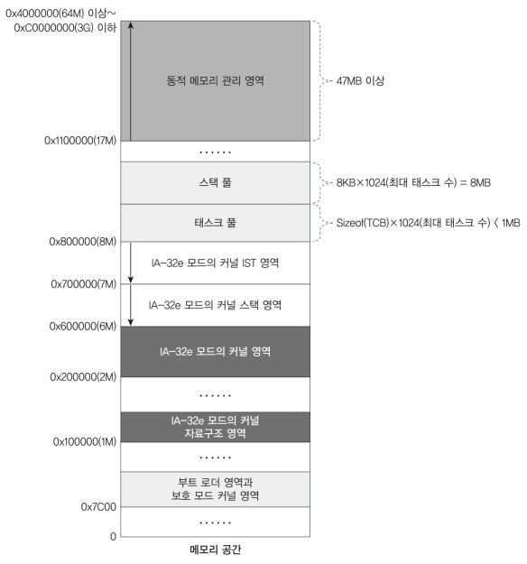
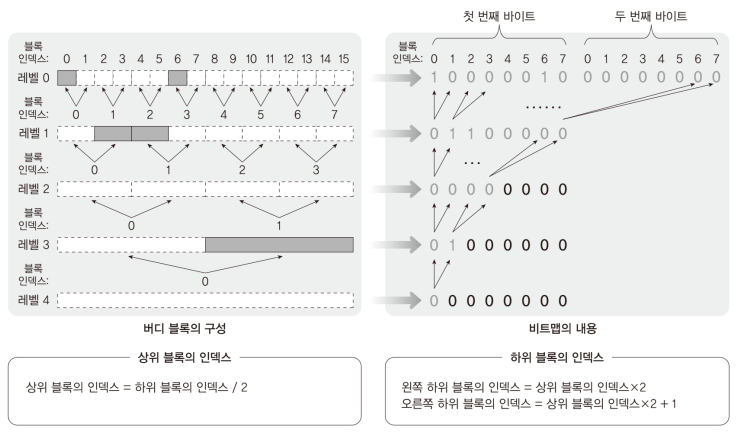
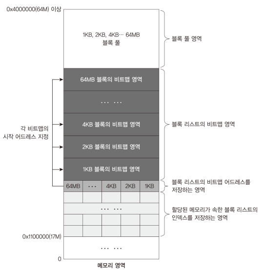

# Code: DynamicMemory.[h, c]

# Explanation

## What does the code do?

### Problem

Every program needs memory to execute. However, allocation of all required
memory at the start of program is waste of memory because most programs do not
utilize all the memory from the start to the end.

### Solution

Instead of allocating the memory at the start, requesting memory when it is
required would efficiently manage the memory. Because memory is allocated
at running time, these files implement how to efficiently manage the memory
allocation to processes

## External Fragment

When requested memory cannot be allocated although size of overall free memory
is bigger or equal to the size of the requested memory

    <figure style='display: inline-block;'>
        
        <figcaption style='text-align: center;'>
            how external memory fragment happens
        </figcaption>
    </figure>

## Internal Fragment

When more memory is allocated to processes than required

    <figure style='display: inline-block;'>
        
        <figcaption style='text-align: center;'>
            internal memory fragment
        </figcaption>
    </figure>

## Buddy Block Algorithm

Buddy Block Algorithm divides dynamic memory into partitions (blocks) and
allocate the blocks as much as required memory.

* If the size of block is bigger than required memory, it halves the block
and gives the split block.

* freed blocks are merged into a bigger block

* simple and efficient, but cannot completely prevent internal and external fragments

    <figure style='display: inline-block;'>
        
        <figcaption style='text-align: center;'>
            buddy block algorithm init
        </figcaption>
    </figure>

    <figure style='display: inline-block;'>
        
        <figcaption style='text-align: center;'>
            buddy block structure after allocating 1KB
        </figcaption>
    </figure>

    <figure style='display: inline-block;'>
        
        <figcaption style='text-align: center;'>
            buddy block structure after freeing 1KB
        </figcaption>
    </figure>

### Example

    <figure style='display: inline-block;'>
        
        <figcaption style='text-align: center;'>
            buddy block algorithm: example of allocating and freeing blocks
        </figcaption>
    </figure>

## Buddy Block Algorithm Implementation in MINT64OS

1. Mint64OS supports up to 3GB dynamic memory because memory address from 3GB
to xGB is usually mapped to different hardware

    * If you want, you can support more than 3GB by using memory map.

    <figure style='display: inline-block;'>
        
        <figcaption style='text-align: center;'>
            memory layout
        </figcaption>
    </figure>

2. bitmap is used for buddy block tree

    * first index starts from 0, not from 1

    * Because first index starts from 0, there must be pointers to each level
    array. (If index starts from 0, one big array for every level can be used

    <figure style='display: inline-block;'>
        
        <figcaption style='text-align: center;'>
            how to implement buddy block algorithm
        </figcaption>
    </figure>

3. structure of dynamic memory manager

    * when memory is allocated to process, the process has only the memory
    address. It does not save the information about which block is responsible
    for the address. The information is managed by dynamic memory manager.

    * The first area of dynamic memory manager manages the above information.
    index of the array corresponds to memory address and data contains
    level of buddy block tree.

    <figure style='display: inline-block;'>
        
        <figcaption style='text-align: center;'>
            dynamic memory manager structure
        </figcaption>
    </figure>

## MINT64OS Characteristics

1. Memory Layout up to CH16

    * start(inclusive) ~ end(exclusive)
    * 0x00000  ~ 0x00400  (Interrupt Vector Table for real mode)
    * 0x07C00  ~ 0x07E00  (Bootloader)
    * 0x07E00  ~ 0x10000  (Stack for real mode and protected mode)
    * 0x10000  ~ ...  (32 bit code of OS; EntryPoint.S + Main.c + ...)
    *
    * 0x20000 ~ 0x20004 (number of memory map entries)
    * 0x20004 ~ ... (memory map entires)
    *
    * 0xA0000  ~ ...      (video memory for graphic mode)
    * 0xB8000  ~ ...      (video memory for text mode)
    *
    * 0x100000(1MB) ~ 0x142000 (IA-32 mode page table tree structure, 264KB)
    * 0x142000      ~ 0x142010 (GDTR, 16 bytes)
    * 0x142010      ~ 0x142038 (GDT, 40 bytes = 3 * 8 bytes + 1 * 16 bytes)
    * 0x142038      ~ 0x1420A0 (TSS, 104 bytes = 1 * 104 bytes)
    * 0x1420A0      ~ 0x1420B0 (IDTR, 16 bytes)
    * 0x1420B0      ~ 0x1426F0 (IDT, 1600 bytes = 100 * 16 bytes)
    *
    * 0x200000(2MB) ~ ... 
    
        * 64 bit code of OS; EntryPoint.S + Main.c + task stack + task
        manager + ...
    
    * 0x600000(6MB) ~ 0x700000(7MB) (Stack for long mode kernel)
    * 0x700000(7MB) ~ 0x800000(8MB) (IST1 stack area)
    * 0x800000(8MB) ~ 0x8CC000 (Task Pool, 816 KB = 816 bytes * 1024)
    * 0x849000      ~ 0x103A000 (Task Stack Pool, 8MB = 8192 * 1024)
    *
    * 0x1100000(17MB) ~... (Dynamic Memory Manager)