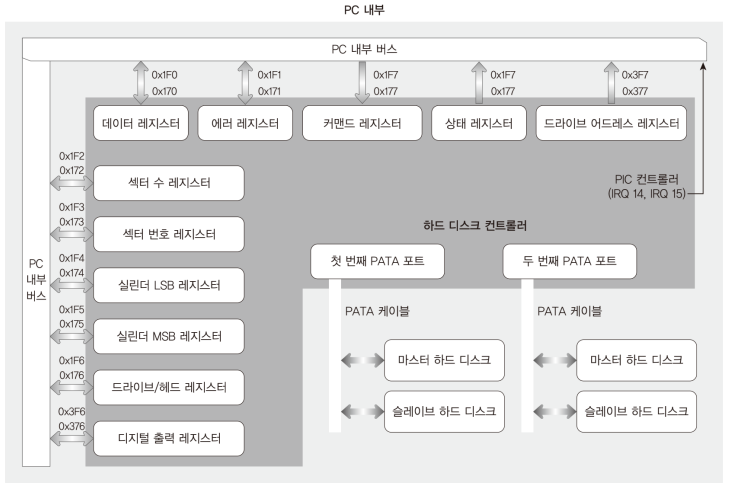
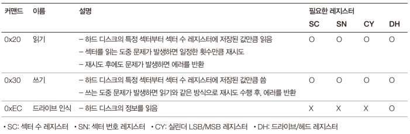
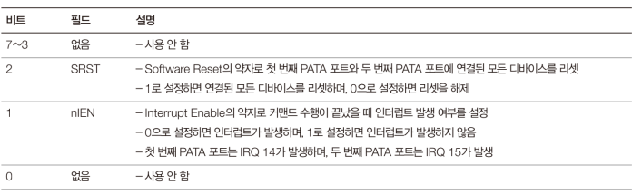
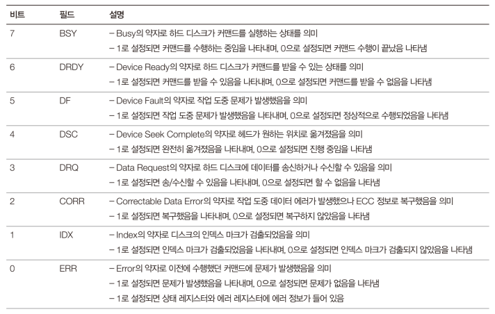
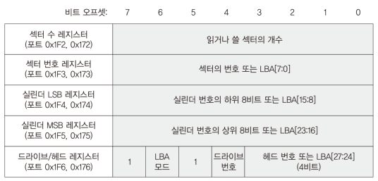

# Explanation

## ATA

ATA, the short form of Advanced Technology Attachment, an interface to connect
hard drives, CD-ROM drives to the computer system. 

* When ATA came out to the world, connector between HDD and system was parallel
connector.

* After the serial ATA came out, when people start to use serial connector,
what was originally called ATA started to be called PATA. 

* Both are part of the ATA standard, and use the same logical command sets,
but SATA obviously has a different electrical interface. Both types of drives
(SATA and PATA) are IDE devices.

## IDE

IDE (Integrated Drive Electronics) was the original name, then they
standardized on ATA.

* These days, people use IDE and PATA interchangeably.

## PATA

* a system can have at most two HBA(host bus controller)

    * primary and secondary HBA

* Each HBA supports at most two disks

    * master and slave disks

    * two disks are physically share the same wires which means that every
    signal goes to both disks.

* Because master and slave drives share the same wires, disk does not respond
if the signals is not for itself. For example, primary disk responds only to 
signal for primary disk.

    * Two disks have exactly the same registers with the same functionality. 

    * Write command writes to registers of both disks

    * Both disks have registers for disk selection, so when a read command
    comes in, the disk reads their own registers and decides whether to
    respond.

    * This means that two disks cannot be running at the same time.

    * If selected disk does not work properly, you cannot use another disk.
    You need to reset before normal operation.

## How to use PATA disks

    <figure style='display: inline-block;'>
        
        <figcaption style='text-align: center;'>
            PATA controller structure
        </figcaption>
    </figure>

I think that registers are not in the host bus controller. If I am right,
the registers are in each disks, and HBA just converts I/O port signals to
ATA signals

    <figure style='display: inline-block;'>
        
        <figcaption style='text-align: center;'>
            PATA I/O ports explanation 
        </figcaption>
    </figure>

    <figure style='display: inline-block;'>
        
        <figcaption style='text-align: center;'>
            requirements for PATA read and write commands
        </figcaption>
    </figure>

    <figure style='display: inline-block;'>
        
        <figcaption style='text-align: center;'>
            explanation of PATA control registers 
        </figcaption>
    </figure>

    <figure style='display: inline-block;'>
        
        <figcaption style='text-align: center;'>
            explanation of PATA status registers 
        </figcaption>
    </figure>

    <figure style='display: inline-block;'>
        
        <figcaption style='text-align: center;'>
            PATA registers for setting address 
        </figcaption>
    </figure>

## Order of reading and writing

1. Check BSY field of status register

    * BSY shows if command is running. when command is finished, you can read
    or set registers

    * No matter of BSY field, you can always read status register.

2. Send command parameters to registers

3. Check DRDY field of status register

    * Although command is finished, there is after-work that disk need to do.
    DRDY field shows if you can run disk command.

4. send read(write) command

5. wait for interrupt (end of command)

6. Check ERR field of status register

7. Check DRQ field of status register

8. read(write) a sector from(to) disk

9. repeat from 6 until the end of data.

## MINT64OS Characteristics

1. Memory Layout up to CH16

    * start(inclusive) ~ end(exclusive)
    * 0x00000  ~ 0x00400  (Interrupt Vector Table for real mode)
    * 0x07C00  ~ 0x07E00  (Bootloader)
    * 0x07E00  ~ 0x10000  (Stack for real mode and protected mode)
    * 0x10000  ~ ...  (32 bit code of OS; EntryPoint.S + Main.c + ...)
    *
    * 0x20000 ~ 0x20004 (number of memory map entries)
    * 0x20004 ~ ... (memory map entires)
    *
    * 0xA0000  ~ ...      (video memory for graphic mode)
    * 0xB8000  ~ ...      (video memory for text mode)
    *
    * 0x100000(1MB) ~ 0x142000 (IA-32 mode page table tree structure, 264KB)
    * 0x142000      ~ 0x142010 (GDTR, 16 bytes)
    * 0x142010      ~ 0x142038 (GDT, 40 bytes = 3 * 8 bytes + 1 * 16 bytes)
    * 0x142038      ~ 0x1420A0 (TSS, 104 bytes = 1 * 104 bytes)
    * 0x1420A0      ~ 0x1420B0 (IDTR, 16 bytes)
    * 0x1420B0      ~ 0x1426F0 (IDT, 1600 bytes = 100 * 16 bytes)
    *
    * 0x200000(2MB) ~ ... 
    
        * 64 bit code of OS; EntryPoint.S + Main.c + task stack + task
        manager + ...
    
    * 0x600000(6MB) ~ 0x700000(7MB) (Stack for long mode kernel)
    * 0x700000(7MB) ~ 0x800000(8MB) (IST1 stack area)
    * 0x800000(8MB) ~ 0x8CC000 (Task Pool, 816 KB = 816 bytes * 1024)
    * 0x849000      ~ 0x103A000 (Task Stack Pool, 8MB = 8192 * 1024)
    *
    * 0x1100000(17MB) ~... (Dynamic Memory Manager)

2. To test PATA Disk, you need to make a disk file

    * `qemu-omg create HDD.img 20M`

3. To run QEMU with the created image, execute below command

    * `qemu-system-x86_64.exe  -m 64 -hda .\Disk.img  -hdb .\HDD.img
    -rtc base=localtime -M pc`