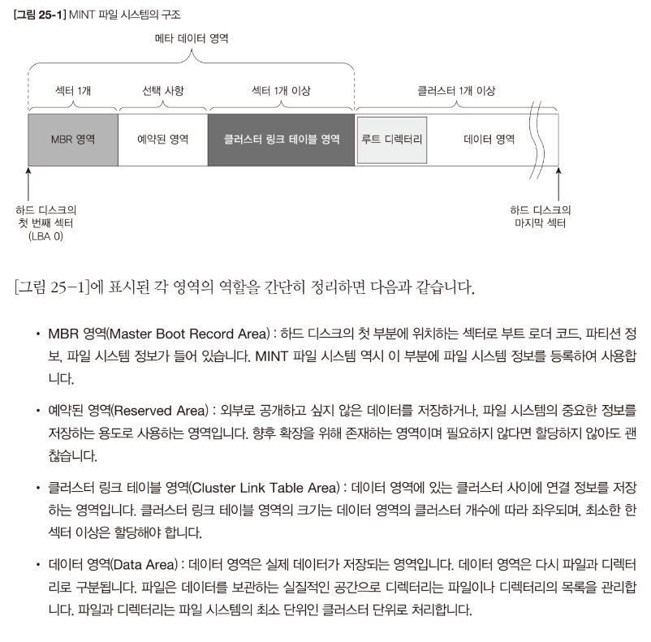
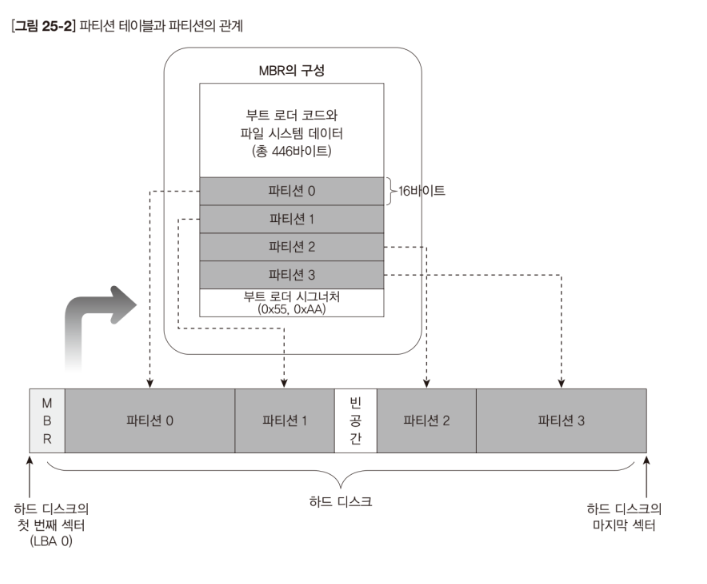
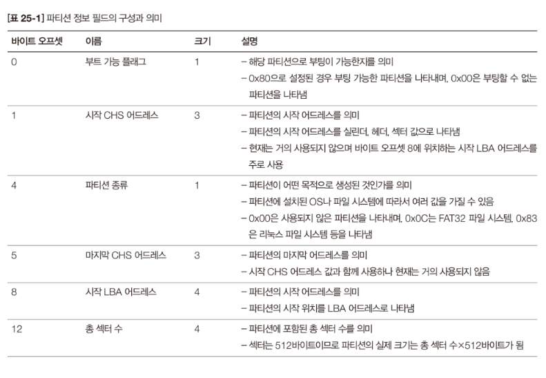
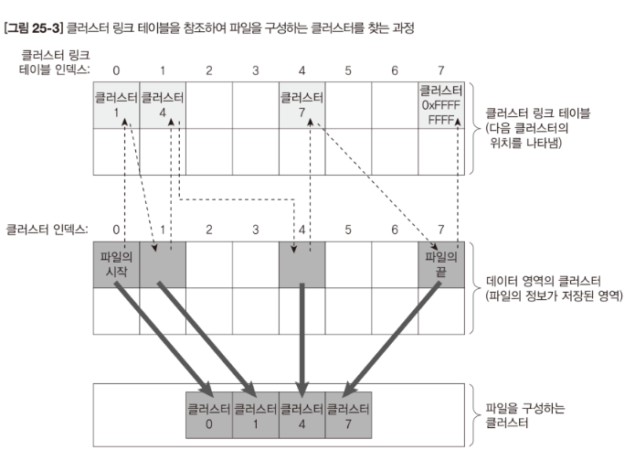
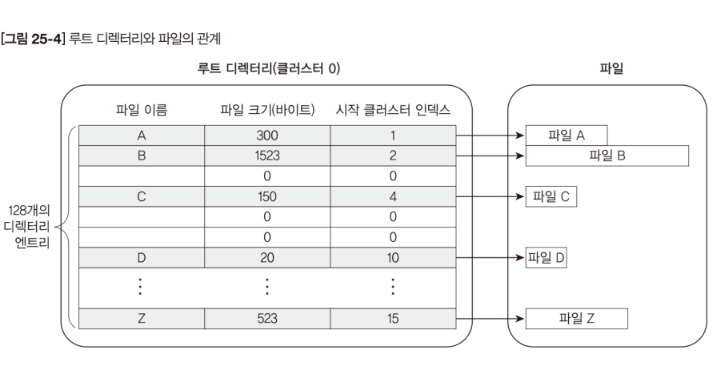
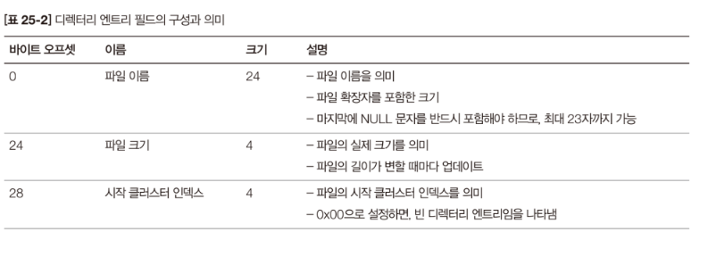
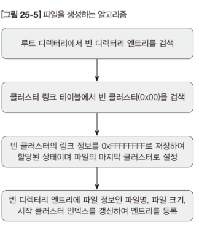
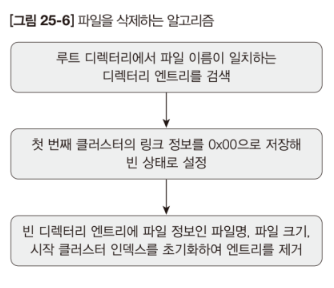

# Code: FileSystem.[c, h], Main.c

# Explanation

## What does the code do?

### Problem

In Chapter 24, we made a hard disk host controller driver. This driver allows 
reading and writing to the hard disk, but we need more sophisticated functions
to read and write files.

### Solution

FileSystem.c contains functions to format the MINT file system and low-level
functions related to the file system.

1. The high-level functions for reading and writing are implemented in Ch 26.

2. In the original code, MINT64OS boots from a floppy disk and the filesystem
code is set to format and mount the primary master IDE disk, which means users
cannot set which disk to format and mount. But I modified the code because my
MINT64OS boots from the primary master hard disk. The modified filesystem code
is set up to format and mount the primary secondary IDE disk.

## MINT Filesystem

1. Mint Filesystem is a simple filesystem that can have only one root directory
and can only have up to 128 files in that directory. 

2. Theoretically, a 16TB hard disk is supported. 

3. The largest single file size is 4 GB.

4. It is not possible to make directory.

5. The longest file name can be up to 23 characters. Encoding must be ASCII.

## How does MINT Filesystem work?

### Cluster

1. A sector on a disk is the smallest readable and writable unit. However,
in the MINT filesystem, a logical smallest unit called cluster is used. In the
MINT filesystem, this cluster consists of 8 sectors. All files are composed of
at least one cluster, and a space smaller than the cluster cannot be allocated. 

    * For example, one cluster is required to store a 1024 byte file on the disk
of the MINT filesystem. Although the actual size of the file is 1024 bytes,
it actually occupies 4 KB on disk.

    * It is not possible to split one cluster to store two files. For example,
a.txt with a size of 512 bytes and b.txt. with a size of 1024 bytes cannot use
one cluster together. They should all have their own cluster.

    * File size of a file can be 0 byte. Even in this case, a file must have one
    cluster. You may be wondering how a zero-size file exists. See the Root
    Directory section for a detailed explanation. meta data about a file such as
    file name, size is stored in a reserved area. 

2. If the file requires more than one cluster, previous cluster contains the
address or link to the next cluster. It has a structure similar to a linked
list.

### Cluster Link Table

1. When writing files to clusters, we need to quickly find out which cluster
is free to use. Cluster Link Table is an area that shows which clusters
are free to use. The link table is at the front of the file system, and the size
of the table is aligned by sectors.

    * For example, link table can be 512 bytes or 1024 bytes or 1536 bytes and
    so on

2. A link table is an array of 4 byte links. The index of each link corresponds
to the index of the cluster.

    * For example, first item in link table has index 0, and the index
    corresponds to index 0 in cluster area.

3. The data in the link shows whether corresponding cluster is free or not.

    * 0xFFFFFFFF in link means unable to use.

    * More precisely, if a file needs more than 1 cluster, previous cluster
    points to this link and this link points to next cluster.

    * If a file takes only one cluster, this link points to 0xFFFFFFFF.

    * If a file takes two clusters, the last cluster points to 0xFFFFFFFF.  

### Root Directory

1. Root directory always occupies first cluster in cluster area, so the first
item in link table is 0xFFFFFFFF.

2. The root directory consists of 32 byte directory entries. A directory entry
contains information about a file, that is, metadata.

    * This information consists of file name, file size, and start cluster index

    * The size of "file name" is 24 bytes. Because the last byte is for end
    character ('\0'), file name can be up to 23 characters long.

    * The size of "file size" is 4 bytes, which can represent up to 4 GB
    (1 Byte * 4GB).

    * The size of "start cluster index" is 4 bytes, which can represents up to
    16TB (4KB * 4GB, remember that a cluster is 4KB)

    * A file of size 0 byte also takes 1 directory entry and 1 cluster. 

### MBR

1. Unlike other filesystems, the MINT filesystem is a custom filesystem.
Therefore, the MBR partition part cannot be used. Instead, near the end of the
MBR, a signature indicating that this disk uses the MINT systemfile is put.

2. Mint64OS looks at this signature to decide whether to mount the disk or not.

    <figure style='display: inline-block;'>
        
        <figcaption style='text-align: center;'>
            MINT filesystem layout
        </figcaption>
    </figure>

    <figure style='display: inline-block;'>
        
        <figcaption style='text-align: center;'>
            MBR layout
        </figcaption>
    </figure>

    <figure style='display: inline-block;'>
        
        <figcaption style='text-align: center;'>
            MBR partition layout
        </figcaption>
    </figure>

    <figure style='display: inline-block;'>
        
        <figcaption style='text-align: center;'>
            How a file is linked in the filesystem
        </figcaption>
    </figure>

    <figure style='display: inline-block;'>
        
        <figcaption style='text-align: center;'>
            MINT filesystem root directory layout
        </figcaption>
    </figure>

    <figure style='display: inline-block;'>
        
        <figcaption style='text-align: center;'>
            MINT filesystem directory entry layout
        </figcaption>
    </figure>

## How to create and delete files in the MINT file system

* Below images show how to use low level functions to create and delete a file.

* In the next chapter, we will make standard high-level functions for file
related features. Reading and Writing will be implemented in the next chapter.

    <figure style='display: inline-block;'>
        
        <figcaption style='text-align: center;'>
            How to create a file in the MINT filesystem
        </figcaption>
    </figure>

    <figure style='display: inline-block;'>
        
        <figcaption style='text-align: center;'>
            How to delete a file in the MINT filesystem
        </figcaption>
    </figure>

## MINT64OS Characteristics

1. Memory Layout up to CH16

    * start(inclusive) ~ end(exclusive)
    * 0x00000  ~ 0x00400  (Interrupt Vector Table for real mode)
    * 0x07C00  ~ 0x07E00  (Bootloader)
    * 0x07E00  ~ 0x10000  (Stack for real mode and protected mode)
    * 0x10000  ~ ...  (32 bit code of OS; EntryPoint.S + Main.c + ...)
    *
    * 0x20000 ~ 0x20004 (number of memory map entries)
    * 0x20004 ~ ... (memory map entires)
    *
    * 0xA0000  ~ ...      (video memory for graphic mode)
    * 0xB8000  ~ ...      (video memory for text mode)
    *
    * 0x100000(1MB) ~ 0x142000 (IA-32 mode page table tree structure, 264KB)
    * 0x142000      ~ 0x142010 (GDTR, 16 bytes)
    * 0x142010      ~ 0x142038 (GDT, 40 bytes = 3 * 8 bytes + 1 * 16 bytes)
    * 0x142038      ~ 0x1420A0 (TSS, 104 bytes = 1 * 104 bytes)
    * 0x1420A0      ~ 0x1420B0 (IDTR, 16 bytes)
    * 0x1420B0      ~ 0x1426F0 (IDT, 1600 bytes = 100 * 16 bytes)
    *
    * 0x200000(2MB) ~ ... 
    
        * 64 bit code of OS; EntryPoint.S + Main.c + task stack + task
        manager + ...
    
    * 0x600000(6MB) ~ 0x700000(7MB) (Stack for long mode kernel)
    * 0x700000(7MB) ~ 0x800000(8MB) (IST1 stack area)
    * 0x800000(8MB) ~ 0x8CC000 (Task Pool, 816 KB = 816 bytes * 1024)
    * 0x849000      ~ 0x103A000 (Task Stack Pool, 8MB = 8192 * 1024)
    *
    * 0x1100000(17MB) ~... (Dynamic Memory Manager)

2. code in Filesystem.c checks if primary slave hdd has MINT filesystem.
Because of that, we need to run QEMU with primary slave hdd. Execute below
command (this command is executed when you run `make run`)

    * `qemu-system-x86_64.exe  -m 64 -hda ./Disk.img  -hdb ./HDD.img
    -rtc base=localtime -M pc`

    * See 24-1.md to create HDD.img. 