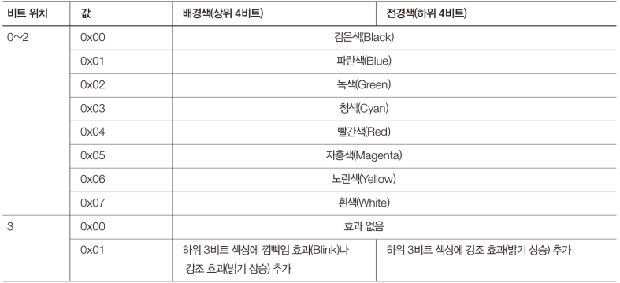

# Code: Bootloader that prints character

```assembly
[ORG 0x00]
[BITS 16]

SECTION .text

mov ax, 0xB800 ; video memory
mov ds, ax

mov byte [0x00], 'M'
mov byte [0x01], 0x4A ; red background and green color

jmp $

times 510 - ($ - $$) db 0x00

db 0x55
db 0xAA
```

# Explanation

## Assembly

1. mov ax, 0xB800 move 0xB800 data to ax register
2. `mov ds, ax` moves value in ax register to ds

    * `mov ds 0xB800` does not work because segment registers can get value
    only from general registers

3. `mov byte [0x00], 'M'` moves 'M' to `0xB800:0x00` as much as 1 byte 

    * In real mode, `[0x00]` means `[DS:0x00]`
    * `[]` means dereference
    * `byte` means size of deferenced address
    * it is like working with c pointer

## Screen Buffer and Control

1. After booting, BIOS set screen mode `text mode`
2. Text mode is `25 X 80`
3. Start of vdeo memory address is `0xB8000`
4. One chracter is 2 bytes which is 1 byte for char and 1 byte for attr

    * overall size of video memory is 4000 bytes which is 80 * 25 * 2 bytes


 