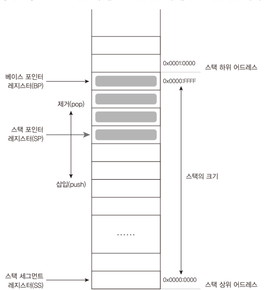
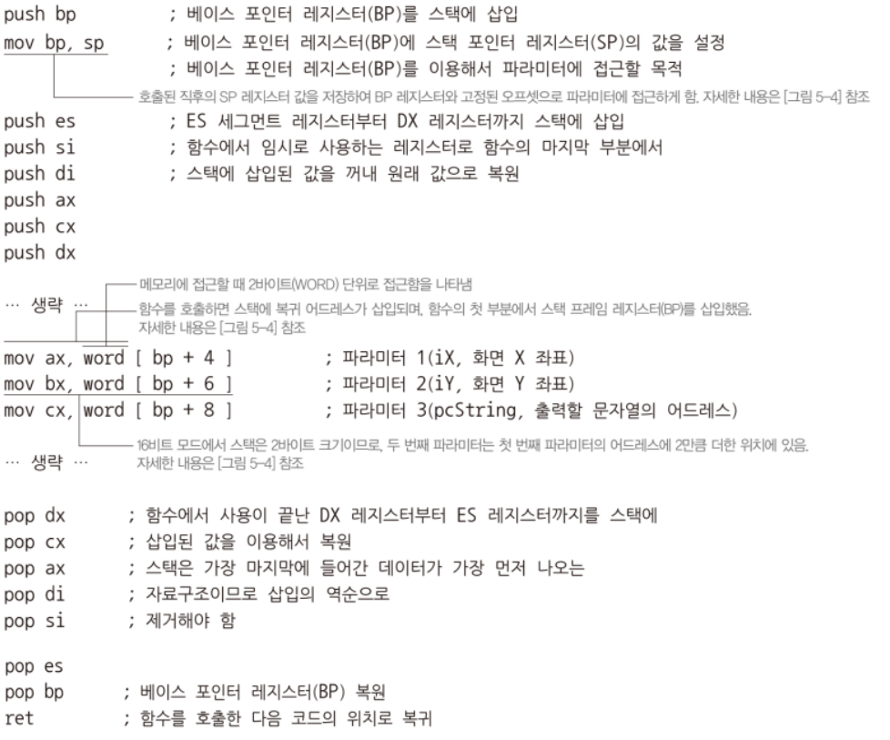
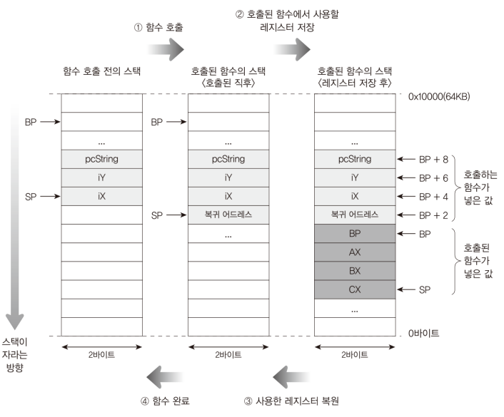
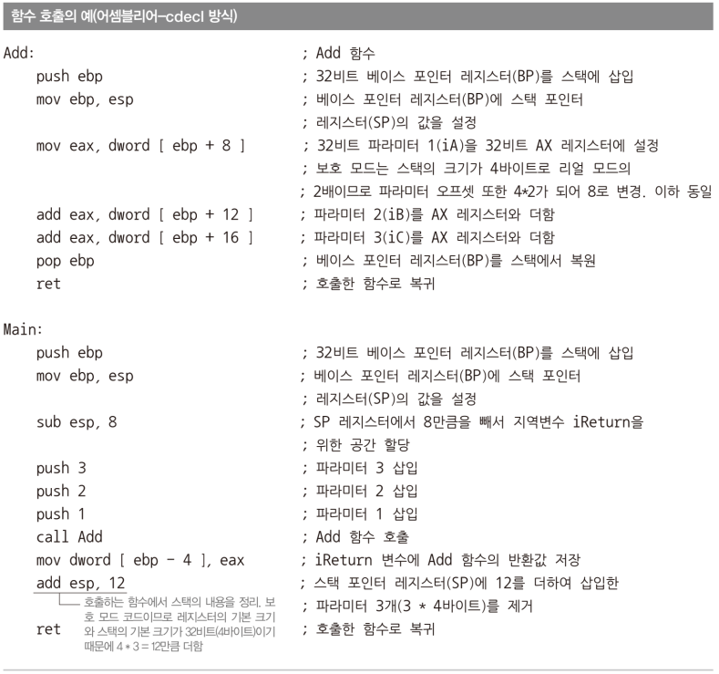
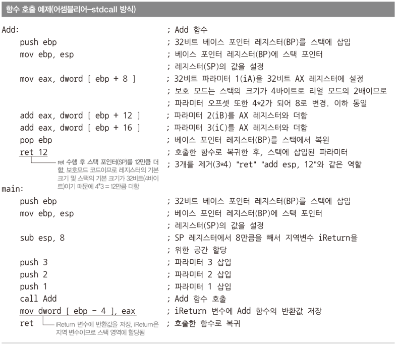
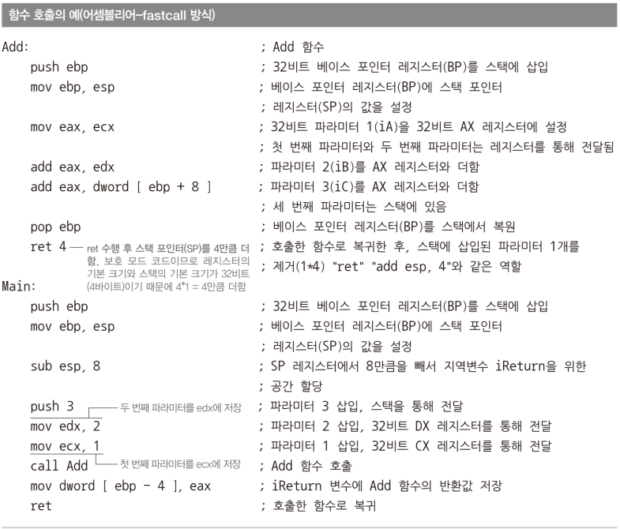

# Code: Part of Bootloader which is about stack and function

```assembly

START:
    ; set regs for a stack from 0x0000:0000 to 0x0000:FFFF (64KB)
    mov ax, 0x0000
    mov ss, ax
    mov sp, 0xFFFE ; 0xFFFE is not mistake! this is for performance
    mov bp, 0xFFFE
    
    ; call PRINTMESSAGE function
    ; add params for the function
    ; param should be pushed in the reverse order of a function signature
    push word [pcString]
    push word [iY]
    push word [iX]
    call PRINTMESSAGE
    ; cdecl convention: clean params from the stack
    add sp, 6

; function signature in C: PrintMessage(iX, iY, pcString)
; follow cdecl calling convention
PRINTMESSAGE:
    ; set env for current function: new stack, empty regs
    ; all values will be restored at the end
    push bp
    mov bp, sp

    push es
    push si
    push di
    push ax
    push cx
    push dx
    ; end of setting env

    ; seg for video memory address
    mov ax, 0xB800
    mov es, ax

    ; calcuate video address for x and y coordinates
    ; y coordinate
    mov ax, word [bp+6] ; short iY
    mov si, 160         ; 80 * 2 (row * char size of text mode)
    mul si              ; iY * 160
    mov di, ax

    ; x coordinate
    mov ax, word [bp+4] ; short iX
    mov si, 2           ; 2 (char size of text mode)
    mul si              ; iX * 2
    add di, ax          : di == iY * 160 + iX * 2

    mov si, word [bp+8] ; char *pcString

.MESSAGELOOP:
    mov cl, byte [si]

    cmp cl, 0
    je .MESSAGEEND

    mov byte [es:di], cl

    add si, 1
    add di, 2

    jmp .MESSAGELOOP

.MESSAGEEND:
    ; pop in the reverse order of push because stack is Last-In, First-out
    pop dx
    pop cx
    pop ax
    pop di
    pop si
    pop es
    pop bp
    ret ; go back to calling address
```

# Explanation

## Assembly

1. `call PRINTMESSAGE` push caller address to stack and go to PRINTMESSAGE addr

2. `push bp` pushes value of bp register to stack

    * set three regs first before using push and pop: `bp`, `sp`, `ss`
    * push and pop internally change value of sp
  
3. `mul si` multiplies ax by si and return the result to ax. 

    * You can use other general purpose registers intead of si

4. `add di, 2` adds di and 2 and return the result to di.

   * You can use other general purpose registers intead of di

5. `pop dx` pops last data from a stack and set the value to dx

6. `ret` pops caller address from stack and returns back to caller

## Stack and Function

1. In x86 system, stack grows downward

2. Stack uses three registers: `BP`, `SP`, `SS`

    * Base Pointer(BP): part of stack address: `[SS:BP]`
    * Stack Pointer(SP): address of last item in stack
    * Stack Segment(SS): segment to use when calcuating stack address
    * `Each register points currently used space, not the free space`
        * ex: if SS:BP is 0x10000, stack actually stores data from 0xFFFF
        * ex: if SS:SP points 0x10000, You can imagine that there is item
        at 0x10000, although the stack is empty
        * ex: if SS:SP points 0xFFFF, there is item at 0xFFFF

    * There are also regs for 32 bits and 64 bits.

3. Caller and callee should follow one of the conventions

    * `stdcall`, `cdecl`, `fastcall` 

4. When a function is called, there are two data pushed into stack after
function parameters: `caller addr`, `BP for caller`

    * call instruction pushes caller addr
    * BP for caller is pushed in function

<div>
  <figure style='display: inline-block;'>
    
    <figcaption style='text-align: center;'>function stack diagram</figcaption>
  </figure>
</div>

<div>
  <figure style='display: inline-block;'>
    
    <figcaption style='text-align: center;'>function template</figcaption>
  </figure>
</div>

<div>
  <figure style='display: inline-block;'>
    
    <figcaption style='text-align: center;'>function call states</figcaption>
  </figure>
</div>

## Function Conventions

1. cdecl

    * params in stack
    * return value is at `AX`
    * caller cleans params from stack

2. stdcall

    * params in stack
    * return value is at AX
    * collee cleans params from stack: `ret <size of params>`

3. fastcall

    * same as stdcall except that registers are use for params
    * every complier has its own slightly different fastcall implemention
    * IA-32e mode uses extended fastcall convention

<div>
  <figure style='display: inline-block;'>
    
    <figcaption style='text-align: center;'>cdecl convention</figcaption>
  </figure>
</div>

<div>
  <figure style='display: inline-block;'>
    
    <figcaption style='text-align: center;'>stdcall convention</figcaption>
  </figure>
</div>

<div>
  <figure style='display: inline-block;'>
    
    <figcaption style='text-align: center;'>fastcall convention</figcaption>
  </figure>
</div>


## MINT64OS Characteristics

1. Stack grows down from `0x10000` which is start address of OS image resides
2. Size of stack is `(0x07C0 + 0x0200) ~ 0x0FFFF`
3. SP is set with 0xFFFE because of bus size. In 16 bits system, It is faster
to read data when the data is placed at a location of multiple 2, and in 32 bits
and 64 systems, data should be placed at a location of multiple 4 or 8.
    * For example, (0xFFFF - 2) bytes is 0xFFFD which is odd number. If you asks
    cpu to read current item from stack, it actually have to execute two
    instructions to read the item

## References

1. [x86 Can push/pop be less than 4 bytes?](
    https://stackoverflow.com/questions/15855021/x86-can-push-pop-be-less-than-4-bytes
)
