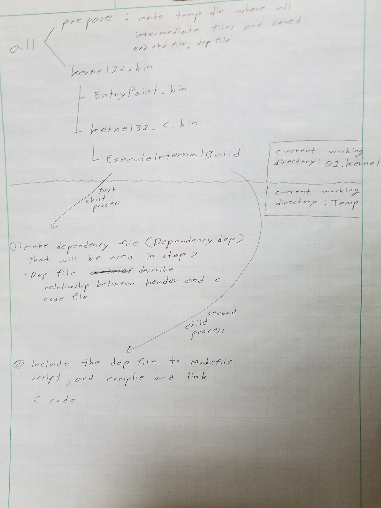

# Code: Makefile in 01.Kernel32

```makefile
NASM32 = nasm
GCC32 = gcc -m32 -c -ffreestanding -fno-pie
LD32 = ld -T ../binary_i386.x -nostdlib

# All object files and intermediate binaries and Kernel32.bin will
# be in Temp directory 
OBJECTDIRECTORY = Temp
SOURCEDIRECTORY = Source

all : prepare Kernel32.bin

prepare:
	mkdir -p $(OBJECTDIRECTORY)

# $^: $(OBJECTDIRECTORY)/EntryPoint.bin $(OBJECTDIRECTORY)/Kernel32_C.bin
# $@: Kernel32.bin
# concatenate entry written in assembly and kernel written in c into a file
Kernel32.bin: $(OBJECTDIRECTORY)/EntryPoint.bin $(OBJECTDIRECTORY)/Kernel32_C.bin
	cat $^ > $@

# Compile EntryPoint.s that switches Real Mode to Protected Mode
$(OBJECTDIRECTORY)/EntryPoint.bin: $(SOURCEDIRECTORY)/EntryPoint.s
	$(NASM32) -o $@ $<


$(OBJECTDIRECTORY)/Kernel32_C.bin: ExecuteInternalBuild
	mv $(OBJECTDIRECTORY)/Kernel32_C.internal.bin $@

# Let child process make Kernel32_C.bin
ExecuteInternalBuild:
	@echo ===    Make Dependency File    ===
	make -C $(OBJECTDIRECTORY) -f ../makefile InternalDependency
	@echo === Dependency Search Complete ===
	make -C $(OBJECTDIRECTORY) -f ../makefile Kernel32_C.internal.bin

##########################################################
# below code is related to making Kernel32_C.bin
# There will be multiple files written in C
# below dependencies are run in child process
# with TEMP as cwd
##########################################################

ASSEMBLYSOURCEFILES = $(wildcard ../$(SOURCEDIRECTORY)/*.asm)
CSOURCEFILES = $(wildcard ../$(SOURCEDIRECTORY)/*.c)

# make dependency file that describes relationship between
# header and c code
InternalDependency:
	$(GCC32) -MM $(CSOURCEFILES) > Dependency.dep

# should included in child process
ifeq (Dependency.dep, $(wildcard Dependency.dep))
include Dependency.dep
endif

ASSEMBLYOBJECTFILES = $(notdir $(patsubst %.asm, %.o, $(ASSEMBLYSOURCEFILES)))
CENTRYPOINTOBJECTFILE = Main.o
# all C object files except Main.o
COBJECTFILES = $(subst Main.o, , $(notdir $(patsubst %.c, %.o, $(CSOURCEFILES))))

%.o: ../$(SOURCEDIRECTORY)/%.c
	$(GCC32) -c $<

%.o: ../$(SOURCEDIRECTORY)/%.asm
	$(NASM32) -f elf32 -o $@ $<

Kernel32_C.internal.bin: $(CENTRYPOINTOBJECTFILE) $(COBJECTFILES) $(ASSEMBLYOBJECTFILES)
	$(LD32) -o $@ $^

clean:
	rm -f *.bin
	rm -f $(OBJECTDIRECTORY)/*.*
```

# Explanation

## What does this Makefile do?

<div>
  <figure style='display: inline-block;'>
    
    <figcaption style='text-align: center;'>
      makefile flow
    </figcaption>
  </figure>
</div>


## Makefile

1. `$(wildcard ../$(SOURCEDIRECTORY)/*.asm)`

    * find all files that ends with .asm in source directory

2. `$(patsubst %.c, %.o, $(CSOURCEFILES))`

    * patsubst = pattern substitution
    * substitute strings that ends with .c to .o

3. `$(notdir $(patsubst %.c, %.o, $(CSOURCEFILES)))`
    
    * notdir filters all directories

4. `$(subst Main.o, , $(notdir $(patsubst %.c, %.o, $(CSOURCEFILES))))`

    * subst = substitution
    * substitution Main.o to empty string

5. `ifeq`, `include`, `endif`

    * it is like C preprocessor
    * if dependency file exists, include the Makefile to script 

6. `make -C $(OBJECTDIRECTORY) -f ../makefile Kernel32_C.internal.bin`

    * execute another child process whose current directory is object directory
    by using makefile in parent directory

## GCC

1. `$(GCC32) -MM $(CSOURCEFILES) > Dependency.dep`

    * find dependency relation in source files and convert it to Makefile