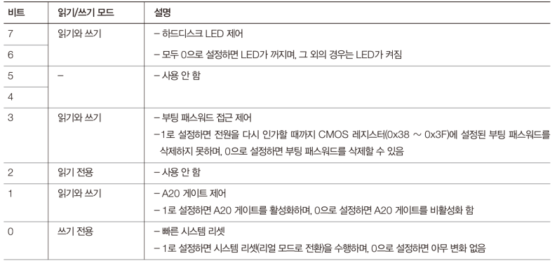
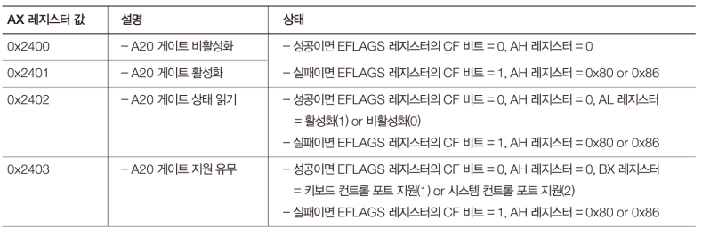

# Code: part of EntryPoint.s that activates A20 Gate

```assembly
START:
    mov ax, 0x1000
    mov ds, ax
    mov es, ax

    ;; A20 Gate activation
    ; activate A20 by using BIOS service, if it fails
    ; try activating by using system control port
    mov ax, 0x2401 ; 0x2401: activate
    int 0x15       ; 0x15: miscellaneous system services

    jc .A20GATEERROR ; if cflag is set, it fails
    jmp .A20GATESUCCESS

    .A20GATEERROR:
        in al, 0x92  ; 0x92: system control port
        or al, 0x02  ; set A20 Gate bit (set bit 1)
        and al, 0xFE ; prevent reset (clear bit 0)
        out 0x92, al

    .A20GATESUCCESS:

    cli ; ignore interrupt until interrupt handler is set

    lgdt [GDTR]
    
        ; PG=0, CD=1, NW=0, AM=0, WP=0, NE=0, ET=1, EM=0, MP=1, PE=1
        ; CD means cache disable
        ; PE is protection enable    
        ; EM, ET, MP, PE are FPU-related fields and they are set
        ; although their feature is not used in IA-32 mode. they will
        ; be explained in detail later. Don't worry about the fields now
        mov eax, 0x4000003B
        mov cr0, eax

        ; 0x08 is offset to the code segment descriptor from GDT
        ; PROTECTEDMODE - $$ + 0x10000 is offset to the code from
        ; segment
        jmp dword 0x08: (PROTECTEDMODE - $$ + 0x10000)
```

# Explanation

## Assembly

1. `in al, 0x92` reads data from I/O address 0x92 and save it to al

2. `out 0x92, al` writes data from al to I/O address 0x92

## I/O port

x86 architecture has two linear memory layout: one for RAM and one for devices

The I/O port memory works slightly different. If you write 0xFFFF to 0x00 of
RAM, the data of 0x01 is 0xFF. However, if you write 0xFFFF to 0x00 of I/O
ports, data at 0x01 is not 0xFF. In I/O port, address is address to device, and
in RAM, address is address to specific data.

Linear memory layout is kind of interface that x86 offers to us. Because of the
simple 1D array interface, we can communicate with devices and save data to
memory without understanding how hardwares are configured to speak with CPU

There are some devices that always have fixed address.

## A20 Gate Activation

There are three ways to activate A20 Gate. If your CPU supports 64 bit or has
more than one core, the computer would support at least two methods

1. `Keyboard Controller`
2. `System Control Port`
3. `BIOS Service`

### System Control Port

System Control Port is always located at `0x92`. You can read or write
`1 byte` sized data.

<div>
  <figure style='display: inline-block;'>
    
    <figcaption style='text-align: center;'>
      system control port data 
    </figcaption>
  </figure>
</div>
s
### BIOS Service

`int 0x15` is miscellaneous system services, and it can activate and deactivate
A20 Gate. In addition, you can read current A20 state and check if system
support A20 Gate Activation

<div>
  <figure style='display: inline-block;'>
    
    <figcaption style='text-align: center;'>
      BIOS A20 Gate activation
    </figcaption>
  </figure>
</div>


## References

1. [How a cpu works with I/O devices 1](
    https://www.reddit.com/r/osdev/comments/ew25sh/io_ports_x86/
)

2. [How a cpu works with I/O devices 2](
    https://stackoverflow.com/questions/56656650/question-about-x86-i-o-port-addresses-and-in-out-instructions
)

2. [Where Can I Find Information About Ports](
    https://wiki.osdev.org/Where_Can_I_Find_Information_About_Ports
)