# Explanation

## Paging

### Caution

This summary note focuses on `IA-32e mode's 2MB-4stages` paging mode

### What problem does Paging solve?

Segmentation offers multiple linear memory spaces, so it is great for organizing
code. For example, a process can have segments for code, data sections or more
sections if it want. However, reassigning a segment to different process or
caching segment to disk are challenging because segment is usually a big chunk.
If each process gives up using segments, `has an virtual linear address space,
and lets OS and CPU maps each small piece of virtual linear space to small
piece of physical memory space.` This method is called Paging

I said 'gives up using segments' in the explanation to help you to understand by
making your imagination as simple as possible. Actually, `you can still make
your program use segmentation with paging.` Without paging, segmentation maps
address directly to physical address, and with paging on, segmentation maps
address to virtual address. And then the virtual address is mapped to real
physical address.

In modern operating system, segmentation is not utilized. It is
considered legacy. However, so you can still utilize segmentation.

### Overview of Paging

1. Segmentation converts logical addresses to linear addresses, and Paging is
the process of translating linear addresses to physical addresses.

    * `logical address` -> `linear address` -> `physical address`
    * Without paging, segmentation is only used and the converted
    linear address is literally physical address
  
2. Paging feature depends on segmentation feature. Paging works on top of 
segmentation. No matter what memory management you decided to utilize,
segmentation must be part of overall address conversion calculation. It sounds
weird, but this is how the CPU works. If you want to utilize only virtual
address, you need two stops. First, set base address of segment descriptor to
0 and limit to maximum. Second, make processes share the same descriptor. 

    * The figure can make you think that linear address is in physical memory,
    so cpu need to access linear address in memory and convert it to physical
    memory. No, linear address is just `(segment descriptor base addr + offset)` 

    

      <figure style='display: inline-block;'>
        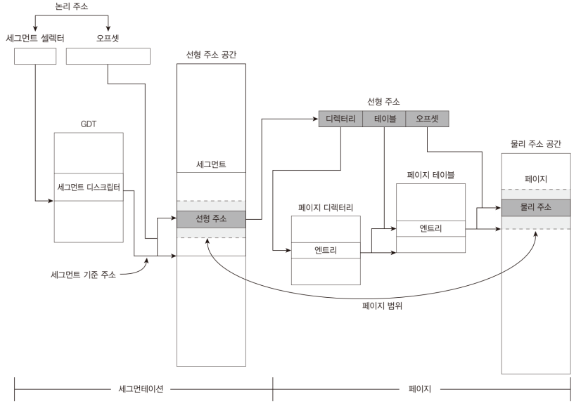
        <figcaption style='text-align: center;'>
        IA-32 paging diagram
        </figcaption>
      </figure>
    

    * In IA-32e mode, you cannot only utilize segmentation. The mode ignores
    base address and limit in segment descriptor. CPU thinks that base address
    is 0 and limit is maximum. This means that you are forced to use
    paging feature. Like other modes, segmentation is still part of overall
    memory conversion calculation in IA-32e mode.

     

      <figure style='display: inline-block;'>
        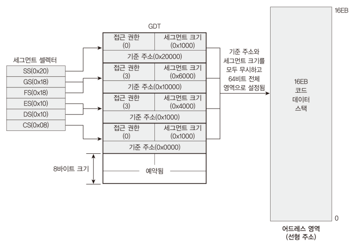
        <figcaption style='text-align: center;'>
          IA-32e segmentation characteristics
        </figcaption>
      </figure>
    
   

3. For paging mapping, a `hierarchical tree data structure` is utilized.

    * The tree stays in memory.
    * each process can have its own tree, so completely independent virtual
    address can be implemented
    
        * but, shared-memory mapping between processes are also possible.

    * Depending on mode and page size, tree depth is different.

4. `Linear address` contains two values

    1. `multiple indices` that locate a leaf in the tree

        * size of a index depends on paging mode
        * number of indices depends on paging mode

    2. `page offset`

        * size of a index depends on paging mode

## Paging Modes

To enable Paging, `CR0`, `CR2`, `CR3`, and `CR4` are needed. `IA32_EFER` is for
switching to IA-32e Mode.

* CR0 has `paging enable`
* CR3 has address to `paging related table`
* CR4 has switches for paging-related features

    * PAE is `paging extension`. IA-32e paging depends on it, so it must be
    set in CR4 for IA-32e

    * Execute-Disable is for security

  <figure style='display: inline-block;'>
    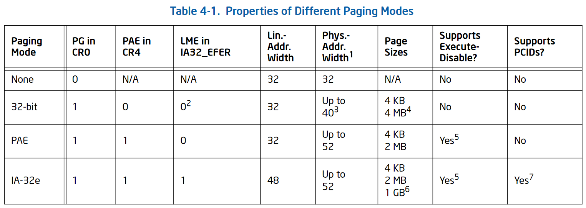
    <figcaption style='text-align: center;'>
      properties of different paging modes
    </figcaption>
  </figure>

  <figure style='display: inline-block;'>
    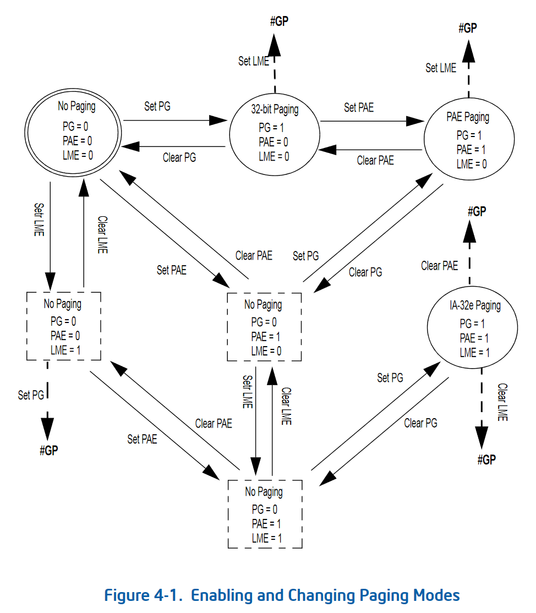
    <figcaption style='text-align: center;'>
      state machine of paging
    </figcaption>
  </figure>

## IA-32e Mode paging modes

Each part in linear address is for finding entry in each table. The tables are
in tree structure and linear address is for locating leaf in the tree 

  <figure style='display: inline-block;'>
    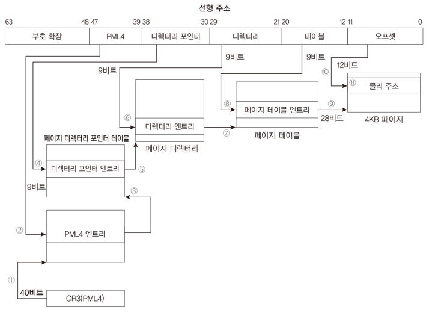
    <figcaption style='text-align: center;'>
      IA-32e paging 4k 5stages
    </figcaption>
  </figure>

  <figure style='display: inline-block;'>
    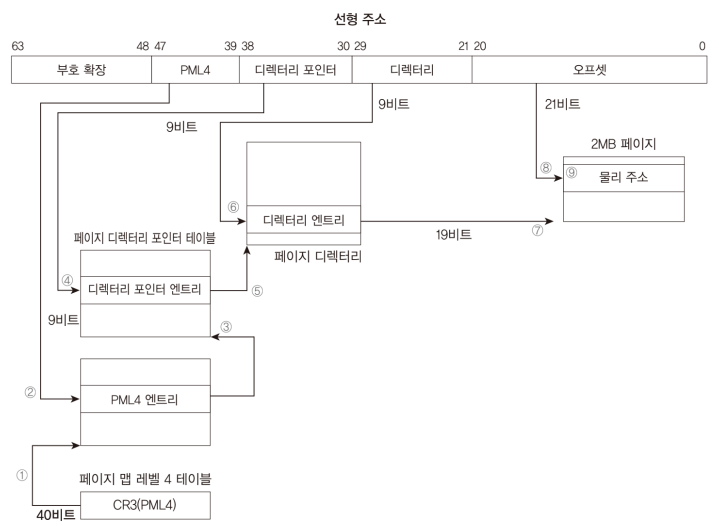
    <figcaption style='text-align: center;'>
      IA-32e paging 2MB 4stages
    </figcaption>
  </figure>

## paging entries (figures are all for IA-32e Mode)

* `paging entry that references to page frame` is only one that has different
structure from other entries

    * `bit 7 (PS)` decides if the entry has different structure. This bit lets
    CPU know that level of stages and paging size

    * only this entry is related to accessible maximum physical memory size

        * For example, in some computer, 2MB-4stages paging can have 256TB of
        linear address and 1TB of physical address
        (2^48 = 256TB, 2MB * 2^19 = 1TB)
        * In 2MB-4stages, this entry uses 19 bits for finding page frame

    * `(base addr * page_size) = physical address of page frame`

* the structure is similar to that of segment descriptor

    * A: access bit (did cpu access the entry)
    * PCD: page cache disable (paging has paging-specific cache feature)
    * PWT: page write-through (paging cache mode)
    * U/S: user/super (0: prevent user(ring 3) from accessing)
    * R/W: read/write (0: prevent user(ring 3) from writing)

    * By default, super user(ring 0~2) can access any pages. this setting can be
    changed by setting CR4. If this is configured, then bit 64(EXB) in entry
    is used

  <figure style='display: inline-block;'>
    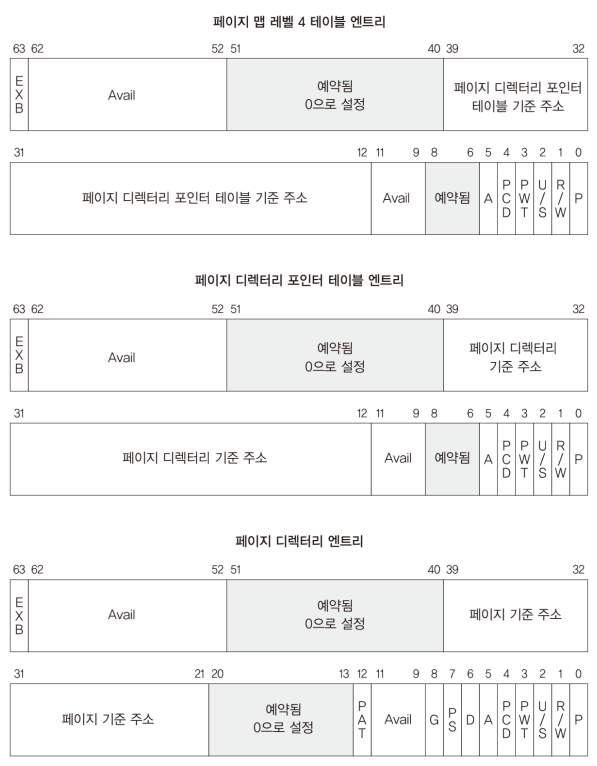
    <figcaption style='text-align: center;'>
      IA-32e paging entries structure 2MB 4stages 
    </figcaption>
  </figure>

  <figure style='display: inline-block;'>
    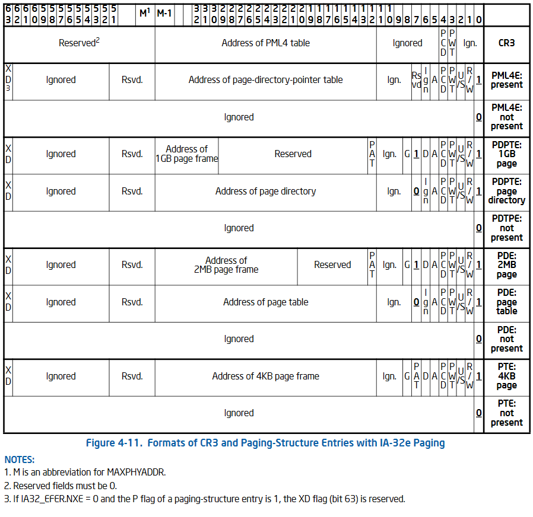
    <figcaption style='text-align: center;'>
      IA-32e paging structure entries
    </figcaption>
  </figure>

  <figure style='display: inline-block;'>
    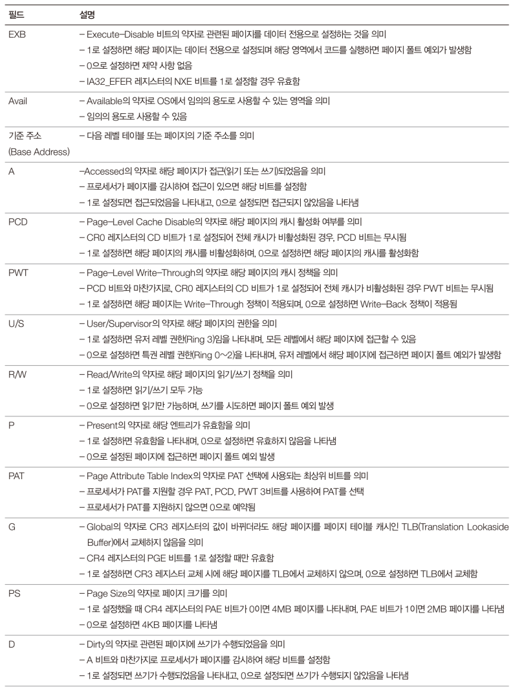
    <figcaption style='text-align: center;'>
      paging entry structure explanation
    </figcaption>
  </figure>

  <figure style='display: inline-block;'>
    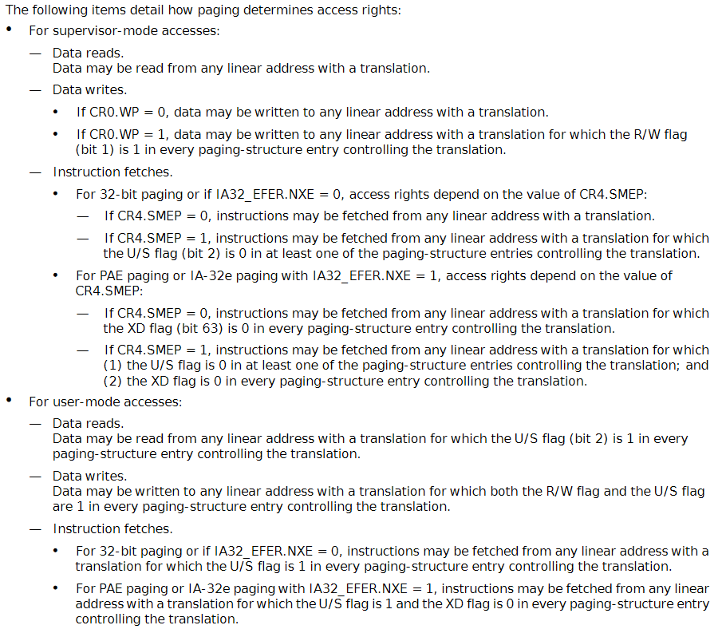
    <figcaption style='text-align: center;'>
      paging access rights
    </figcaption>
  </figure>

## Control Register for paging

To use paging cache, CR0, CR3, and each paging entry are need to be configured

For MINT64OS, only PAE bit of CR4 is used. Do not worry about other
bits in CR4

  <figure style='display: inline-block;'>
    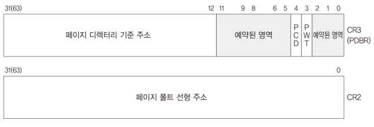
    <figcaption style='text-align: center;'>
      CR3 structure
    </figcaption>
  </figure>

  <figure style='display: inline-block;'>
    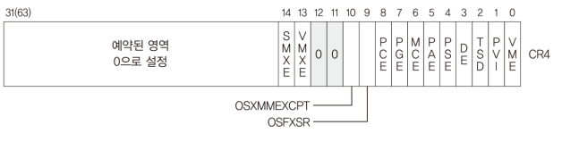
    <figcaption style='text-align: center;'>
      CR4 structure
    </figcaption>
  </figure>

  <figure style='display: inline-block;'>
    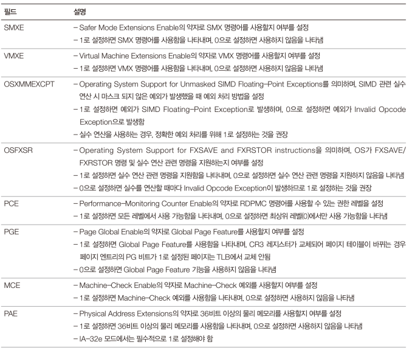
    <figcaption style='text-align: center;'>
      CR4 control register explanation 1
    </figcaption>
  </figure>

  <figure style='display: inline-block;'>
    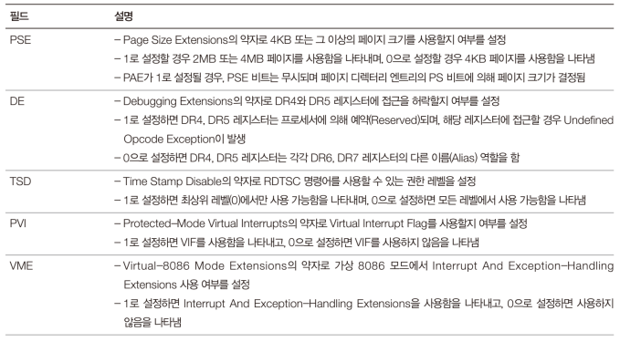
    <figcaption style='text-align: center;'>
      CR4 control register explanation 2
    </figcaption>
  </figure>

## Note

  <figure style='display: inline-block;'>
    
    <figcaption style='text-align: center;'>
      paging note
    </figcaption>
  </figure>

## References

1. [Do modern OS's use paging and segmentation?](
    https://stackoverflow.com/questions/24358105/do-modern-oss-use-paging-and-segmentation
)

2. [Intel Segmentation and Paging manual](
    ./assets/intel-segmentation-and-paging.pdf
)

## References in Korean

1. [paging QA1](
    https://jsandroidapp.cafe24.com/xe/index.php?mid=freeboard&search_target=title&search_keyword=paging&document_srl=6296
)

2. [paging QA2](
    https://jsandroidapp.cafe24.com/xe/index.php?mid=qna&search_target=title&search_keyword=%ED%8E%98%EC%9D%B4%EC%A7%95&document_srl=5372
)

3. [paging QA3](
    https://jsandroidapp.cafe24.com/xe/index.php?mid=qna&search_target=title&search_keyword=%ED%8E%98%EC%9D%B4%EC%A7%95&document_srl=6116
)

4. [paging QA4](
    https://jsandroidapp.cafe24.com/xe/index.php?mid=qna&search_target=title&search_keyword=%ED%8E%98%EC%9D%B4%EC%A7%95&document_srl=6421
)

5. [paging QA5](
    https://jsandroidapp.cafe24.com/xe/index.php?mid=qna&search_target=title&search_keyword=%ED%8E%98%EC%9D%B4%EC%A7%95&document_srl=10292
)

6. [paging QA6](
    https://jsandroidapp.cafe24.com/xe/index.php?mid=qna&search_target=title&search_keyword=%ED%8E%98%EC%9D%B4%EC%A7%95&document_srl=10306
)