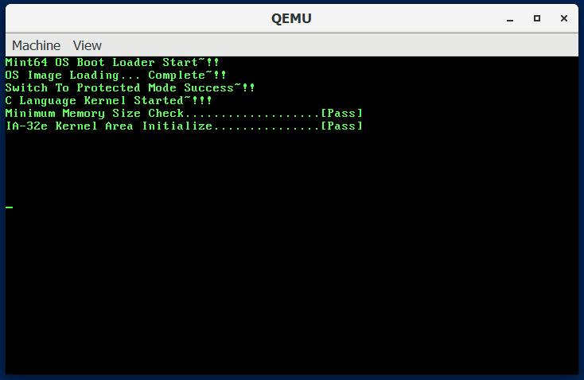

# my-operating-system-programming-skills

This repository is for studying how operating system works. You can find my summary note in markdown format and source code. From the first chapter to the last chapter, you can test
from just a simple bootloader to the complex GUI desktop environment 64 bits multi-core
operating system

# Prerequisite for running OS

## Ubuntu

    # First make sure that you are running linux in your computer natively

    sudo apt update && sudo apt upgrade
    
    # programs for development environment
    sudo apt install nasm gcc binutils make git

    # x86_64 emulator
    # It seems like it supports x86, but x64 is also supported
    sudo apt install qemu-system-x86

    # clone this repository
    git clone 'https://github.com/ybjeon01/my-operating-system-programming-skills'

## Docker + Windows

1. install QEMU for Windows from https://www.qemu.org/
2. install Docker for Windows from https://www.docker.com/
3. run Ubuntu container that has shared volume between Windows and Ubuntu
4. install nasm, gcc, binutils, and make in the container
5. clone this repository to shared volume

# How to run

## Ubuntu

    # go to a chapter directory where you want to compile
    
    # compile
    make all

    # run operating system in emulator
    make run

    # clean
    make clean
    
## Docker + Windows

    # Inside Docker container

    # go to a chapter directory where you want to compile
    
    # compile
    make all

    # open Powershell whose current directory is this repository directory
    qemu-system-x86_64.exe -m 64 -fda .\Disk.img -rtc base=localtime -M pc

# Directory Structure

* Each Chapter directory

    * Summary directory that contains note I wrote after reading a chapter
    
    * Other directories are source code for OS. Directory name is self-explanatory

        * Makefile that compiles source code in the directory

    * Makefile that instructs Makefile in each directory and concatenates
    complied binaries in each directory

# Features

* Ch04

    * describe how to make bootloader that prints a string and execute infinite
    loop

    * summaries
    
        * [4-1.md](Ch4/summary/4-1.md)
        * [4-2.md](Ch4/summary/4-2.md)
        * [4-3.md](Ch4/summary/4-3.md)

    * [result image](Ch4/summary/assets/result.PNG)

* Ch05

    * summaries
    
        * [5-1.md](Ch5/summary/5-1.md)
        * [5-2.md](Ch5/summary/5-2.md)
        * [5-3.md](Ch5/summary/5-3.md)
        * [5-4.md](Ch5/summary/5-4.md)
        * [5-5.md](Ch5/summary/5-5.md)

    * [result image](Ch5/summary/assets/result.PNG)

    1. Bootloader 

        * have stack so it can call functions
        * have print function in cdecl convention
        * read OS from floppy disk, load at 0x10000 and execute it
    
    2. Virtual OS

        * a simple OS to check if bootloader load OS successfully
        * print numbers 1024 times to the screen. 1024 is size of sectors that
        this OS takes

* Ch06

    * summaries
    
        * [6-1.md](Ch6/summary/6-1.md)
        * [6-2.md](Ch6/summary/6-2.md)
        * [6-3.md](Ch6/summary/6-3.md)

    * [result image](Ch6/summary/assets/result.PNG)

    1. EntryPoint.s

        * a file that contains code switching from Real mode to Protected Mode
        * print success menage after successfully switching to Protected Mode

* Ch07

    * describe how to concatenate EntryPoint.s and code written in C

        * Memory Layout conflict
        * what is Linker and how to use Linker script

    * describe modified Makefile that automatically add code dependencies,
    so you can write multiple c codes without adding dependencies to Makefile
    manually

    * summaries

        * [7-1.md](Ch7/summary/7-1.md)
        * [7-2.md](Ch7/summary/7-2.md)
        * [7-3.md](Ch7/summary/7-3.md)
        * [7-4.md](Ch7/summary/7-4.md)

    * [result image](Ch7/summary/assets/result.PNG)

    1. 01.Kernel32/Main.c

        * First code written in C

    2. ImageMaker.c

        * utility program that concatenates Bootloader.bin and other binary.
        * this program automatically modifies TOTALSECTORCOUNT part of
        Bootloader.bin, so you can add multiple c code without modifying
        Bootloader.asm manually

* Ch08

    * describe what is A20 Gate and how to activate it
    
    * summaries

        * [8-1.md](Ch8/summary/8-1.md)
        * [8-2.md](Ch8/summary/8-2.md)
        * [8-3.md](Ch8/summary/8-3.md)

    * [result image](Ch8/summary/assets/result.PNG)

    1 01.Kernel32/EntryPoint.s

        * has code to activate A20 Gate

    2. 01.Kernel32/Main.c

        * has code to check if system has 64MB memory