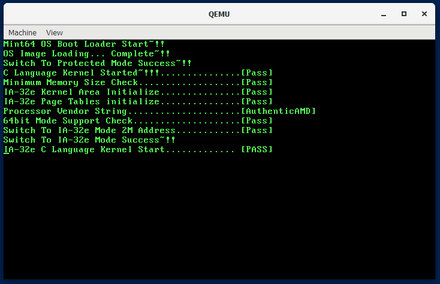

# my-operating-system-programming-skills




This repository is for studying how operating system works. You can find my summary note in markdown format and source code. From the first chapter to the last chapter, you can test
from just a simple bootloader to the complex GUI desktop environment 64 bits multi-core
operating system

# Prerequisite for running OS

## Ubuntu

    # First make sure that you are running linux in your computer natively

    sudo apt update && sudo apt upgrade
    
    # programs for development environment
    sudo apt install nasm gcc binutils make git

    # x86_64 emulator
    # It seems like it supports x86, but x64 is also supported
    sudo apt install qemu-system-x86

    # clone this repository
    git clone 'https://github.com/ybjeon01/my-operating-system-programming-skills'


## Docker + Windows

1. install QEMU for Windows from https://www.qemu.org/
2. install Docker for Windows from https://www.docker.com/
3. run Ubuntu container that has shared volume between Windows and Ubuntu
4. install nasm, gcc, binutils, and make in the container
5. clone this repository to shared volume

# How to run

## Ubuntu

```Bash
# go to a chapter directory where you want to compile

# compile
make all

# run operating system in emulator
make run

# clean
make clean
```

## Docker + Windows

```Bash
# Inside Docker container

# go to a chapter directory where you want to compile

# compile
make all

# open Powershell whose current directory is this repository directory
qemu-system-x86_64.exe -m 64 -fda .\Disk.img -rtc base=localtime -M pc
```
## In Real PC

```Bash
# Before running, it is necessary to install the OS to floppy disk, so
# go to a chapter that you like

# By default, image is made to work under 2.88MB floppy disk. Let it work
# under 1.44MB floppy disk 
make FLOPPY=144 all

# If you are running Windows, download dd command for Windows and copy OS
# Image to a directory where dd command is

# For Linux (floppy disk dev name can be different. But usually is it fd0)
sudo dd if=./Disk.img of=/dev/fd0 bs=1440k count=1

# For Windows
.\dd.exe of="\\.\a:" if=Disk.img bs=1440k count=1

# Go to CMOS (BIOS setting)
# If your BIOS is using UEFI, change it to legacy first and then
# change your bootloader so BIOS reads MBR from floppy disk first

# In my case, I have a Acer Laptop made in 2018. Its BIOS allows to
# emulate USB Floppy Drive as old Floppy Drive, so I changed UEFI to legacy
# mode, connected USB-FDD, and tested my image
```

# Directory Structure

* Each Chapter directory

    * Summary directory that contains note I wrote after reading a chapter
    
    * Other directories are source code for OS. Directory name is self-explanatory

        * Makefile that compiles source code in the directory

    * Makefile that instructs Makefile in each directory and concatenates
    complied binaries in each directory


# Features

* Ch04

    * describe how to make bootloader that prints a string and execute infinite
    loop

    * summaries
    
        * [4-1.md](Ch04/summary/4-1.md)
        * [4-2.md](Ch04/summary/4-2.md)
        * [4-3.md](Ch04/summary/4-3.md)

    * [result image](Ch04/summary/assets/result.PNG)

    1. 00.Bootloader/Bootloader.asm

        * print a message by using BIOS service

    2. 00.Bootloader/Makefile

        * compile Bootloader.asm to a binary

    3. Makefile in root directory

        * copy the Bootloader.bin in 00.Bootloader directory into root directory
        and change the name to Disk.img

* Ch05

    * summaries
    
        * [5-1.md](Ch05/summary/5-1.md)
        * [5-2.md](Ch05/summary/5-2.md)
        * [5-3.md](Ch05/summary/5-3.md)
        * [5-4.md](Ch05/summary/5-4.md)
        * [5-5.md](Ch05/summary/5-5.md)

    * [result image](Ch05/summary/assets/result.PNG)

    1. 00.Bootloader/Bootloader.asm

        * has stack so it can call functions
        * has print function in cdecl convention
        * reads OS from floppy disk, load at 0x10000 and execute it
        * has preprocessor directives so Bootloader can copy OS
        from 1.44 or 2.88 floppy disk 

    2. 00.Bootloader/Makefile

        * accept Floppy option from root Makefile and pass it to assembly compiler

    2. 01.Kernel32/VirtualOS.bin

        * a simple OS to check if bootloader load OS successfully
        * print numbers 1024 times to the screen. 1024 is size of sectors that
        this OS takes

    3. 01.Kernel32/Makefile

        * compile VirtualOS.asm to a binary file

    4. Makefile in root directory

        * concatenate Bootloader.bin and VirtualOS.bin
        * add option Floppy so you can test the image file with real computer

            1. Floppy=144 means the created image is for 1.44MB floppy disk
            2. Floppy=288 means the created image is for 2.88MB floppy disk (default)

* Ch06
    * describe how to switch from real mode to protected mode 
    * describe segment descriptor and GDT(global descriptor table)
    which is required before switching
    * describe some of features that CR0 controls: cache and FPU 

    * summaries
    
        * [6-1.md](Ch06/summary/6-1.md)
        * [6-2.md](Ch06/summary/6-2.md)
        * [6-3.md](Ch06/summary/6-3.md)

    * [result image](Ch06/summary/assets/result.PNG)

    1. 01.Kernel32/Source/EntryPoint.s

        * a file that contains code switching from Real mode to Protected Mode
        * print success menage after successfully switching to Protected Mode

    2. Makefile in root directory

        * remove VirtualOS part
        * concatenate Bootloader.bin and EntryPoint.bin when making OS image file

* Ch07

    * describe how to concatenate EntryPoint.s and code written in C

        * Memory Layout conflict
        * what is Linker and how to use Linker script

    * describe modified Makefile that automatically add code dependencies,
    so you can write multiple c codes without adding dependencies to Makefile
    manually

    * summaries

        * [7-1.md](Ch07/summary/7-1.md)
        * [7-2.md](Ch07/summary/7-2.md)
        * [7-3.md](Ch07/summary/7-3.md)
        * [7-4.md](Ch07/summary/7-4.md)

    * [result image](Ch07/summary/assets/result.PNG)

    1. 00.Bootloader/Bootloader.asm

        * TOTALSECTORCOUNT constant, so ImageMaker can modify the value, and bootloader
        can successfully load the whole os image to memory

    2. 01.Kernel32/Source/EntryPoint.s

        *  jump to where C code is: 0x10200

    3. 01.Kernel32/Source/Main.c

        * First code written in C

    4. 01.Kernel32/[Makefile, binary_i386.x]

        * Makefile file and linker script that compiles code to 32 bit kernel

    5. 04./Utility/01.ImageMaker/ImageMaker.c

        * utility program that concatenates Bootloader.bin and 32 bit kernel
        binary.
        * this program automatically modifies TOTALSECTORCOUNT part of
        Bootloader.bin, so you can add multiple c code without modifying
        Bootloader.asm manually

* Ch08

    * describe what is A20 Gate and how to activate it
    
    * summaries

        * [8-1.md](Ch08/summary/8-1.md)
        * [8-2.md](Ch08/summary/8-2.md)
        * [8-3.md](Ch08/summary/8-3.md)

    * [result image](Ch08/summary/assets/result.PNG)

    1. 01.Kernel32/EntryPoint.s

        * has code to activate A20 Gate

    2. 01.Kernel32/Main.c

        * has code to check if system has 64MB memory

* Ch09

    * describe paging, a memory management feature
    * explains how to prepare to use the feature
    
    * summaries

        * [9-1.md](Ch09/summary/9-1.md)
        * [9-2.md](Ch09/summary/9-2.md)
        * [9-3.md](Ch09/summary/9-3.md)

    * [result image](Ch09/summary/assets/result.PNG)

    1. 01.Kernel32/[Page.h, Page.c]

        * has code to initialize IA-32e mode page tree data structure

* Ch10

    * describe paging, a memory management feature
    * explains how to prepare to use the feature
    
    * summaries

        * [10-1.md](Ch10/summary/10-1.md)
        * [10-2.md](Ch10/summary/10-2.md)
        * [10-3.md](Ch10/summary/10-3.md)
        * [10-4.md](Ch10/summary/10-4.md)
        * [10-5.md](Ch10/summary/10-5.md)
        * [10-6.md](Ch10/summary/10-6.md)
        * [10-7.md](Ch10/summary/10-7.md)

    * [early result image](Ch10/summary/assets/result1.PNG)
    * [result image](Ch10/summary/assets/result2.PNG)

    1. 01.Kernel32/Source/[ModeSwitch.asm, ModeSwitch.h]

        * reads cpuid and check if current CPU supports long mode
        * mount all prepared data structures to registers and switch
        long mode on and jump to code at 0x200000(2MB)

    2. 00.Bootloader/Bootloader.asm

        * a new constant, KERNEL32SECTORCOUNT which helps 32 bit Kernel
        to copy 64 bit Kernel to memory at 0x200000

    3. 01.Kernel32/Source/Main.c

        * copy Kernel64 binary to 0x200000 and call function in ModeSwitch.asm

    4. 02.Kernel64/Source/[EntryPoint.s, Main.c]

        * first code written in C for long mode

    5. 02.Kernel64/Makefile and 01.Kernel64/binary_amd64

        * Makefile file and linker script that compiles code to 64 bit kernel

    6. 04./Utility/01.ImageMaker/ImageMaker.c

        * this program is modified to add 64 bit binary to image file
        * modify KERNEL32SECTORCOUNT in Bootloader.asm