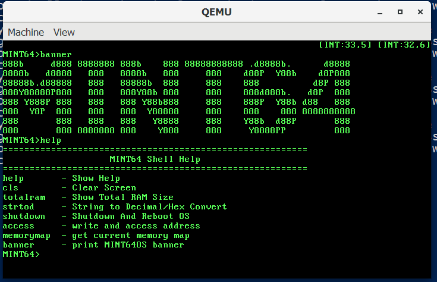
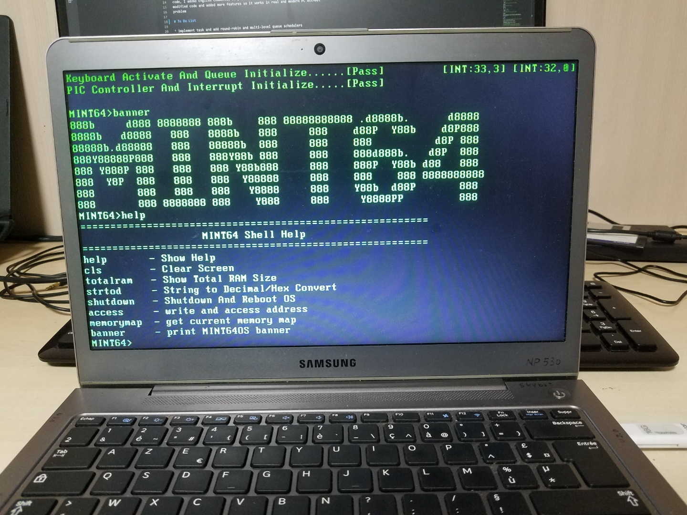

# my-operating-system-programming-skills

# Pictures





## Current State (Ch24): PATA disk driver that reads first sector of hdd  


This repository is for studying how operating system works. You can find my
summary note in markdown format and source code. From the first chapter to the
last chapter, you can test from just a simple bootloader to the complex GUI 
desktop environment 64 bits multi-core operating system.

The code I write here is based on a book, "Structures and Principles of 64 bit
multi-core OS" written by a Korean author. You can find original MINT64OS
code in this [repository](https://github.com/kkamagui). Unlike the original
code, I added English comments, so you can understand how it works. Also I
modified code and added more features so it works in real and modern PC without
problem   

# Videos

1. [Ch4 in real computer](https://www.youtube.com/watch?v=0Lf-dNaZmwo)

2. [Ch9 in real computer](https://www.youtube.com/watch?v=IdnCPOYaedQ)

3. [CH10 in real computer](https://www.youtube.com/watch?v=ql7xM7M2JCw)

4. [CH14 in QEMU](https://www.youtube.com/watch?v=UNmXIaIwEUA)

5. [CH15_sub1 in real computer 1](https://www.youtube.com/watch?v=ZBIv6zvOMJQ)

6. [CH15_sub1 in real computer 2](https://www.youtube.com/watch?v=7wx2FVJK7-A)

7. [Ch18 in real computer](https://youtu.be/2numiF76nx0)

8. [Ch19 in real computer](https://youtu.be/ATwmjECjap0)

9. [Ch21 in real computer](https://youtu.be/5VM0xHjQbfU)

    * describe how to address original showmatrix code problem

10. [Ch21 in real computer](https://youtu.be/-n4KDdYV-Pk)

    * describe how to address general protection exception caused in original
    code

# To Do List

* add Hard Disk driver and implement a simple file system(fat32)

* add functions offered by stdio.h and unistd.h

* add RAM disk and cache feature to improve hard disk speed

* extract CPU info and activate more than one cores (multi core)

* implement a simple GUI desktop environment

* add mouse driver (PS/2)

* divide user level memory regions from kernel level memory regions 

## Not in the book

* add a simple audio driver

* add ext2 file system

* make the bootloader in C language with assembly

* Instead of concatenating bootloader with kernel binary, let linker link
both automatically.

* Currently, Bootloader does too many things, use chain loading and let
Kernel code load OS-related binary to memory

* implement a network layer up to TCP/IP

* make a simple http server

* Instead of using BIOS, use UEFI

* support ARM instruction set

* add USB driver and usb mouse driver

# Prerequisite for running OS

## Ubuntu

    # First make sure that you are running linux in your computer natively

    sudo apt update && sudo apt upgrade
    
    # programs for development environment
    sudo apt install nasm gcc binutils make git

    # x86_64 emulator
    # It seems like it supports x86, but x64 is also supported
    sudo apt install qemu-system-x86

    # clone this repository
    git clone 'https://github.com/ybjeon01/my-operating-system-programming-skills'


## Docker + Windows

1. install QEMU for Windows from https://www.qemu.org/
2. install Docker for Windows from https://www.docker.com/
3. run Ubuntu container that has shared volume between Windows and Ubuntu
4. install nasm, gcc, binutils, and make in the container
5. clone this repository to shared volume

# How to run

## Ubuntu

```Bash
# go to a chapter directory where you want to compile

# compile
make all

# run operating system in emulator
make run

# clean
make clean
```

## Docker + Windows

```Bash
# Inside Docker container

# go to a chapter directory where you want to compile

# compile
make all

# open Powershell whose current directory is this repository directory
qemu-system-x86_64.exe -m 64 -fda .\Disk.img -rtc base=localtime -M pc
```
## In Real PC

```Bash
# Before running, it is necessary to install the OS to floppy disk, so
# go to a chapter that you like

# By default, image is made to work under 2.88MB floppy disk. Let it work
# under 1.44MB floppy disk 
make FLOPPY=144 all

# If you are running Windows, download dd command for Windows and copy OS
# Image to a directory where dd command is

# For Linux (floppy disk dev name can be different. But usually is it fd0)
sudo dd if=./Disk.img of=/dev/fd0 bs=1440k count=1

# For Windows
.\dd.exe of="\\.\a:" if=Disk.img bs=1440k count=1

# Go to CMOS (BIOS setting)
# If your BIOS is using UEFI, change it to legacy first and then
# change your bootloader order so BIOS reads MBR from floppy disk first

# In my case, I have a Acer Laptop made in 2018. Its BIOS allows to
# emulate USB Floppy Drive as old Floppy Drive, so I changed UEFI to legacy
# mode, connected USB-FDD, and tested my image
```

## from Ch15_sub1

from CH15_sub1, PC can boot OS from USB or HDD.


### Ubuntu

```Bash
# go to a chapter directory where you want to compile

# compile
make all

# run operating system in emulator
make run

# clean
make clean
```

### Docker + Windows

```Bash
# Inside Docker container

# go to a chapter directory where you want to compile

# compile
make all

# open Powershell whose current directory is this repository directory
qemu-system-x86_64.exe -m 64 -hda .\Disk.img -rtc base=localtime -M pc
```
### In Real PC

```Bash
  
make  all

# If you are running Windows, download dd command for Windows and copy OS
# Image to a directory where dd command is

sudo dd if=./Disk.img of=/dev/[your usb or hdd]

# For Windows
.\dd.exe of=[usb or hdd drive letter] if=Disk.img

# Go to CMOS (BIOS setting)
# If your BIOS is using UEFI, change it to legacy first and then
# change your bootloader order so BIOS reads MBR from usb or hdd first

# In my case, I have a Acer Laptop made in 2018. Its BIOS allows to
# emulate USB HDD Drive as Hard Disk Drive, so I changed UEFI to legacy
# mode, connected USB-HDD, and tested my image
```

# Directory Structure

* Each Chapter directory

    * Summary directory that contains note I wrote after reading a chapter
    
    * Other directories are source code for OS. Directory name is
    self-explanatory

        * Makefile that compiles source code in the directory

    * Makefile that instructs Makefile in each directory and concatenates
    complied binaries in each directory


# Features

* Ch04

    * describe how to make bootloader that prints a string and execute infinite
    loop

    * summaries
    
        * [4-1.md](Ch04/summary/4-1.md)
        * [4-2.md](Ch04/summary/4-2.md)
        * [4-3.md](Ch04/summary/4-3.md)

    * [result image](Ch04/summary/assets/result.PNG)

    1. 00.Bootloader/Bootloader.asm

        * print a message by using BIOS service

    2. 00.Bootloader/Makefile

        * compile Bootloader.asm to a binary

    3. Makefile in root directory

        * copy the Bootloader.bin in 00.Bootloader directory into root directory
        and change the name to Disk.img

* Ch05

    * summaries
    
        * [5-1.md](Ch05/summary/5-1.md)
        * [5-2.md](Ch05/summary/5-2.md)
        * [5-3.md](Ch05/summary/5-3.md)
        * [5-4.md](Ch05/summary/5-4.md)
        * [5-5.md](Ch05/summary/5-5.md)

    * [result image](Ch05/summary/assets/result.PNG)

    1. 00.Bootloader/Bootloader.asm

        * has stack so it can call functions
        * has print function in cdecl convention
        * reads OS from floppy disk, load at 0x10000 and execute it
        * has preprocessor directives so Bootloader can copy OS
        from 1.44 or 2.88 floppy disk 

    2. 00.Bootloader/Makefile

        * accept Floppy option from root Makefile and pass it to assembly
        compiler

    2. 01.Kernel32/VirtualOS.bin

        * a simple OS to check if bootloader load OS successfully
        * print numbers 1024 times to the screen. 1024 is size of sectors that
        this OS takes

    3. 01.Kernel32/Makefile

        * compile VirtualOS.asm to a binary file

    4. Makefile in root directory

        * concatenate Bootloader.bin and VirtualOS.bin
        * add option Floppy so you can test the image file with real computer

            1. Floppy=144 means the created image is for 1.44MB floppy disk
            2. Floppy=288 means the created image is for 2.88MB floppy disk
            (default)

* Ch06
    * describe how to switch from real mode to protected mode 
    * describe segment descriptor and GDT(global descriptor table)
    which is required before switching
    * describe some of features that CR0 controls: cache and FPU 

    * summaries
    
        * [6-1.md](Ch06/summary/6-1.md)
        * [6-2.md](Ch06/summary/6-2.md)
        * [6-3.md](Ch06/summary/6-3.md)

    * [result image](Ch06/summary/assets/result.PNG)

    1. 01.Kernel32/Source/EntryPoint.s

        * a file that contains code switching from Real mode to Protected Mode
        * print success menage after successfully switching to Protected Mode

    2. Makefile in root directory

        * remove VirtualOS part
        * concatenate Bootloader.bin and EntryPoint.bin when making OS image
        file

* Ch07

    * describe how to concatenate EntryPoint.s and code written in C

        * Memory Layout conflict
        * what is Linker and how to use Linker script

    * describe modified Makefile that automatically add code dependencies,
    so you can write multiple c codes without adding dependencies to Makefile
    manually

    * summaries

        * [7-1.md](Ch07/summary/7-1.md)
        * [7-2.md](Ch07/summary/7-2.md)
        * [7-3.md](Ch07/summary/7-3.md)
        * [7-4.md](Ch07/summary/7-4.md)

    * [result image](Ch07/summary/assets/result.PNG)

    1. 00.Bootloader/Bootloader.asm

        * TOTALSECTORCOUNT constant, so ImageMaker can modify the value, and
        bootloader
        can successfully load the whole os image to memory

    2. 01.Kernel32/Source/EntryPoint.s

        *  jump to where C code is: 0x10200

    3. 01.Kernel32/Source/Main.c

        * First code written in C

    4. 01.Kernel32/[Makefile, binary_i386.x]

        * Makefile file and linker script that compiles code to 32 bit kernel

    5. 04./Utility/01.ImageMaker/ImageMaker.c

        * utility program that concatenates Bootloader.bin and 32 bit kernel
        binary.
        * this program automatically modifies TOTALSECTORCOUNT part of
        Bootloader.bin, so you can add multiple c code without modifying
        Bootloader.asm manually

* Ch08

    * describe what is A20 Gate and how to activate it
    
    * summaries

        * [8-1.md](Ch08/summary/8-1.md)
        * [8-2.md](Ch08/summary/8-2.md)
        * [8-3.md](Ch08/summary/8-3.md)

    * [result image](Ch08/summary/assets/result.PNG)

    1. 01.Kernel32/EntryPoint.s

        * has code to activate A20 Gate

    2. 01.Kernel32/Main.c

        * has code to check if system has 64MB memory

* Ch09

    * describe paging, a memory management feature
    * explains how to prepare to use the feature
    
    * summaries

        * [9-1.md](Ch09/summary/9-1.md)
        * [9-2.md](Ch09/summary/9-2.md)
        * [9-3.md](Ch09/summary/9-3.md)

    * [result image](Ch09/summary/assets/result.PNG)

    1. 01.Kernel32/[Page.h, Page.c]

        * has code to initialize IA-32e mode page tree data structure

* Ch10

    * describe how to switch from protected mode to long mode
    
    * summaries

        * [10-1.md](Ch10/summary/10-1.md)
        * [10-2.md](Ch10/summary/10-2.md)
        * [10-3.md](Ch10/summary/10-3.md)
        * [10-4.md](Ch10/summary/10-4.md)
        * [10-5.md](Ch10/summary/10-5.md)
        * [10-6.md](Ch10/summary/10-6.md)
        * [10-7.md](Ch10/summary/10-7.md)

    * [early result image](Ch10/summary/assets/result1.PNG)
    * [result image](Ch10/summary/assets/result2.PNG)

    1. 01.Kernel32/Source/[ModeSwitch.asm, ModeSwitch.h]

        * reads cpuid and check if current CPU supports long mode
        * mount all prepared data structures to registers and switch
        long mode on and jump to code at 0x200000(2MB)

    2. 00.Bootloader/Bootloader.asm

        * a new constant, KERNEL32SECTORCOUNT which helps 32 bit Kernel
        to copy 64 bit Kernel to memory at 0x200000

    3. 01.Kernel32/Source/Main.c

        * copy Kernel64 binary to 0x200000 and call function in ModeSwitch.asm

    4. 02.Kernel64/Source/[EntryPoint.s, Main.c]

        * first code written in C for long mode

    5. 02.Kernel64/Makefile and 01.Kernel64/binary_amd64

        * Makefile file and linker script that compiles code to 64 bit kernel

    6. 04./Utility/01.ImageMaker/ImageMaker.c

        * this program is modified to add 64 bit binary to image file
        * modify KERNEL32SECTORCOUNT in Bootloader.asm

* Ch11

    * describe Port I/O
    * describe PS/2 Controller, keyboard, scan code, and ascii code
    * describe IA-32e mode calling convention
    
    * summaries

        * [11-1.md](Ch11/summary/11-1.md)
        * [11-2.md](Ch11/summary/11-2.md)
        * [11-3.md](Ch11/summary/11-3.md)
        * [11-4.md](Ch11/summary/11-4.md)

    * [result image](Ch11/summary/assets/result.PNG)

    1. 02.Kernel64/Source/[Keyboard.h, Keyboard.c]

        * has functions that handle PS/2 Controller

    2. 02.Kernel64/Source/[AssemblyUtility.asm, AssemblyUtility.h]

        * has functions that read and write through Port I/O
        * allow C code to utilize Port I/O

    3. 02.Kernel64/Source/Main.c

        * read key from keyboard and print it to monitor

    4. 02.Kernel64/binary_amd64.x

        * add .bss and .data section to image file because Keyboard.c has data
        in these sections

* Ch12

    * describe interrupt and exception
    * describe TSS/IDT/IST data structures for interrupt/exception handling
    * describe new memory-related utility functions
    
    * summaries

        * [12-1.md](Ch12/summary/12-1.md)
        * [12-2.md](Ch12/summary/12-2.md)
        * [12-3.md](Ch12/summary/12-3.md)

    * [result image](Ch12/summary/assets/result.PNG)

    1. 02.Kernel64/Source/[Descriptor.h, Descriptor.c]

        * has MINT64OS specific GDT/IDT initializing functions

    2. 02.Kernel64/Source/[AssemblyUtility.asm, AssemblyUtility.h]

        * has functions that load GDTR, TSS, and IDTR to registers

    3. 02.Kernel64/Source/Main.c

        * replace GDTR with new one in 64 bit kernel data area
        * if user hit zero on keyboard, zero division exception occurs

    4. 02.Kernel64/Source/Utility[.c, .h]

        * has memory-related utility functions: kMemCmp, kMemSet, kMemcpy


* Ch13

    * describe PIC that manages interrupts from device and how to use it
    * describe more about context switch which is base of multi-tasking
    
    * summaries

        * [13-1.md](Ch13/summary/13-1.md)
        * [13-2.md](Ch13/summary/13-2.md)
        * [13-3.md](Ch13/summary/13-3.md)

    * [result image](Ch13/summary/assets/result.PNG)

    1. ISR.[asm, h]

        * interrupt functions that store and restore context for code in
        flow and interrupt handler code

    2. 02.Kernel64/Source/Descriptor.c

        * gate descriptors reference functions in ISR.asm which calls
        interrupt handler in C

    3. 02.Kernel64/Source/[AssemblyUtility.asm, AssemblyUtility.h]

        * has functions that enable and disable interrupt feature of CPU
        * has function that reads Rflags

    4. 02.Kernel64/Source/Main.c

        * initialize PIC and print what interrupt happens at the top right
        corner

* Ch14

    * describe generic type circular array queue
    
    * apply the queue as keyboard buffer, so code does not access controller
    every time it needs character
    
    * describe why interrupt and context switch can be problematic when
    a object is shared between codes or processes
    
    * summaries

        * [14-1.md](Ch14/summary/14-1.md)
        * [14-2.md](Ch14/summary/14-2.md)

    * [result image](Ch14/summary/assets/result.PNG)

    1. 02.Kernel64/Source/Queue.[c, h]

        * has implementation of generic type circular array queue

    2. 02.Kernel64/Source/Keyboard.[c, h] 

        * utilizes keyboard queue buffer

        * blocks interrupts while working with queue or PS/2 controller
        to prevent handlers from polluting the shared objects

    3. 02.Kernel64/Source/InterruptHandler.c

        * get scan code from controller and put it to keyboard queue

    4. 02.Kernel64/Source/Main.c

        * use different method that gets key from keyboard buffer

* Ch15

    * describe C style variable argument list
    
    * describe how to implement string-related functions

        1. printf, vsprintf, sprintf, atoi, itoa, strlen

    * describe how shell is working
    
    * summaries

        * [14-1.md](Ch14/summary/14-1.md)
        * [14-2.md](Ch14/summary/14-2.md)

    * [result image1](Ch15/summary/assets/result1.PNG)
    * [result image2](Ch15/summary/assets/result2.PNG)
    * [result image3](Ch15/summary/assets/result3.PNG)
    * [result image4](Ch15/summary/assets/result4.PNG)
    * [result image5 with wrong total ram size](Ch15/summary/assets/result5.PNG)

    1. 02.Kernel64/Source/Console.[c, h]

        * has console related functions

    2. 02.Kernel64/Source/ConsoleShell.[c, h] 

        * has shell function and commands for shell

    3. 02.Kernel64/Source/Utility.[c, h]

        * has string and memory related functions 

    3. 02.Kernel64/Source/InterruptHandler.c

        * use function in Console.c instead of kPrintString

    4. 02.Kernel64/Source/Main.c

        * use function in Console.c instead of kPrintString
        * execute a simple shell

* Ch15_sub1 (extra explanation and code not in the book)

    * describes how to boot OS from USB or HDD instead of Floppy Disk
    
    * describes how to get available memory in the right way

        1. use BIOS service that returns memory map

    * has additional shell commands

    * to execute in QEMU use `-hda` instead of `-fda`
    
    * summaries

        * [15_sub1-1.md](Ch15_sub1/summary/15_sub1-1.md)
        * [15_sub1-2.md](Ch15_sub1/summary/15_sub1-2.md)
        * [15_sub1-3.md](Ch15_sub1/summary/15_sub1-3.md)

    * [result image1](Ch15_sub1/summary/assets/result1.PNG)
    * [result image2](Ch15_sub1/summary/assets/result2.PNG)
    * [result image3](Ch15_sub1/summary/assets/result3.PNG)
    * [result image4 that access memory at 64GB](Ch15_sub1/summary/assets/result4.PNG)
    * [result image5](Ch15_sub1/summary/assets/result5.PNG)

    1. 00.Bootloader/Bootloader.asm

        * ask BIOS to get drive information about CHS

        * have partition entry in MBR section so some BIOSes
        can boot from USB without problem

        * Floppy macro is discarded

    2. 01.Kernel32/Source/EntryPoint.s

        * ask BIOS memory map and save it to 0x20000
        so OS can check total ram memory

    3. 02.Kernel64/Source/Utility.[c, h]

        * calculate total ram size by reading memory map

    3. 02.Kernel64/Source/ConsoleShell.[h, c]

        * three commands

            * memorymap that reads memorymap

            * access that tries to write and read memory at specific address

            * banner that prints MINT64OS text in big size by combining small
            letters

    4. Makefile in root directory and 00.Bootloader/Makefile

        * Floppy env variable is discarded


* Ch16

    * describes PIT, RTC, and TSC which are related to time
    
    * summaries

        * [16-1.md](Ch16/summary/16-1.md)
        * [16-2.md](Ch16/summary/16-2.md)

    * [result image1](Ch16/summary/assets/result1.PNG)
    * [result image2 in real pc](Ch16/summary/assets/result2.jpg)

    1. 02.Kernel64/Sources/PIT.[h, c]

        * add functions that uses programable interval timer

    2. 02.Kernel64/Sources/AssemblyUtility.[h, asm]

        * add function that read time stamp counter

    3. 02.Kernel64/Sources/RTC.[h, c]

        * add functions that read current date and time

    4. 02.Kernel64/Sources/ConsoleShell.[h, c]

        * add shell commands that utilizes above files


* Ch17

    * describe concept of multitasking, task and context switch
    
    * implement a very simple task structure which will be utilized in
    multitasking preemptive system
    
    * summaries

        * [17-1.md](Ch17/summary/17-1.md)

    * [result image1](Ch17/summary/assets/result1.PNG)
    * [result image2 in real pc](Ch17/summary/assets/result2.jpg)

    1. 02.Kernel64/Sources/Task.[h, c]

        * implement simple task structure that stores cpu registers

    2. 02.Kernel64/Sources/AssemblyUtility.[h, asm]

        * add context switch function which cannot be implemented in C language 

    3. 02.Kernel64/Sources/ConsoleShell.[h, c]

        * add a shell command that creates a test task and switch context
        from shell to the task


* Ch18

    * describe Round-Robin scheduling, a preemptive scheduling

    * describe Linked List, a data structure that is used for scheduler

    * describe why context switching in interrupt context should be
    implemented in different way

    * have shell command that tests multitasking
    
    * summaries

        * [18-1.md](Ch18/summary/18-1.md)
        * [18-2.md](Ch18/summary/18-2.md)
        * [18-3.md](Ch18/summary/18-3.md)

    * [result image1](Ch18/summary/assets/result1.PNG)
    * [result image2](Ch18/summary/assets/result2.PNG)
    * [result image3 in real pc](Ch18/summary/assets/result3.jpg)

    1. 02.Kernel64/Source/List.[h, c]

        * implement Linked List which is utilized in Round-Robin task scheduler

    2. 02.Kernel64/Source/Task.[h, c]

        * implement more sophisticated Task Pool which can have up to 1024 tasks

        * implement Round-Robin Scheduler

    3. 02.Kernel64/Source/InterruptHandler.[h, c]

        * call scheduler when PIT interrupt happens and switch context if
        cpu time of current task is expired

    4. 02.Kernel64/Source/ISR.asm

        * has intermediate function that calls PIT interrupt handler

    5. 02.Kernel64/Source/Utility.[h. c]

        * has PIT interrupt counter which is incremented by one when PIt
        interrupt handler is called

    5. 02.Kernel64/Source/ConsoleShell.[h, c]

        * has command shell that test scheduler and task creation


* Ch19

    * describe multi-level priority queue scheduling.

    * describe IDLE task which halts CPU and retrieves resources allocated
    ended tasks

    * describe how to use bochs, a (x86) PC emulator which can be used
    as a debugger
    
    * summaries

        * [19-1.md](Ch19/summary/19-1.md)
        * [19-2.md](Ch19/summary/19-2.md)
        
    * [result image1](Ch19/summary/assets/result1.PNG)
    * [result image2 in real pc](Ch19/summary/assets/result2.jpg)

    1. 02.Kernel64/Source/AssemblyUtility.[h, c]

        * add function that stop CPU reading next instruction until interrupt
        happens

    2. 02.Kernel64/Source/Task.[h, c]

        * implement multi-level priority queue scheduling algorithm

        * add IDLE task

    3. 02.Kernel64/Source/Main.[h, c]

        * start IDLE task

    4. 02.Kernel64/binary_amd64.x

        * deploy global variables defined outside of functions to .bss
        section(pool manager and scheduler are defined as global variables
        to make debugging easier)

    5. 02.Kernel64/Source/ConsoleShell.[h, c]

        * has shell commands that are related to priority queues and idle task

    6. summary/assets/bochs/*

        * contains example of my bochs setting files


* Ch20

    * describe synchronization problem.

    * describe difference between mutex and semaphore and
    how to implement mutex 
    
    * summaries

        * [20-1.md](Ch20/summary/20-1.md)
        
    * [result image1](Ch20/summary/assets/result1.PNG)
    * [result image2 in real pc](Ch20/summary/assets/result2.jpg)

    1. 02.Kernel64/Source/AssemblyUtility.[h, c]

        * add function that compares and sets value in one assembly instruction

    2. 02.Kernel64/Source/Synchronization.[h, c]

        * implement mutex mechanism

    3. 02.Kernel64/Source/Task.c

        * use mutex object to scheduler

    4. 02.Kernel64/Source/Keyboard.c

        * use mutex object to keyboard queue

    5. 02.Kernel64/Source/ConsoleShell.[h, c]

        * add command that tests mutex mechanism


* Ch21

    * describe how to implement thread.

    * describe how to automatically kill a process or thread at the end of task
    
    * summaries

        * [21-1.md](Ch21/summary/21-1.md)
        * [21-2.md](Ch21/summary/21-2.md)
        
    * [result image1](Ch21/summary/assets/result1.PNG)
    * [result image2](Ch21/summary/assets/result2.PNG)
    * [result image3 in real pc](Ch21/summary/assets/result3.jpg)

    1. 02.Kernel64/Source/Main.c

        * change type of kIdleTask, so it runs as kernel thread 

    2. 02.Kernel64/Source/Task.[h, c]

        * implement thread feature
        * automatically kill a process or thread when a task is finished

    3. 02.Kernel64/Source/ConsoleShell.[h, c]

        * has a command that test if threads work without problem
        * has a fun command that print string as in a movie Matrix

    4. 02.Kernel64/Source/Utility.[h, c]

        * has kSleep function that works like sleep function in `unistd.h`


* Ch22

    * describe about FPU

    * describe how to implement floating number calculation by using FPU
    
    * summaries

        * [22-1.md](Ch22/summary/22-1.md)
        * [22-2.md](Ch22/summary/22-2.md)
        
    * [result image1](Ch22/summary/assets/result1.PNG)
    * [result image2 in real PC](Ch22/summary/assets/result2.jpg)

    1. 01.Kernel32/Source/ModeSwitch.asm

        * modify CR0 and CR4 to enable FPU instructions

    2. 02.Kernel64/Source/AssemblyUtility.[h, c]

        * add C language wrapper functions that expose FPU instructions

    3. 02.Kernel64/Source/Task.[h, c]

        * add FPU context to TCB structure
        * add code that handles FPU to scheduler

    4. 02.Kernel64/Source/InterruptHandler.[h, c]

        * add Device Not Available Exception handler that initialize FPU or
        switch FPU context

    5. 02.Kernel64/Source/ISR.asm

        * has intermediate function that calls Device Not Available interrupt
        handler

    6. 02.Kernel64/Source/Utility.c

        * add a format string, %f which can print floating-point numbers

    7. 02.Kernel64/Source/Console.[h, c]

        * add a format string, %f which can print floating-point numbers

    8. 02.Kernel64/Source/ConsoleShell.[h, c]

        * add shell command that tests FPU context switch and FPU instructions


* Ch23

    * describe about dynamic memory and buddy block algorithm

    * describe how to implement buddy block algorithm for dynamic memory
    allocation
    
    * summaries

        * [23-1.md](Ch23/summary/23-1.md)
        
    * [result image1](Ch23/summary/assets/result1.PNG)
    * [result image2 in real PC](Ch23/summary/assets/result2.jpg)

    1. 02.Kernel64/Source/DynamicMemory.[h, c]

        * implement buddy block algorithm

    2. 02.Kernel64/Source/Main.c

        * add dynamic memory allocation feature to kernel

    3. 02.Kernel64/Source/ConsoleShell.[h, c]

        * add shell command that tests dynamic memory allocation


* Ch24

    * describe how to implement PATA disk driver

    * describe ATA specification and registers in ATA disks
    
    * summaries

        * [24-1.md](Ch24/summary/24-1.md)
        
    * [result image1](Ch24/summary/assets/result1.PNG)

    1. 02.Kernel64/Source/AssemblyUtility.[h, asm]

        * implement I/O port functions that reads or writes 2 bytes

    2. 02.Kernel64/Source/HardDisk.[h, c]

        * implement PATA disk driver

    3. 02.Kernel64/Source/ISR.asm

        * add hard disk interrupts

    4. 02.Kernel64/Source/InterruptHandler.[h, c]

        * add hard disk interrupts

    5. 02.Kernel64/Source/Main.c

        * initialize HDD manager

    6. 02.Kernel64/Source/ConsoleShell.[h, c]

        * add hard disk related commands
